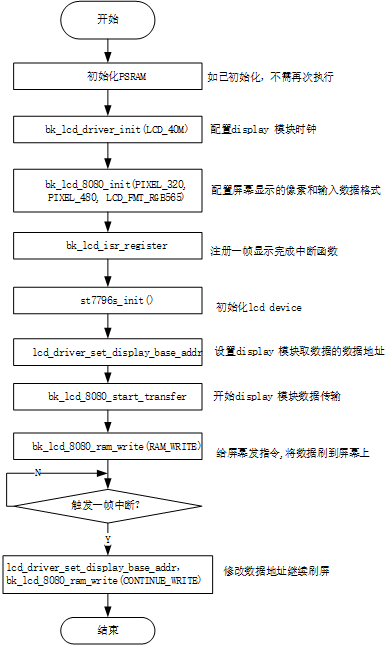
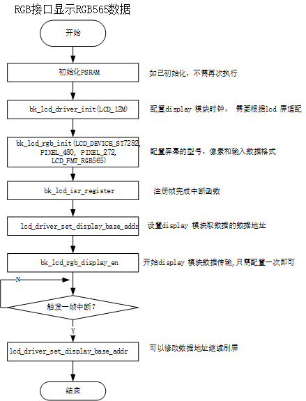
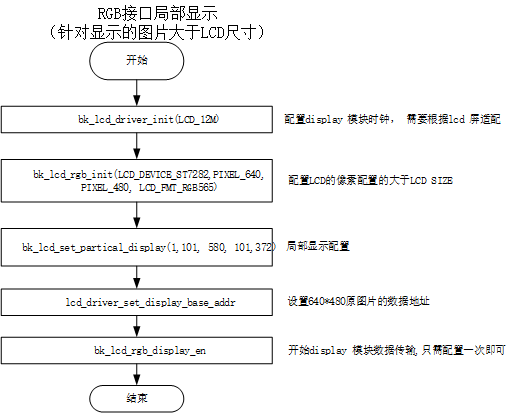
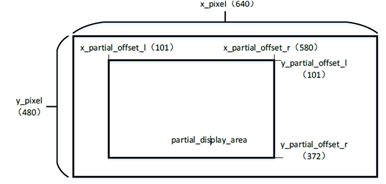

Display APIs
================

:link_to_translation:`zh_CN:[中文]`

LCD Display Interface
----------------------------

The BK LCD Display Driver supports following interfaces:

- i8080 LCD  interface
    1) The screen Driving IC used in the project is ST7796S
    2) The data transmission of the 8080 interface is 8-bit
    3) The interface supports RGB565 data

- RGB interface
    1) The supported screens in the project include Driving IC ST7282, HX8282 and GC9503V
    2) the data supported by the interface including RGB565, YUYV, UYVY, YYUV, UVYY, VUYY

LCD API Categories
----------------------------

LCD 8080 Config
----------------------------------------

    Figure 1. 8080 lcd config flow

LCD RGB Config
----------------------------------------

    Figure 2. rgb lcd config flow

LCD parcical display 
----------------------------------------

    Figure 3. rgb lcd config flow

局部显示参数配置

    Figure 4. rgb lcd config flow

API Reference
----------------------------------------
.. include:: ../../_build/inc/lcd.inc

API Typedefs
-------------------------------------------
.. include:: ../../_build/inc/lcd_types.inc
