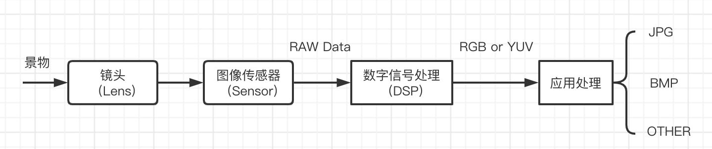

Camera Overview  
=======================

:link_to_translation:`zh_CN:[中文]`

.. toctree::
   :maxdepth: 1

1 Working Principle
-------------------------------------
   The scene is projected to the surface of the image SENSOR through the optical image generated by the LENS, and then converted into an electrical signal, 
   converted into A digital image signal after A/D (analog-to-digital conversion), and then sent to the digital signal processing chip (DSP) for processing, after output YUV or RGB format data.

   Figure 1.Working principle and process

2 Main Components
-------------------------------------
   Generally speaking, camera is mainly composed of lens and sensor IC two parts, of which some sensor IC integrated DSP, some not integrated, but also need external DSP processing.

1、lens

   The lens structure of the camera is composed of several lenses, divided into Plastic lenses and Glass lenses, usually the lens structure is: 1P,2P,1G1P,1G3P,2G2P,4G and so on.

   Figure 2.Lens structure

2、 sensor (Image sensor)

 - Sensor is a Semiconductor chip that comes in two types: CCD (Charge Coupled Device), short for charge-coupled device, and CMOS (Complementary Metal-Oxide Semiconductor), complementary metal-oxide semiconductor.
 - The Sensor converts the light transmitted from the lens into an electrical signal, and then converts it into a digital signal through the internal AD. Since each pixel of the sensor can only be sensitive to R light or B light or G light, each pixel is stored in monochrome at this time, which is called RAW DATA.
   In order to restore the RAW DATA data of each pixel to the three primary colors, it needs to be processed by the ISP. ISP (Image signal processing) mainly completes the processing of digital images, and converts the original data collected by the sensor into the format supported by the display.

.. note::
 - 1、 CCD sensor, charge signal first transmitted, after amplification, and then A/D, imaging quality high sensitivity, good resolution, low noise; Slow processing speed; The cost is high and the process is complex.
 - 2、 CMOS sensor, charge signal first amplified, after A/D, and then transmitted; The imaging quality sensitivity is low and the noise is obvious. Fast processing speed; Low cost, simple process.

3、CAMIF (camera controller)

   The camera interface circuit on the chip controls the device, receives the data collected by the sensor, sends it to the CPU, and sends it to the LCD for display.

3 Camera Ports
-------------------------------------
   There are two common camera interfaces: UVC interface and DVP interface

 - USB port, only data cable, no clock cable.
 
 .. figure:: ../../../../common/_static/uvc_interface.png
    :align: center
    :alt: uvc interface
    :figclass: align-center

    Figure 3.UVC interface

- DVP（Digital Video Port/Parally Port）interface, mainly composed of power bus, input bus, output bus.
 
 .. figure:: ../../../../common/_static/dvp_interface.png
    :align: center
    :alt: dvp interface
    :figclass: align-center

    Figure 4.DVP interface
    
 - Input bus

 PWDN: camera enable pin, can be configured in two modes, one is standby, one is normal work. When the camera is configured as standby, all operations including reset are invalid for the camera, so the pin must be set to normal work to reset it.

 MCLK: The working clock provided to the camera.

 IIC_SDA/IIC_SCL: Registers used to read and write sensors.

 - Output bus

 PCLK: pixel sync signal pin.

 VSYNC: indicates the frame synchronization signal.

 HSYN: indicates the line synchronization signal.

 DATA[0-7] : Output data pin.

 - Power bus

 AVDD: The analog voltage of the camera, which mainly supplies power to the photosensitive region of the camera and the ADC part.

 IOVDD: The analog voltage of the GPIO port of the camera mainly supplies power to the IIC or DVP part.

 DVDD: The digital operating voltage of the camera, if the power supply is unstable, it may cause the screen to burn.
 

