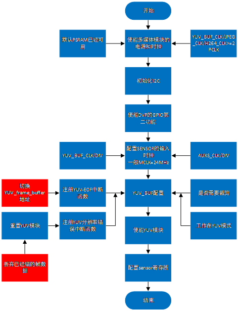
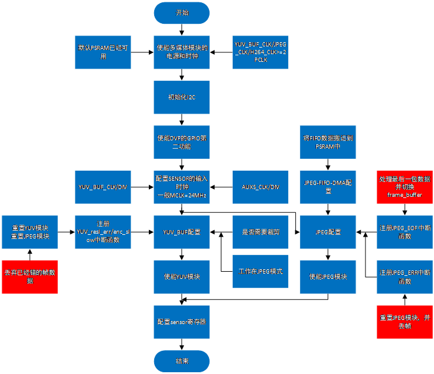
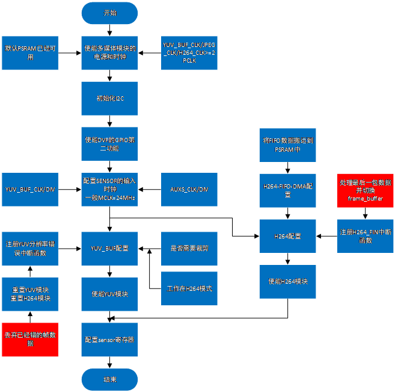
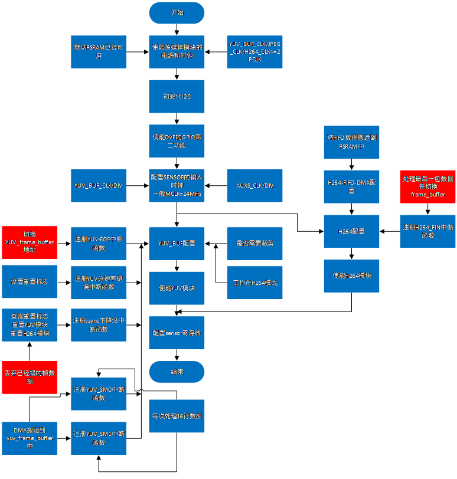

DVP Camera Introduction
=======================

:link_to_translation:`zh_CN:[中文]`

1 Introduction to DVP
--------------------------
The current DVP camera is based on the CIS interface and only supports 20/24Pin 8bit data output. The internal register model of the sensor is configured through the I2C protocol to achieve the required output resolution, frame rate, exposure and other performance adjustments.
In addition, for the output data of the sensor, it is necessary to use the hardware module for further editing. For example, the YUV_BUF module is used to cut and convert the YUV422 data output of the sensor into YUV420, and then the H264 module is used for encoding to reduce the use of memory space and perform more functions.
Or directly for YUV422 data using JPEG module encoding, output is more stable and memory space use smaller image.

2 Types and specifications supported by DVP
-----------------------------------------------

+----------+-------------------+---------------+----------+---------------+
| name     |      resolution  |    frame rate  | MCLK(MHz)|  Output format|        
+==========+===================+===============+==========+===============+
|  GC0328C | 640X480 and below | 25 and below  |    24    |     YUV422    |                      
+----------+-------------------+---------------+----------+---------------+
|  GC2145  | 1280X720 and below|  23 and below |    24    |     YUV422    |           
+----------+-------------------+---------------+----------+---------------+
|  OV2640  | 1280X720 and below|    20 below   |    16    |     YUV422    |              
+----------+-------------------+---------------+----------+---------------+
|  HM1055  |     1280X720      |  25 and below |   36     |     YUV422    |                    
+----------+-------------------+---------------+----------+---------------+

3 DVP use process
------------------------

- 1、Power on and clock configure each multimedia hardware module, including YUV_BUF/JPEG/H264 module, and supply power to the sensor;
- 2、Initialize I2C, because I2C needs to be used to configure the DVP register and specify the write/read address of the DVP
- 3、configure the DVP GPIO second function, so that the output can be detected in real time
- 4、Configure the input clock of the sensor. There are two sources of the clock: clock division for YUV_BUF and clock division for AUXS
- 5、Configure the register value of YUV_BUF/JPEG/H264 according to the specific application, and configure DMA to process the data, and finally enable related modules;
- 6、Configure the register value of the sensor through I2C to achieve the ideal output data;

4 Main applications of DVP working mode
------------------------------------------

DVP cameras can rely on different hardware modules to meet different needs, and several main applications are listed below.

1、DVP works in YUV (or GRAY) mode

   Figure 1.DVP works in YUV (or GRAY) mode

2、DVP works in JPEG mode

   Figure 2.DVP works in JPEG mode

3、DVP works in H264 mode

   Figure 3.DVP works in H264 mode

4、DVP works in YUV and H264 mode

   Figure 4.DVP works in YUV and H264 mode

