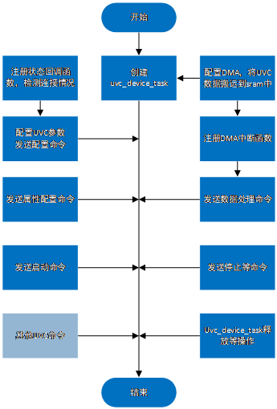

UVC Camera Introduction
=======================

:link_to_translation:`zh_CN:[中文]`

1 Introduction to UVC
--------------------------
USB Video Control (UVC) is a USB device class specification in the USB industry specification, and a unified data exchange specification for video devices with USB interfaces.
In the UVC specification, it is clearly required to have two interfaces: one is the VC Interface (video control class Interface) and the VS Interface (video stream interface). The VC interface is responsible for the configuration of UVC equipment, and the VS interface is responsible for the transmission of video stream data, and the two cooperate with each other to complete the functions of UVC equipment.
The current hardware supports USB2.0, including Full-speed and High-speed. In addition to the 1.5Mbps and 12Mbps transmission modes specified in USB1.1, USB2.0 also adds a high-speed transmission mode of 480Mbps. The USB1.1 unit data transfer time is 1 millisecond, while the USB2.0 unit data transfer time is 125 microseconds.
The UVC output data format is determined by its own firmware, which may support YUV, H264, MJPEG, H265, etc.

2 Types and specifications supported by UVC
---------------------------------------------
+-------------------+-------------------+--------------+--------------------+-----------------+------------------+-------------+--------------------+
| USB specification | UVC specification | Transmission | transmission speed |  MaxPacketSize  |    resolution    |     fps     |    output format   |
+===================+===================+==============+====================+=================+==================+=============+====================+
|       USB2.0      |    UVC1.5/UVC1.1  |   ISO/BULK   |  High(Full)-speed  | 1024 and below  |1280X720 and below| 20 and below| YUV/JPEG/H264/H265 |
+-------------------+-------------------+--------------+--------------------+-----------------+------------------+-------------+--------------------+

3 UVC Usage process
------------------------

- 1、initialize the USB hardware module, that is, initialize the host, and start its work usb_task;
- 2、host Detects whether the device is connected and enumerates.
- 3、After detecting that the connection is successful, the upper layer reads the device descriptor and sets UVC parameters based on it
- 4、Start the UVC
- 5、Process UVC packets
- 6、Pause UVC transmission
- 7、restore UVC transmission, etc., do a good job of state machine switching

4 Main applications of UVC working mode
-----------------------------------------

The working mode of UVC is mainly based on the data transmitted by itself. The following is its working process, which is only responsible for the analysis of the data. After the analysis, the data will be operated by other hardware modules, such as JPEG_EDC decoding and display, or the related applications of direct transmission of H264/JPEG data.

   Figure 1. UVC working mode
