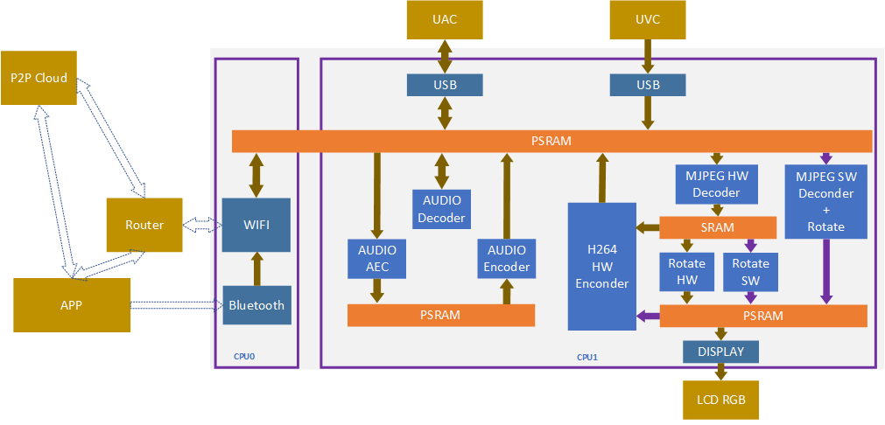
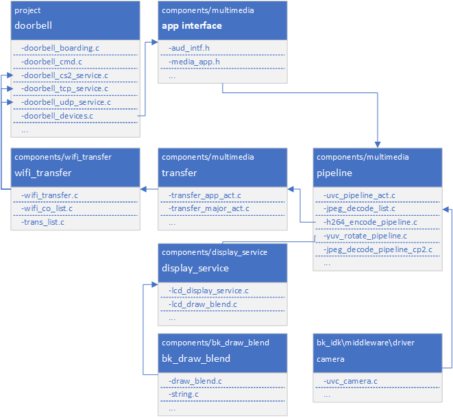

Doorbell
=================================

:link_to_translation:`zh_CN:[中文]`

1. Introduction
---------------------------------

This project is a demo of a USB camera door lock, supporting end-to-end (BK7258 device) to mobile app demonstrations.

1.1 Specifications
,,,,,,,,,,,,,,,,,,,,,,,,,,,,,,,,,

    * Hardware configuration:
        * Core board, **BK7258_QFN88_9X9_V3.2**
        * Display adapter board, **BK7258_LCD_interface_V3.0**
        * Mac Xiaoban, **BK_madule_Microphone_V1.1**
        * Speaker small board, **BKnModule_Speaker_V1.1**
        * PSRAM 8M/16M
    * Support, UVC
        * Reference peripherals, UVC resolution of **864 * 480**
    * Support, UAC
    * Support, TCP LAN image transmission
    * Support UDP LAN image transmission
    * Support, Shangyun, P2P image transfer
    * Support, LCD RGB/MCU I8080 display
        * Reference peripherals, **ST7701SN**, 480 * 854 RGB LCD
        * RGB565/RGB888
    * Support, hardware/software rotation
        * 0°, 90°, 180°, 270°
    * Support, onboard speaker
    * Support, Micro
    * Support, MJPEG hardware decoding
        * YUV422
    * Support, MJPEG software decoding
        * YUV420
    * Support, H264 hardware decoding
    * Support, OSD display
        * ARGB888[PNG]
        * Custom Font

.. warning::
    Please use reference peripherals to familiarize and learn about demo projects.
    If the specifications of the peripherals are different, the code may need to be reconfigured.

1.2 Path

    <bk_avdk source code path>/projects/media/doorbell

2. Framework diagram
---------------------------------

2.1 Software Module Architecture Diagram
,,,,,,,,,,,,,,,,,,,,,,,,,,,,,,,,,,,,,,,,,,,,,,

    As shown in the following figure, BK7258 has multiple CPUs:
        * CPU0, running WIFI/BLE as a low-power CPU.
        * CPU1, runs multimedia and serves as a high-performance multimedia CPU.

    Figure 1. software module architecture

..

    * In the UVC scheme, we adopt a pipeline approach to improve overall performance.
    * The images output by UVC cameras can be divided into two types: YUV420 MJPEG and YUV422 MJPEG.
        * The software will automatically recognize and use a hardware decoder to decode YUV422 MJPEG. YUV420 MJPEG uses CPU1 and CPU2 for software decoding.
        * When decoding hardware, the image resolution needs to be a multiple of 32 for wide resolution and a multiple of 16 for high resolution.
        * YUV pixel arrangement is divided into planar format, packed format, and semi planar format. Hardware encoded data, in packet format when required.
    * MJPEG HW Decoder, in pipeline mode, due to the encoding data of H264, it needs to be decoded based on MJPEG before encoding. Therefore, both local display and image transmission will use this hardware module.
        * When closing, it is important to note that both the display and image transfer are closed before closing this module. The default demo already includes this logic.
    * MJPEG SW Decoder, two decoders will not work simultaneously at the same time.
        * Once the image is confirmed to be YUV420 or YUV422, it is decided whether to use software decoding or hardware decoding.
    * Rota HW and Rota SW will only use one type of rotating module at the same time.
        * Rota HW, supports RGB 565 image output, supports 0°, 90°, 270°.
        * Rota SW supports 0°, 90°, 180°, and 270°.
        * If you need to use RGB888 output or support 180°, and meet one of the conditions, you need to switch to software decoding.
        * How to make decisions on Rota HW and Rota SW currently is determined by the SDK software. Users only need to input the rotation angle and output image format parameters into the corresponding interface when opening the LCD.

2.2 Code Module Relationship Diagram
,,,,,,,,,,,,,,,,,,,,,,,,,,,,,,,,,,,,,,,,,,,

    As shown in the following figure, multimedia interfaces are defined in **media_app.h** and **aud_intf.h**.

    Figure 2. module relationship diagram

3. Configuration
---------------------------------

3.1 Bluetooth and Multimedia Memory Reuse
,,,,,,,,,,,,,,,,,,,,,,,,,,,,,,,,,,,,,,,,,,,,,,,

    In order to further save memory, in the default project, the multimedia memory encoding and decoding memory and Bluetooth memory are multiplexed, mainly using the following two macros.
    If you want to use two modules in parallel, you can close them yourself. Please confirm if the overall memory is sufficient before closing.

    ========================================  ===============  ===============  ===============
    Kconfig                                     CPU             Format            Value    
    ========================================  ===============  ===============  ===============
    CONFIG_BT_REUSE_MEDIA_MEMORY                CPU0 && CPU1    bool                y    
    CONFIG_BT_REUSE_MEDIA_MEM_SIZE              CPU0 && CPU1    hex               0x1B000
    ========================================  ===============  ===============  ===============

    * In order to solve memory reuse conflicts during actual use, it is necessary to check the status of Bluetooth and disable or uninstall Bluetooth before using the multimedia module.
    * If the multimedia modules have already been turned off and you want to use them again, you need to reinitialize Bluetooth. Please refer to the following code.
    * The range of values is based on the maximum memory required by the Bluetooth hardware module and the maximum memory required for multimedia hardware encoding, with one value being the maximum.
    * The hardware memory requirements for general Bluetooth are relatively small [actual statistics need to be calculated based on the compiled map program]. Because it is generally configured according to the maximum memory capacity of multimedia hardware.

3.1.1 Uninstalling Bluetooth
.................................

::

    #ifdef CONFIG_BT_REUSE_MEDIA_MEMORY
    #if CONFIG_BLUETOOTH
        bk_bluetooth_deinit();
    #endif
    #endif

3.1.2 Initialize Bluetooth
.................................

::

    bk_bluetooth_init();

3.2 Hardware Decoding Memory Configuration Instructions
,,,,,,,,,,,,,,,,,,,,,,,,,,,,,,,,,,,,,,,,,,,,,,,,,,,,,,,,,,,,

    A hardware accelerator requires a portion of memory, which is optimized based on the actual resolution.
    The default configuration parameters are LCD with a 480 * 854 vertical screen and Camera with an 864 * 480 MJPEG image.

::

    //The recommended output resolution and width for Camera are multiples of 32. When the default configuration of the screen and camera is small, memory can be optimized by modifying the configuration macro.
    #define IMAGE_MAX_WIDTH (864)
    #define IMAGE_MAX_HEIGHT (480)

    //When starting the scaling module, it is necessary to pay attention to these two sets of parameters. The default recommendation is that the width should be slightly larger than the screen.
    #define DISPLAY_MAX_WIDTH (864)
    #define DISPLAY_MAX_HEIGHT (480)

    typedef struct {
    #if SUPPORTED_IMAGE_MAX_720P
        uint8_t decoder[DECODE_MAX_PIPELINE_LINE_SIZE * 2];
        uint8_t scale[SCALE_MAX_PIPELINE_LINE_SIZE * 2];
        uint8_t rotate[ROTATE_MAX_PIPELINE_LINE_SIZE * 2];
    #else
        uint8_t decoder[DECODE_MAX_PIPELINE_LINE_SIZE * 2];
        uint8_t rotate[ROTATE_MAX_PIPELINE_LINE_SIZE * 2];
    #endif

    } mux_sram_buffer_t;

    * If rotation is not required, the memory of the rotating part can be saved.
    * Attention should be paid to the resolution of scaling. The scaled resolution, width, and height must all be multiples of 8.

.. caution::
    When the VNet BT-REUSEUMEDIA.MMORY macro is opened, this portion of memory will be reused with Bluetooth hardware memory.

4. Demonstration explanation
---------------------------------

    Please visit `APP Usage Document <https://docs.bekencorp.com/arminodoc/bk_app/app/zh_CN/v2.0.1/app_usage/app_usage_guide/index.html#debug>`__.

.. hint::
    If you do not have cloud account permissions, you can use debug mode to set the local area network TCP image transmission method.

5. Code explanation
---------------------------------

5.1 UVC Camera
,,,,,,,,,,,,,,,,,,,,,,,,,,,,,,,,,

    Supported peripherals, please refer to `Support Peripherals <../../../support_peripherals/index.html>`_

5.1.1 Turn on UVC
.................................

5.1.1.1 Application Code
*********************************

::

    //Path      : projects/media/doorbell/main/src/doorbell_devices.c
    //Loaction  :  CPU0

    int doorbell_camera_turn_on(camera_parameters_t *parameters)
    {
        ...

        //turn onUVCcamera
        ret = media_app_camera_open(&device);

        //Set local display rotation.
        //It should be noted that:
        //    1.When MJPEG is YUV422 MJPEG, only the local display will rotate. That is, H264 images do not rotate.
        //    2.When MJPEG is YUV420 MJPEG, rotation will be performed during software decoding. Both local display and H264 encoded images are rotated data.
        media_app_pipline_set_rotate(rot_angle);

        //Open H264 Hardware Encoding Accelerator
        ret = media_app_h264_pipeline_open();

        ...
    }

5.1.1.2 Interface Code
*********************************

::

    //Path      :  components/multimedia/app/media_app.c
    //Loaction  :  CPU0

    bk_err_t media_app_camera_open(media_camera_device_t *device)
    {
        ...

        //Uninstall Bluetooth
        #ifdef CONFIG_BT_REUSE_MEDIA_MEMORY
        #if CONFIG_BLUETOOTH
            bk_bluetooth_deinit();
        #endif
        #endif

        //Vote to activate CPU1. The purpose of voting is to ensure that CPU1 can be automatically turned off when not in use, in order to achieve the goal of low power consumption.
        bk_pm_module_vote_boot_cp1_ctrl(PM_BOOT_CP1_MODULE_NAME_VIDP_JPEG_EN, PM_POWER_MODULE_STATE_ON);

        //Notify CPU1 to turn on the UVC camera.
        ret = media_send_msg_sync(EVENT_CAM_UVC_OPEN_IND, (uint32_t)device);

        ...
    }

5.1.2 Obtain an image
.................................

5.1.2.1 Application Code
*********************************

::

    //Path      :  components/multimedia/camera/uvc.c
    //Loaction  :  CPU1
    
    bk_err_t bk_uvc_camera_open(media_camera_device_t *device)
    {
        ...

        //Register the MJPEG data callback for obtaining UVC images.
        //If frame loss processing is required, it can be done in this callback.
        uvc_camera_config_st->jpeg_cb.push   = frame_buffer_fb_push;

        ...
    }

5.1.2.2 Interface Code
*********************************

::

    //Path      :  bk_idk/middleware/driver/camera/uvc_camera.c
    //Loaction  :  CPU1
    static void uvc_camera_eof_handle(uint32_t idx_uvc)
    {
        ...

        //Here is a stack of data streams obtained through ISO or BULK transfer from USB. And unpacking, grouping, and finally obtaining a complete frame of UVC data. And call back to the application layer.
        uvc_camera_config_ptr->jpeg_cb.push(curr_frame_buffer);

        ...
    }

.. attention::
    Here is an introduction to how to obtain MJPEG images on CPU1. If your application is running on CPU0, it needs to be sent to CPU0 through a mailbox for use, and after use, it needs to be returned to CPU1 for release.

5.1.3 Turn off UVC
.................................

5.1.3.1 Application Code
*********************************
::

    //Path      :  projects/media/doorbell/main/src/doorbell_devices.c
    //Loaction  :  CPU0

    int doorbell_camera_turn_off(void)
    {
        ...

        //Disable H264 encoding
        media_app_h264_pipeline_close();

        //Turn off UVC camera
        media_app_camera_close(UVC_CAMERA);

        ...
    }

5.1.3.2 Interface Code
*********************************

::

    //Path      :  components/multimedia/app/media_app.c
    //Loaction  :  CPU0

    bk_err_t media_app_camera_close(camera_type_t type)
    {
        ...

        //Turn off UVC camera
        ret = media_send_msg_sync(EVENT_CAM_UVC_CLOSE_IND, 0);

        //Vote to allow CPU1 to be turned off. The purpose of voting is to ensure that CPU1 can be automatically turned off when not in use, in order to achieve the goal of low power consumption.
        bk_pm_module_vote_boot_cp1_ctrl(PM_BOOT_CP1_MODULE_NAME_VIDP_JPEG_EN, PM_POWER_MODULE_STATE_OFF);

        ...
    }

.. warning::
        * All operations involving multimedia require attention to the requirement of low power consumption. To turn on the device, it must be turned off, otherwise the entire system cannot enter low-power mode.
        * The operation involving CPU1 voting, opening and closing, must appear in pairs, otherwise there will be a problem of CPU1 being unable to close and increasing power consumption.
        * You can refer to the chapter on low power consumption

5.2 LCD Display
,,,,,,,,,,,,,,,,,,,,,,,,,,,,,,,,,

    Supported peripherals, please refer to `Support Peripherals <../../../support_peripherals/index.html>`_

5.2.1 Open LCD
.................................

5.2.1.1 Application Code
*********************************

::

    //Path      : projects/media/doorbell/main/src/doorbell_devices.c
    //Loaction  :  CPU0

    int doorbell_display_turn_on(uint16_t id, uint16_t rotate, uint16_t fmt)
    {
        ...

        //Set the pixel format for display
        if (fmt == 0)
        {
            media_app_lcd_fmt(PIXEL_FMT_RGB565_LE);
        }
        else if (fmt == 1)
        {
            media_app_lcd_fmt(PIXEL_FMT_RGB888);
        }

        //Set the rotation angle.
        switch (rotate)
        {
            case 90:
                rot_angle = ROTATE_90;
                break;
            case 180:
                rot_angle = ROTATE_180;
                break;
            case 270:
                rot_angle = ROTATE_270;
                break;
            case 0:
            default:
                rot_angle = ROTATE_NONE;
                break;
        }

        media_app_pipline_set_rotate(rot_angle);

        //Open local LCD display
       media_app_lcd_pipeline_open(&lcd_open);

        ...
    }

5.2.1.2 Interface Code
*********************************

::

    //Path      :  components/multimedia/app/media_app.c
    //Loaction  :  CPU0

    bk_err_t media_app_lcd_pipeline_open(void *lcd_open)
    {
        ...

        //
        ret = media_app_lcd_pipeline_disp_open(config);

        //
        ret = media_app_lcd_pipeline_jdec_open();

        ...
    }

    bk_err_t media_app_lcd_pipeline_disp_open(void *config)
    {
        ...

        //Vote to activate CPU1. The purpose of voting is to ensure that CPU1 can be automatically turned off when not in use, in order to achieve the goal of low power consumption.
        bk_pm_module_vote_boot_cp1_ctrl(PM_BOOT_CP1_MODULE_NAME_VIDP_LCD, PM_POWER_MODULE_STATE_ON);

        //Notify CPU1 to turn on the LCD
        ret = media_send_msg_sync(EVENT_PIPELINE_LCD_DISP_OPEN_IND, (uint32_t)ptr);

        ...
    }

    bk_err_t media_app_lcd_pipeline_jdec_open(void)
    {
        int ret = BK_OK;

        //Vote to activate CPU1. The purpose of voting is to ensure that CPU1 can be automatically turned off when not in use, in order to achieve the goal of low power consumption.
        bk_pm_module_vote_boot_cp1_ctrl(PM_BOOT_CP1_MODULE_NAME_VIDP_JPEG_DE, PM_POWER_MODULE_STATE_ON);

        //Set rotation angle
        ret = media_send_msg_sync(EVENT_PIPELINE_SET_ROTATE_IND, jpeg_decode_pipeline_param.rotate);

        //Open the rotation, scaling, and decoding modules that display dependencies.
        ret = media_send_msg_sync(EVENT_PIPELINE_LCD_JDEC_OPEN_IND, 0);

        return ret;
    }

5.2.2 Turn off LCD
.................................

5.2.2.1 Application Code
*********************************

::

    //Path      : projects/media/doorbell/main/src/doorbell_devices.c
    //Loaction  :  CPU0

    int doorbell_display_turn_off(void)
    {
        ...

        //Turn off local LCD display
        media_app_lcd_pipeline_close();

        ...
    }

5.2.2.2 Interface Code
*********************************

::

    //Path      : components/multimedia/app/media_app.c
    //Loaction  :  CPU0

    bk_err_t media_app_lcd_pipeline_close(void)
    {
        ...

        //Disable MJPEG, decoding/rotation, and other functions.
        ret = media_app_lcd_pipeline_jdec_close();

        //Turn off the display LCD
        ret = media_app_lcd_pipeline_disp_close();

        ...
    }

5.2.3 OSD Display
.................................

5.3 Audio
,,,,,,,,,,,,,,,,,,,,,,,,,,,,,,,,,

5.3.1 Open UAC, onboard MIC/SPEAKER
......................................

::

    //Path      :  projects/media/doorbell/main/src/doorbell_devices.c
    //Loaction  :  CPU0

    int doorbell_audio_turn_on(audio_parameters_t *parameters)
    {
        ...

        //Enable AEC
        if (parameters->aec == 1)
        {
            aud_voc_setup.aec_enable = true;
        }
        else
        {
            aud_voc_setup.aec_enable = false;
        }

        //Set SPEAKER single ended mode
        ud_voc_setup.spk_mode = AUD_DAC_WORK_MODE_SIGNAL_END;

        //Turn on UAC
        if (parameters->uac == 1)
        {
            aud_voc_setup.mic_type = AUD_INTF_MIC_TYPE_UAC;
            aud_voc_setup.spk_type = AUD_INTF_SPK_TYPE_UAC;
        }
        else //Activate onboard MIC and SPEAKER
        {
            aud_voc_setup.mic_type = AUD_INTF_MIC_TYPE_BOARD;
            aud_voc_setup.spk_type = AUD_INTF_SPK_TYPE_BOARD;
        }

        if (aud_voc_setup.mic_type == AUD_INTF_MIC_TYPE_BOARD && aud_voc_setup.spk_type == AUD_INTF_SPK_TYPE_BOARD) {
            aud_voc_setup.data_type = parameters->rmt_recoder_fmt - 1;
        }

        //Set sampling rate
        switch (parameters->rmt_recorder_sample_rate)
        {
            case DB_SAMPLE_RARE_8K:
                aud_voc_setup.samp_rate = 8000;
            break;

            case DB_SAMPLE_RARE_16K:
                aud_voc_setup.samp_rate = 16000;
            break;

            default:
                aud_voc_setup.samp_rate = 8000;
            break;
        }

        //Register MIC data callback
        aud_intf_drv_setup.aud_intf_tx_mic_data = doorbell_udp_voice_send_callback;

        ...
    }

5.3.2 Obtaining uplink MIC data
.................................

::

    //Path      :  projects/media/doorbell/main/src/doorbell_devices.c
    //Loaction  :  CPU0

    //Register MIC callback
    aud_intf_drv_setup.aud_intf_tx_mic_data = doorbell_udp_voice_send_callback;
    ret = bk_aud_intf_drv_init(&aud_intf_drv_setup);

    int doorbell_udp_voice_send_callback(unsigned char *data, unsigned int len)
    {
        ...

        //The usual callback is to transmit in the direction of WIFI.
        return db_device_info->audio_transfer_cb->send(buffer, len, &retry_cnt);
    }

5.3.3 Play downstream SPEAKER data
........................................

::

    //Path      :  projects/media/doorbell/main/src/doorbell_devices.c
    //Loaction  :  CPU0

    void doorbell_audio_data_callback(uint8_t *data, uint32_t length)
    {
        ...

        //Send data to SPEAKER
        ret = bk_aud_intf_write_spk_data(data, length);

        ...
    }

5.3.4 AEC/Noise Reduction Treatment
.........................................

    Please refer to `AEC Debug <../../../audio_algorithms/aec/index.html>`_

5.3.7 Turn off UAC, onboard MIC/SPEAKER
...........................................

::

    //Path      :  projects/media/doorbell/main/src/doorbell_devices.c
    //Loaction  :  CPU0

    int doorbell_audio_turn_off(void)
    {
        ...

        bk_aud_intf_voc_stop();
        bk_aud_intf_voc_deinit();
        /* deinit aud_tras task */
        aud_work_mode = AUD_INTF_WORK_MODE_NULL;
        bk_aud_intf_set_mode(aud_work_mode);
        bk_aud_intf_drv_deinit();

        ...
    }

5.4 H264 Encoding and Decoding
,,,,,,,,,,,,,,,,,,,,,,,,,,,,,,,,,

    Please refer to the `H264 encoding <../../../video_codec/H264_encoding/index.html>`_

5.5 WIFI transmission
,,,,,,,,,,,,,,,,,,,,,,,,,,,,,,,,,

5.5.1 Setting up WIFI network data transmission callback
..............................................................

::

    //Path      :  projects/media/doorbell/main/src/doorbell_udp_service.c
    //Loaction  :  CPU0

    bk_err_t doorbell_udp_service_init(void)
    {
        ...

        //Here, we have set up callbacks for image and audio data to WIFI
        doorbell_devices_set_camera_transfer_callback(&doorbell_udp_img_channel);
        doorbell_devices_set_audio_transfer_callback(&doorbell_udp_aud_channel);

        ...
    }

    typedef struct {
        //The callback for the final data transmission
        media_transfer_send_cb send;

        //Packaging of Head and Payload before Data Transmission
        media_transfer_prepare_cb prepare;

        //Optimize packet loss handling for latency optimization
        media_transfer_drop_check_cb drop_check;

        //Obtain the TX data buffer that needs to be filled
        media_transfer_get_tx_buf_cb get_tx_buf;

        //Get the size of the TX buffer to be filled
        media_transfer_get_tx_size_cb get_tx_size;

        //Set the data format of the image
        pixel_format_t fmt;
    } media_transfer_cb_t;

5.5.1 Obtaining H264 image data
.................................

::

    //Path      :  components/wifi_transfer/src/wifi_transfer.c
    //Loaction  :  CPU0

    bk_err_t bk_wifi_transfer_frame_open(const media_transfer_cb_t *cb)
    {
        ...

        //Improve the performance of network image transmission
        bk_wifi_set_wifi_media_mode(true);
        bk_wifi_set_video_quality(WIFI_VIDEO_QUALITY_SD);

        ...

        //Register H264 image data and obtain callback
        ret = media_app_register_read_frame_callback(cb->fmt, wifi_transfer_read_frame_callback);

        ...
    }

5.5.2 Open Image Data Image Transfer
.......................................

::

    //Path      :  projects/media/doorbell/main/src/doorbell_devices.c
    //Loaction  :  CPU0

    int doorbell_video_transfer_turn_on(void)
    {
        ...

        //Open image transfer
        ret = bk_wifi_transfer_frame_open(db_device_info->camera_transfer_cb);

        ...
    }

5.5.2 Close Image Data Image Transfer
.........................................

::

    //Path      :  projects/media/doorbell/main/src/doorbell_devices.c
    //Loaction  :  CPU0

    int doorbell_video_transfer_turn_off(void)
    {
        ...

        //Close image transfer
        ret = bk_wifi_transfer_frame_close();

        ...
    }

