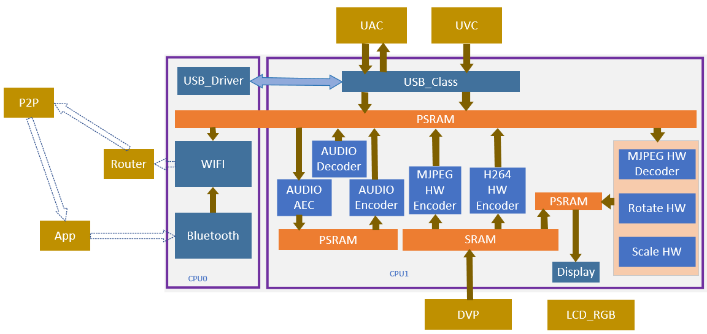
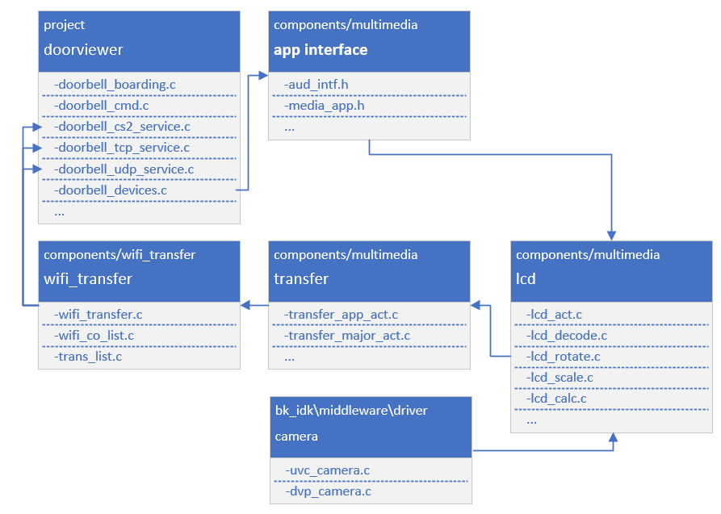

Doorviewer
======================================================

:link_to_translation:`zh_CN:[中文]`

1. Introduction
---------------------------------

This project is a demo of a USB/DVP camera door lock, supporting end-to-end (BK7258 device) to mobile app demonstrations. Default use of 16Mbyte PSRAM

1.1 Specifications
,,,,,,,,,,,,,,,,,,,,,,,,,,,,,,,,,

    * Hardware configuration:
        * Core board, **BK7258_QFN88_9X9_V3.2**
        * Display adapter board, **BK7258_LCD_interface_V3.0**
        * Mac Xiaoban, **BK_madule_Microphone_V1.1**
        * Speaker small board, **BKnModule_Speaker_V1.1**
        * PSRAM 8M/16M
    * Support, UVC/DVP
        * Reference peripherals, UVC resolution of **864 * 480**
        * Reference peripherals, DVP resolution of **640 * 480**, **1280 * 720**
    * Support, UAC
    * Support, TCP LAN image transmission
    * Support UDP LAN image transmission
    * Support, Shangyun, P2P image transfer
    * Support, LCD RGB/MCU I8080 display
        * Reference peripherals, **ST7701SN**, 480 * 854 RGB LCD
        * RGB565/RGB888
    * Support, hardware/software rotation
        * 0°, 90°, 180°, 270°
    * Support, onboard speaker
    * Support, Micro
    * Support, MJPEG hardware decoding
        * YUV422
    * Support, MJPEG software decoding
        * YUV420
    * Support, H264 hardware decoding
    * Support, OSD display
        * ARGB888[PNG]
        * Custom Font

.. warning::
    Please use reference peripherals to familiarize and learn about demo projects.
    If the specifications of the peripherals are different, the code may need to be reconfigured.

1.2 Path
,,,,,,,,,,,,,,,,,,,,,,,,,,,,,,,,,

    <bk_avdk source code path>/projects/media/doorviewer

2. Framework diagram
---------------------------------

2.1 Software Module Architecture Diagram
,,,,,,,,,,,,,,,,,,,,,,,,,,,,,,,,,,,,,,,,,,,,

    As shown in the following figure, BK7258 has multiple CPUs:
        * CPU0, running WIFI/BLE as a low-power CPU.
        * CPU1, runs multimedia and serves as a high-performance multimedia CPU.

    Figure 1. software module architecture
    doorviewer software module architecture

..

    * In the UVC scheme, a frame method is used to generate a JPEG image, which triggers another task to perform decoding, rotation, or scaling operations, and ultimately displays it on the desired LCD screen.
    * The images output by UVC cameras can be divided into two types: YUV420 MJPEG and YUV422 MJPEG.
        * JPEG images are directly transmitted and displayed via WiFi.
        * The software will automatically recognize and use a hardware decoder to decode YUV422 MJPEG. YUV420 MJPEG uses CPU1 for software decoding.
        * When decoding hardware, the image resolution needs to be a multiple of 32 for wide resolution and a multiple of 16 for high resolution.
        * YUV pixel arrangement is divided into planar format, packed format, and semi planar format. Hardware encoded data, in packet format when required.
    * In the DVP scheme, a dual stream approach is used to generate one frame of JPEG/H264 image while synchronously generating one frame of YUV image, which triggers another task to perform rotation or scaling operations, and ultimately displays it on the desired LCD screen.

        * DVP cameras support single/dual stream modes, and users can configure them according to their needs.
        * Single stream only supports any one of YUV422/JPEG/H264.
        * Dual stream supports either JPEG/H264 and outputs YUV422 simultaneously.
        * The MJPEG image output by DVP is YUV422 MJPEG.
    * MJPEG HW Decoder, after obtaining a frame of JPEG image, directly decodes it.
    * MJPEG SW Decoder, direct decoding
    * Rota HW and Rota SW will only use one type of rotating module at the same time.
        * Rota HW, supports RGB 565 image output, supports 0°, 90°, 270°.
        * Rota SW supports 0°, 90°, 180°, and 270°.
        * If you need to use RGB888 output or support 180°, and meet one of the conditions, you need to switch to software decoding.
        * How to make decisions on Rota HW and Rota SW currently is determined by the SDK software. Users only need to input the rotation angle and output image format parameters into the corresponding interface when opening the LCD.
    * Scale requires clear input and output resolutions, as well as image formats for input and output.

2.2 Code Module Relationship Diagram
,,,,,,,,,,,,,,,,,,,,,,,,,,,,,,,,,,,,,,

    As shown in the following figure, multimedia interfaces are defined in **media_app.h** and **aud_intf.h**.

    Figure 2. module relationship diagram

    doorviewer module relationship diagram

3. Configuration
---------------------------------

3.1 Bluetooth and Multimedia Memory Reuse
,,,,,,,,,,,,,,,,,,,,,,,,,,,,,,,,,,,,,,,,,,,

    Using the doorviewer project, decoding, rotation, and scaling are all executed in frames, so memory does not need to be shared with Bluetooth.

    +-------------------------------------+---------------+---------------------------------------------------------------------+
    |          marco                      |     value     |                       implication                                   |
    +-------------------------------------+---------------+---------------------------------------------------------------------+
    | CONFIG_BT_REUSE_MEDIA_MEMORY        |       N       | Multimedia and Bluetooth share one SRAM (time-division multiplexing)|
    +-------------------------------------+---------------+---------------------------------------------------------------------+

3.1.1 Uninstalling Bluetooth
.................................

::

    #ifdef CONFIG_BT_REUSE_MEDIA_MEMORY
    #if CONFIG_BLUETOOTH
        bk_bluetooth_deinit();
    #endif
    #endif

3.1.2 Initialize Bluetooth
.................................

::

    bk_bluetooth_init();

4. Demonstration explanation
---------------------------------

    Please visit `APP Usage Document <https://docs.bekencorp.com/arminodoc/bk_app/app/zh_CN/v2.0.1/app_usage/app_usage_guide/index.html#debug>`__.

    Demo result: During runtime, UVC/DVP, LCD, and AUDIO will be launched. The LCD will display UVC output JPEG (864X480) images, which are decoded and rotated 90 ° before being displayed on the LCD (480X854),
    The same JPEG image will be transmitted to the phone for display via WIFI (864X480).

.. hint::
    If you do not have cloud account permissions, you can use debug mode to set the local area network TCP image transmission method.

5. Code explanation
---------------------------------

5.1 Camera
,,,,,,,,,,,,,,,,,,,,,,,,,,,,,,,,,

    Supported peripherals, please refer to `Support Peripherals <../../../support_peripherals/index.html>`_

5.1.1 Turn on Camera
.................................

5.1.1.1 Application Code
*********************************

::

    //Path      :  projects/media/doorbell/main/src/doorbell_devices.c
    //Loaction  :  CPU0

    int doorbell_camera_turn_on(camera_parameters_t *parameters)
    {
        ...

        if (parameters->id == UVC_DEVICE_ID)
        {
            device.type = UVC_CAMERA;
        }
        else
        {
            device.type = DVP_CAMERA;
        }

        device.info.resolution.width = parameters->width;
        device.info.resolution.height = parameters->height;
        device.info.fps = FPS30;

        //Open the UVC/DVP camera
        ret = media_app_camera_open(&device);

        ...
    }

5.1.1.2 Interface Code
*********************************

::

    //Path      : components/multimedia/app/media_app.c
    //Loaction  :  CPU0

    bk_err_t media_app_camera_open(media_camera_device_t *device)
    {
        ...

        //Uninstall Bluetooth
        #ifdef CONFIG_BT_REUSE_MEDIA_MEMORY
        #if CONFIG_BLUETOOTH
            bk_bluetooth_deinit();
        #endif
        #endif

        //Vote to activate CPU1. The purpose of voting is to ensure that CPU1 can be automatically shut down when not in use, in order to achieve the goal of low power consumption.
        bk_pm_module_vote_boot_cp1_ctrl(PM_BOOT_CP1_MODULE_NAME_VIDP_JPEG_EN, PM_POWER_MODULE_STATE_ON);

        //Notify CPU1 to turn on the UVC camera
        ret = media_send_msg_sync(EVENT_CAM_UVC_OPEN_IND, (uint32_t)device);

        ...
    }

5.1.2 Obtain an image
.................................

    Because the current multimedia runs on CPU1, whether it is DVP/UVC storing one frame of image, it is all placed on PSRAM. When CPU1 needs to obtain a frame of image, the following interface needs to be called:

::

    //Path      : components/multimedia/comm/frame_buffer.c
    //Loaction  :  CPU1

    bk_err_t frame_buffer_fb_register(frame_module_t index, fb_type_t type)
    {
        bk_err_t ret = BK_FAIL;

        ...

        //index: Indicate the module that needs to read images, referring to the corresponding structural meaning.

        //type: This module represents the type of image that needs to be obtained.

        return ret;
    }

    frame_buffer_t *frame_buffer_fb_read(frame_module_t index)
    {
        frame_buffer_t *frame = NULL;

        ...

        //index: Indicate the module that needs to read images, referring to the corresponding structural meaning.

        //The return may be an invalid frame, and it is necessary to determine the return value of this function. If it is NULL, the call needs to continue,
        //this interface is usually called in a loop within a task.
        return frame;
    }

    void frame_buffer_fb_free(frame_buffer_t *frame, frame_module_t index)
    {
        ...

        //When using the interface frame_fuffer_fc_read above and reading a valid frame, after completion of use, the frame image needs to be released and this interface needs to be called.
    }

    bk_err_t frame_buffer_fb_deregister(frame_module_t index, fb_type_t type)
    {
        bk_err_t ret = BK_FAIL;

        ...

        //Similar to frame_fuffer_fb_register, when no reading is required, it needs to be logged out
        return ret;
    }

    When obtaining an image frame on CPU0, it needs to be transmitted through a mailbox, and the general process is as follows. When CPU0 is not needed, operations on CPU0 can be deleted. Please refer to the attached image for details:
    ``transfer_app_act.c``, ``transfer_major_act.c``.

.. figure:: ../../../../_static/multimedia_get_frame.png
    :align: center
    :alt: get frame Overview
    :figclass: align-center

    Figure 3. get frame diagram

    multimeida get frame diagram

5.1.2.1 Application Code
*********************************

::

    //Path      :  components/multimedia/camera/uvc.c
    //Loaction  :  CPU1

    bk_err_t bk_uvc_camera_open(media_camera_device_t *device)
    {
        ...

        //Register the MJPEG data callback for obtaining UVC images.
        //If frame loss processing is required, it can be done in this callback.
        uvc_camera_config_st->jpeg_cb.push   = frame_buffer_fb_push;

        ...
    }

    //Path      : components/multimedia/camera/dvp.c
    //Loaction  :  CPU1

    bk_err_t bk_dvp_camera_open(media_camera_device_t *device)
    {
        ...

        //Register the MJPEG data callback for obtaining DVP images.
        //If frame loss processing is required, it can be done in this callback.
        config.fb_complete = frame_buffer_fb_push;

        ...

        return bk_dvp_camera_driver_init(&config);
    }

5.1.2.2 Interface Code
*********************************

::

    //Path      :  bk_idk/middleware/driver/camera/uvc_camera.c
    //Loaction  :  CPU1

    static void uvc_camera_eof_handle(uint32_t idx_uvc)
    {
        ...

        //Here is a stack of data streams obtained through ISO or BULK transfer from USB. And unpacking, grouping, and finally obtaining a complete frame of UVC data. And call back to the application layer.
        uvc_camera_config_ptr->jpeg_cb.push(curr_frame_buffer);

        ...
    }

    //Path      :  bk_idk/middleware/driver/camera/dvp_camera.c
    //Loaction  :  CPU1

    static void dvp_camera_jpeg_eof_handler(jpeg_unit_t id, void *param)
    {
        ...

        //This is the completion interrupt of hardware JPEG encoding, where a complete frame of DVP data is finally obtained and called back to the application layer.
        dvp_camera_config->fb_complete(curr_encode_frame);
    }

.. attention::
    Here is an introduction to how to obtain MJPEG images on CPU1. If your application is running on CPU0, it needs to be sent to CPU0 through a mailbox for use, and after use, it needs to be returned to CPU1 for release.

5.1.3 Turn off Camera
.................................

5.1.3.1 Application Code
*********************************

::

    //Path      :  projects/media/doorbell/main/src/doorbell_devices.c
    //Loaction  :  CPU0

    int doorbell_camera_turn_off(void)
    {
        ...

        if (db_device_info->camera_id == UVC_DEVICE_ID)
        {
            //Turn off UVC camera
            media_app_camera_close(UVC_CAMERA);
        }
        else
        {
            //Turn off DVP camera
            media_app_camera_close(DVP_CAMERA);
        }

        ...
    }

5.1.3.2 Interface Code
*********************************

::

    //Path      :  components/multimedia/app/media_app.c
    //Loaction  :  CPU0

    bk_err_t media_app_camera_close(camera_type_t type)
    {
        ...

        //Turn off camera
        if (type == UVC_CAMERA)
        {
            ret = media_send_msg_sync(EVENT_CAM_UVC_CLOSE_IND, 0);
        }
        else
        {
            ret = media_send_msg_sync(EVENT_CAM_DVP_CLOSE_IND, 0);
        }

        //Vote to allow CPU1 to be turned off. The purpose of voting is to ensure that CPU1 can be automatically shut down when not in use, in order to achieve the goal of low power consumption.
        bk_pm_module_vote_boot_cp1_ctrl(PM_BOOT_CP1_MODULE_NAME_VIDP_JPEG_EN, PM_POWER_MODULE_STATE_OFF);

        ...
    }

.. warning::
    * All operations involving multimedia require attention to the requirement of low power consumption. To turn on the device, it must be turned off, otherwise the entire system cannot enter low-power mode.
    * The operation involving CPU1 voting, opening and closing, must appear in pairs, otherwise there will be a problem of CPU1 being unable to close and increasing power consumption.
    * You can refer to the chapter on low power consumption

5.2 LCD Display
,,,,,,,,,,,,,,,,,,,,,,,,,,,,,,,,,

    Supported peripherals, please refer to `Support Peripherals <../../../support_peripherals/index.html>`_

5.2.1 Open LCD
.................................

5.2.1.1 Application Code
*********************************

::

    //Path      : projects/media/doorbell/main/src/doorbell_devices.c
    //Loaction  :  CPU0

    int doorbell_display_turn_on(uint16_t id, uint16_t rotate, uint16_t fmt)
    {
        ...

        //Set rotation angle
        if (rotate == 90)
        {
            media_app_lcd_rotate(ROTATE_90);
        }

        //Open the desired LCD screen display
        media_app_lcd_open(&lcd_open);

        ...
    }

5.2.1.2 Interface Code
*********************************

::

    //Path      : components/multimedia/app/media_app.c
    //Loaction  :  CPU0

    bk_err_t media_app_lcd_open(void *lcd_open)
    {
        ...

        //Vote to allow CPU1 to be turned off. The purpose of voting is to ensure that CPU1 can be automatically shut down when not in use, in order to achieve the goal of low power consumption.
        bk_pm_module_vote_boot_cp1_ctrl(PM_BOOT_CP1_MODULE_NAME_VIDP_LCD, PM_POWER_MODULE_STATE_ON);

        //Notify CPU1 to turn on the LCD
        ret = media_send_msg_sync(EVENT_LCD_OPEN_IND, (uint32_t)ptr);

        ...
    }

5.2.2 Turn off LCD
.................................

5.2.2.1 Application Code
*********************************

::

    //Path      :  projects/media/doorbell/main/src/doorbell_devices.c
    //Loaction  :  CPU0

    int doorbell_display_turn_off(void)
    {
        ...

        //Turn off local LCD display
        media_app_lcd_close();

        ...
    }

5.2.2.2 Interface Code
*********************************

::

    //Path      : components/multimedia/app/media_app.c
    //Loaction  :  CPU0

    bk_err_t media_app_lcd_close(void)
    {
        ...

        //urn off local LCD display
        ret = media_send_msg_sync(EVENT_LCD_CLOSE_IND, 0);

        //Vote to allow CPU1 to be turned off. The purpose of voting is to ensure that CPU1 can be automatically shut down when not in use, in order to achieve the goal of low power consumption.
        bk_pm_module_vote_boot_cp1_ctrl(PM_BOOT_CP1_MODULE_NAME_VIDP_LCD, PM_POWER_MODULE_STATE_OFF);

        ...
    }

5.2.3 OSD Display
.................................

5.3 Audio
,,,,,,,,,,,,,,,,,,,,,,,,,,,,,,,,,

    Please refer to the `Audio <../../doorbell/index.html#audio>`_

5.4 H264 Encoding and Decoding
,,,,,,,,,,,,,,,,,,,,,,,,,,,,,,,,,

    Please refer to the `H264 encoding <../../../video_codec/H264_encoding/index.html>`_

5.5 WIFI transmission
,,,,,,,,,,,,,,,,,,,,,,,,,,,,,,,,,

    Please refer to the `WIFI transmission <../../doorbell/index.html#wifi>`_