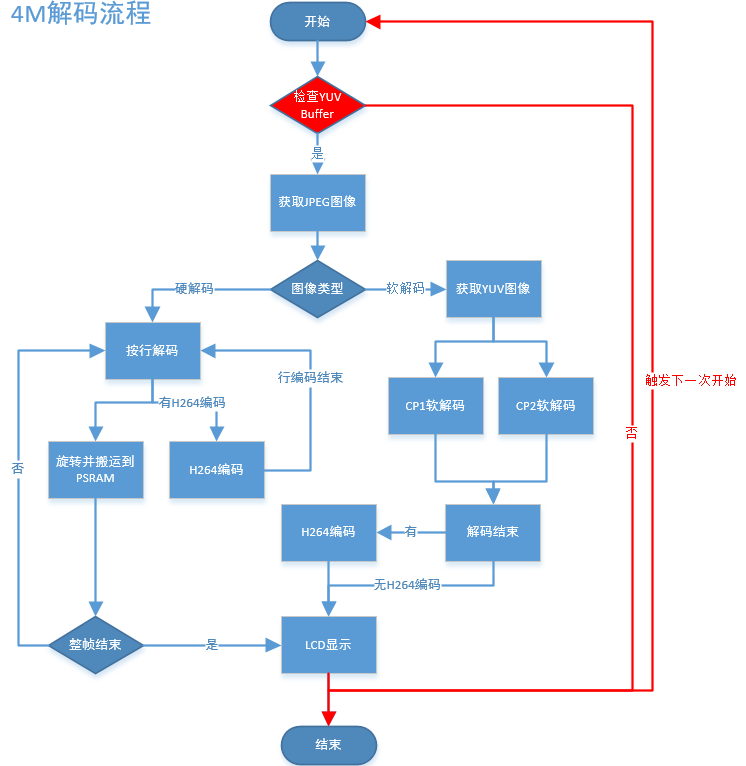
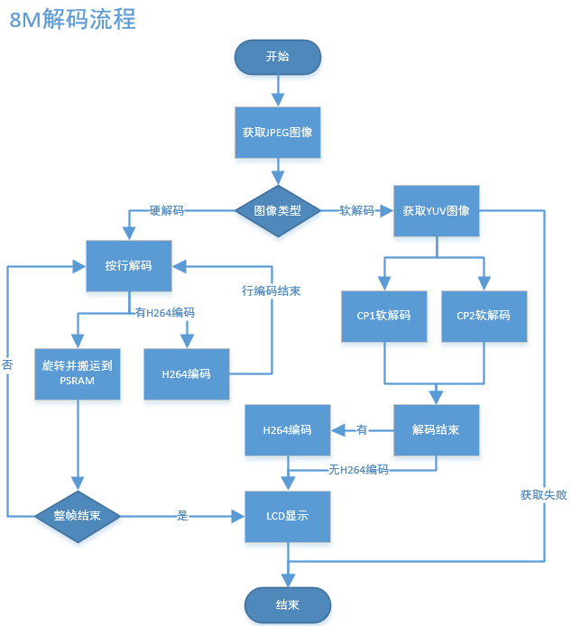

Doorbell_cs2_4M
======================================================

:link_to_translation:`zh_CN:[中文]`

1. Introduction
---------------------------------

This project is a demo of a USB camera door lock, supporting end-to-end (BK7258 device) to mobile app demonstrations. By default, it supports Shangyun for network transmission.

1.1 Specifications
,,,,,,,,,,,,,,,,,,,,,,,,,,,,,,,,,

    * Hardware configuration:
        * Core board, **BK7258_QFN88_9X9_V3.2**
        * Display adapter board, **BK7258_LCD_interface_V3.0**
        * Speaker small board, **BKnModule_Speaker_V1.1**
        * PSRAM 8M/16M
    * Support, UVC
        * Reference peripherals, UVC resolution of **864 * 480**
    * Support, UAC
    * Support, TCP LAN image transmission
    * Support UDP LAN image transmission
    * Support, Shangyun, P2P image transfer
    * Support, LCD RGB/MCU I8080 display
        * Reference peripherals, **ST7701SN**, 480 * 854 RGB LCD
        * RGB565/RGB888
    * Support, hardware/software rotation
        * 0°, 90°, 180°, 270°
    * Support, onboard speaker
    * Support, MJPEG hardware decoding
        * YUV422
    * Support, MJPEG software decoding
        * YUV420
    * Support, H264 hardware decoding
    * Support, OSD display
        * ARGB888[PNG]
        * Custom Font

1.2 Path
,,,,,,,,,,,,,,,,,,,,,,,,,,,,,,,,,

    <bk_avdk source code path>/projects/thirdparty/doorbell_cs2_4M

2. Framework diagram
---------------------------------

    Please refer to `Framework diagram <../../media/doorbell/index.html#framework-diagram>`_

3. Configuration
---------------------------------

    Please refer to `Configuration <../../media/doorbell/index.html#configuration>`_

3.1 Differences
,,,,,,,,,,,,,,,,,,,,,,,,,,,,,,,,,

    The difference between doorbell_cs2_4M and doorbell_cs2_8M is that the former does not support DVP cameras and does not support the on-board microphone.

    The macros supporting 4M are configured on CPU1, The path is thirdparty/doorbell_cs2_4M/config/bk7258_cp1/config, and the macro configuration differences between the two projects are as follows:

    +------------------+-------------------------------------+---------------+-------------------------------------+
    | project          |          marco                      |     value     |           implication               |
    +------------------+-------------------------------------+---------------+-------------------------------------+
    | doorbell_cs2_4M  | CONFIG_MEDIA_PSRAM_SIZE_4M          |       Y       | PSRAM is 4M                         |
    +------------------+-------------------------------------+---------------+-------------------------------------+
    | doorbell_cs2_8M  | CONFIG_MEDIA_PSRAM_SIZE_4M          |       N       | PSRAM is 8M                         |
    +------------------+-------------------------------------+---------------+-------------------------------------+

    The allocation of PSRAM with different sizes is shown in the following table. The config file needs to be modified, with the file path as follows:

    thirdparty/doorbell_cs2_4M/config/bk7258/config

    thirdparty/doorbell_cs2_4M/config/bk7258_cp1/config

    thirdparty/doorbell_cs2_4M/config/bk7258_cp2/config

    +------------------------------------+---------------------------------+---------------------------------+
    | project                            |          doorbell_cs2_4M        |          doorbell_cs2_8M        |
    +------------------------------------+---------------------------------+---------------------------------+
    | CONFIG_PSRAM_MEM_SLAB_USER_SIZE    |      0                          |      102400                     |
    +------------------------------------+---------------------------------+---------------------------------+
    | CONFIG_PSRAM_MEM_SLAB_AUDIO_SIZE   |      51200                      |      102400                     |
    +------------------------------------+---------------------------------+---------------------------------+
    | CONFIG_PSRAM_MEM_SLAB_ENCODE_SIZE  |      946176                     |      1433600                    |
    +------------------------------------+---------------------------------+---------------------------------+
    | CONFIG_PSRAM_MEM_SLAB_DISPLAY_SIZE |      2490368                    |      5701632                    |
    +------------------------------------+---------------------------------+---------------------------------+
    | CONFIG_PSRAM_HEAP_SIZE (CP0)       |      0x7D000                    |      0x80000                    |
    +------------------------------------+---------------------------------+---------------------------------+
    | CONFIG_PSRAM_HEAP_SIZE (CP1)       |      0x2F000                    |      0x80000                    |
    +------------------------------------+---------------------------------+---------------------------------+

    The flow is as shown in the following diagram:

    Figure 1. doorbell_cs2_4M decode process

    Figure 2. doorbell_cs2_8M decode process

    The main differences in the process are as shown in the following table:

    +------------------+--------------------------------------------------------------------------------------------------------------------------------+
    | project          |          decode process                                                                                                        |
    +------------------+--------------------------------------------------------------------------------------------------------------------------------+
    | doorbell_cs2_4M  |Firstly, attempt to obtain the YUV image, and continue with the decoding only after the allocation is successful.               |
    |                  |                                                                                                                                |
    |                  |The LCD display triggers the next image capture process immediately after completion.                                           |
    +------------------+--------------------------------------------------------------------------------------------------------------------------------+
    | doorbell_cs2_8M  |Directly decode, and upon failure to obtain the YUV image, immediately release the JPEG and wait for the next frame of JPEG.    |
    +------------------+--------------------------------------------------------------------------------------------------------------------------------+

4. Demonstration explanation
---------------------------------

    Please visit `APP Usage Document <https://docs.bekencorp.com/arminodoc/bk_app/app/zh_CN/v2.0.1/app_usage/app_usage_guide/index.html#debug>`__

    Demo result: During runtime, UVC, LCD, and AUDIO will be activated. The LCD will display UVC and output JPEG (864X480) images that have been decoded and rotated 90 degrees before being displayed on the LCD (480X854),
    After decoding, the YUV is encoded with H264 and transmitted to the mobile phone for display via WIFI (864X480).

.. hint::
    If you do not have cloud account permissions, you can use debug mode to set the local area network TCP image transmission method.

5. Code explanation
---------------------------------

    Please refer to `Code explanation <../../media/doorbell/index.html#code-explanation>`_

6. Porting Instructions
---------------------------------

    For the media module, the biggest difference between the 4M and 8M configurations is the reduction in PSRAM size, which in turn reduces the number of internal buffer images, as shown in the following table:

    +------------------+---------------------------------+-------------------------------+-------------------------------+
    | project          |          YUV images             |     JPEG images               |      H264 images              |
    +------------------+---------------------------------+-------------------------------+-------------------------------+
    | doorbell_cs2_4M  |      3                          |      4                        |      4                        |
    +------------------+---------------------------------+-------------------------------+-------------------------------+
    | doorbell_cs2_8M  |      5                          |      4                        |      8                        |
    +------------------+---------------------------------+-------------------------------+-------------------------------+

    To modify the project from 8M FLASH + 8M PSRAM to 4M FLASH + 4M PSRAM, follow the steps below:

Step 1:
,,,,,,,,,,,,,,,,,,,,,,,,,,,,,,,,,

    Merge the platform code into the project.

    Synchronize modifications according to the patch, with the patch commit title being "adapter for new 4+4 psram of W955D8MKY",

    There are a total of four commits, and the code directory and involved files are as shown in the following table:

    

Step 2:
,,,,,,,,,,,,,,,,,,,,,,,,,,,,,,,,,

    Synchronize the modifications according to the patch. The patch's commit title is "PSRAM configuration for image transmission-related buffers when the size is 4M."

    There are three commits in total, and the code directory and involved files are as shown in the following table:

    +---------------------------------+-------------------------------------------------------------------+
    |          Code Directory         |     Involved Files                                                |
    +---------------------------------+-------------------------------------------------------------------+
    |components                       |display_service/src/lcd_display_service.c                          |
    |                                 |                                                                   |
    |                                 |media_utils/src/psram_mem_slab.c                                   |
    |                                 |                                                                   |
    |                                 |multimedia/comm/frame_buffer.c                                     |
    |                                 |                                                                   |
    |                                 |multimedia/Kconfig                                                 |
    |                                 |                                                                   |
    |                                 |multimedia/pipeline/h264_encode_pipeline.c                         |
    |                                 |                                                                   |
    |                                 |multimedia/pipeline/h264_encode_pipeline.c                         |
    |                                 |                                                                   |
    |                                 |multimedia/pipeline/jpeg_get_pipeline.c                            |
    +---------------------------------+-------------------------------------------------------------------+
    |bk_idk/components/part_table     |CMakeLists.txt                                                     |
    |                                 |                                                                   |
    |                                 |part_table.mk                                                      |
    +---------------------------------+-------------------------------------------------------------------+
    |projects                         |thirdparty/doorbell_cs2_4M/config/bk7258_cp1/config                |
    |                                 |                                                                   |
    |                                 |thirdparty/doorbell_cs2_4M/config/bk7258_cp2/config                |
    |                                 |                                                                   |
    |                                 |thirdparty/doorbell_cs2_4M/config/bk7258/config                    |
    |                                 |                                                                   |
    |                                 |thirdparty/doorbell_cs2_4M/config/bk7258/bk7258_partitions.csv     |
    +---------------------------------+-------------------------------------------------------------------+

    Key modification points are as shown in the following table:

    +-------------------------------------------------------------------+-------------------------------------------------------------------------------------+
    |     Involved Files                                                |          Key modification points                                                    |
    +-------------------------------------------------------------------+-------------------------------------------------------------------------------------+
    |display_service/src/lcd_display_service.c                          |Retrieve JPEG image immediately after the display is complete                        |
    +-------------------------------------------------------------------+-------------------------------------------------------------------------------------+
    |media_utils/src/psram_mem_slab.c                                   |Prevent circular search in the buffer                                                |
    +-------------------------------------------------------------------+-------------------------------------------------------------------------------------+
    |multimedia/comm/frame_buffer.c                                     |Reduce the number of internal image buffers                                          |
    +-------------------------------------------------------------------+-------------------------------------------------------------------------------------+
    |multimedia/Kconfig                                                 |Enable the macro CONFIG_MEDIA_PSRAM_SIZE_4M                                          |
    +-------------------------------------------------------------------+-------------------------------------------------------------------------------------+
    |multimedia/pipeline/h264_encode_pipeline.c                         |Modify the pipeline flow                                                             |
    |                                                                   |                                                                                     |
    |multimedia/pipeline/h264_encode_pipeline.c                         |Reduce the impact of YUV image resizing on the frame rate of the software decoding   |
    |                                                                   |                                                                                     |
    |multimedia/pipeline/jpeg_get_pipeline.c                            |                                                                                     |
    +-------------------------------------------------------------------+-------------------------------------------------------------------------------------+
    |CMakeLists.txt                                                     |add doorbell_cs2_4M project                                                          |
    |                                                                   |                                                                                     |
    |part_table.mk                                                      |                                                                                     |
    +-------------------------------------------------------------------+-------------------------------------------------------------------------------------+
    |thirdparty/doorbell_cs2_4M/config/bk7258_cp1/config                |Enable the macro CONFIG_MEDIA_PSRAM_SIZE_4M                                          |
    |                                                                   |                                                                                     |
    |thirdparty/doorbell_cs2_4M/config/bk7258_cp2/config                |Modify PSRAM allocation, moving the USB to run on CP1                                |
    |                                                                   |                                                                                     |
    |thirdparty/doorbell_cs2_4M/config/bk7258/config                    |The specific modifications to the PSRAM are detailed in the table above.             |
    +-------------------------------------------------------------------+-------------------------------------------------------------------------------------+
    |thirdparty/doorbell_cs2_4M/config/bk7258/bk7258_partitions.csv     |Modify the FLASH space allocation to 4M                                              |
    +-------------------------------------------------------------------+-------------------------------------------------------------------------------------+
