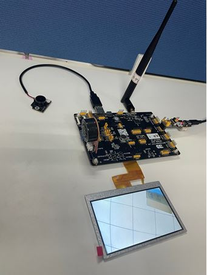

BK-RLK Multi-media demo
========================

:link_to_translation:`en:[English]`

1 Functional Overview
-------------------------------------
   Based on BK-RLK wireless communication solution,the demo realized the function of transmitting one-way video, two-way audio and local LCD display from a single devices to multiple devices. Through this demo, user can see how to realize device discovery,connection,business data transmission and low power consumption management with the help of BK-RLK wireless communication solution.

2 Demo Introduction
-------------------------------------
   BK-RLK multi-media demo is a multi-media communication system based on multiple devices supporting BK-RLK,which is divided into Client and Server.It is mainly demonstrates the use of the following functions of BK-RLK:

   - Connection communication guide between Client and Server
   - Power save guide between Client and Server
   - Video and audio transmission guide between Client and Server

Connection communication guide between Client and Server:
   BK-RLK multi-media demo communication system is a process of automatic discovery of devices,connection pairing and video transmission.This process includes serveral state transitions as shown in the following table. During device initialization,the connection state will be configured to idle state by default. When the connection process starts,the connection state will be switched to probing state,and when the connection is completed,the connection state will be switched to connection state. Video and audio communication can only be carried out when the connection state is in connection state.

+------------------+-------------------------------------------------------------------------+
| status           | Description                                                             |
+==================+=========================================================================+
| idle             | During device initialization,the default configuration connection state |
|                  | is idle state, which is used by both Client and Server.                 |
+------------------+-------------------------------------------------------------------------+
| probing          | After the device initialization completed,it goes to probing state,     |
|                  | which is used by both Client and Server.                                |
+------------------+-------------------------------------------------------------------------+
| wait probing end | After receiving the broadcast frame of Prob req, Server enters wait     |
|                  | probing end state,which is only used by Server side.                    |
+------------------+-------------------------------------------------------------------------+
| connection       | When the connection is completed,both the Client and Server enter the   |
|                  | connection state.                                                       |
+------------------+-------------------------------------------------------------------------+

Figure 1 describes the whole process of connection and communication between Client and Server in BK-RLK multi-media demo communication system. As shown in the Figure 1, both Client and Server set the connection state to idle state during initialization. Next, both Client and Server will configure BK-RLK (please refer to the Wi-Fi BK-RLK User Guide for the specific configuration of BK-RLK). After the configuration of BK-RLK is completed, Client and Server connection state will be configured as probing state.
After the connection state of Client is changed to probing state, BK-RLK data send interface will be called to continuously send Prop req broadcast frames until BK-RLK receive interface received the Prob rsp unicast frame replied by Server. Client adds the information of the peer device to the BK-RLK peer link list through the received Prob rsp frame. Client changed connection state to the connection state. Then, Client starts video and audio configuration, turns on the camera, turns on the local LCD, turns on the audio, and starts calling the BK-RLK send interface to start business data communication with the Server.
After the connection state of the Server is changed to probing state, it will be in standby state until the Prob req broadcast frame sent by the Client is received through the BK-RLK receive interface. Server will switched state to the wait probing end state and send the Prob rsp unicast frame through the BK-RLK send interface. And then,the connection state switch to the connection state after receiving the ACK. Subsequently, it starts to configure video and audio and carries out business data communication with the Client.

Note:When both the Client and Server are in the connection state,they will automatically connect each other when one of them is disconnected.

.. figure:: ../../../_static/bk_rlk_system_connection.jpg
    :align: center
    :alt: BK-RLK system connection
    :figclass: align-center

    Figure 1. communication flow chart of connection between Client and Server

Power save guide between Client and Server:
   In BK-RLK multi-media demo communication system, the Client can enter the power save state. The Client maintain work state for a period of time and then enter the power save state periodically. The information involved is shown in the following table:

+-----------+--------------------+------------------------+-----------------------------------+
| role      | information        | instruction            | comment                           |
+===========+====================+========================+===================================+
|           |                    |                        | This value determines the sleep   |
|           | RLK_RTC_LOWPOWER   | power save period,     | time of the device.The larger the |
|           | _PS_INTERVAL       | default 2s             | value is set, the lower power     |
|           |                    |                        | consumption will be. At the same  |
|           |                    |                        | time,the wake up delay may become |
|           |                    |                        | larger when peer device wake up   |
|           |                    |                        | Client device.                    |
|           +--------------------+------------------------+-----------------------------------+
| Client    |                    |                        | After the device goes into sleep, |
|           | RLK_RTC_LOWPOWER   |                        | it needs to periodically monitor  |
|           | _KEEPALIVE_TIME    | work period,default    | whether there is any business.    |
|           | _INTERVAL          | 2 ms                   | This value determins the monitor  |
|           |                    |                        | time of the device. The smaller   |
|           |                    |                        | the value is set,the smaller the  |
|           |                    |                        | work time and power consumption   |
|           |                    |                        | will be, and it may alse affect   |
|           |                    |                        | the wake-up delay.                |
|           +--------------------+------------------------+-----------------------------------+
|           |                    | sscom cmd. Input by    | The API function can be called to |
|           | rlkc ps            | Client, Client devices | realize this function in the      |
|           |                    | enter sleep mode.      | un-cmd situation.                 |
+-----------+--------------------+------------------------+-----------------------------------+
|           |                    | sscom cmd. Input by    | The API function can be called to |
| Server    | rlks wakeup_peer   | Server,wake up Client  | realize this function in the      |
|           |                    | device and keep work   | un-cmd situation.                 |
|           |                    | mode.                  |                                   |
+-----------+--------------------+------------------------+-----------------------------------+

BK-RLK power save usage can be divided into Client and Server:
Client input rlkc ps cmd,whether the cmd takes effect,there are the following forms:

 - Video and audio in progress will stop immediately;
 - Using the current detection tool to see that the peak current drops immediately;

Note:After input rlkc ps cmd,the client device will work with the configured sleep/work cycle. At this time ,all business is stopped. The API function rlk_client_ps_cmd_handler() can be called to realize this function in the un-cmd situation.

Server input rlks wakeup_peer cmd. Server will print WAKEUP PEER SUCCESS information when successfully wake up client.

Notes:After input rlks wakeup_peer cmd, Client device will still work in the configured sleep/work cycle untile the successful print information is received. Business has not been resumed for the Client device. After received the successful print information, Client current returns to the peak value and work again. There is a delay between the input of the cmd and the successful wake up the peer. It depends on the current air environment and the configured sleep cycle and work cycle length. The API function rlk_server_wakeup_peer() can be called to realize this function in the un-cmd situation.

The specific wake up process is shown in Figure 2 below:

.. figure:: ../../../_static/bk_rlk_system_ps.jpg
    :align: center
    :alt: BK-RLK system ps
    :figclass: align-center

    Figure 2. Power save flow chart of Client and Server

In an open environment, comparison of power consumption between Standerd Wi-Fi and BK-RLK using the same set of hardware devices are shown in the following table:

+-----------+-------------------------------------------------+------------------------------+
| devices   | condition                                       | average power consumption    |
+===========+=================================================+==============================+
| Wi-Fi     | Dtim20                                          | 557uA                        |
+-----------+-------------------------------------------------+------------------------------+
| BK-RLK    | RLK_RTC_LOWPOWER_PS_INTERVAL = 2s               | 320uA                        |
|           | RLK_RTC_LOWPOWER_KEEPALIVE_TIME_INTERVAL = 2ms  |                              |
+-----------+-------------------------------------------------+------------------------------+

Video and audio transmission guide between Client and Server:
   After the Client and Server are successfully paired,they automatically enter video and audio transmission mode.

3 Environment Construction
-------------------------------------
   BK-RLK multi-media communication system is divided into two parts: Client and Server. And its environment construction is described in Figure 3 and Figure 4.
   Figure 3 is a BK7256 sample device as the Client, which adds a usb camera,an LCD display and an audio broadcaster.

    Figure 3. Client environment construction

Figure 4 is a BK7256 sample device as the Server, which adds an LCD display and an audio broadcaster.

.. figure:: ../../../_static/bk_rlk_server_env.jpg
    :align: center
    :alt: BK-RLK Server
    :figclass: align-center

    Figure 4. Server environment construction

4 Code Path
-------------------------------------
   BK-RLK Multi-media system demo path: ``./projects/wifi``

   Client demo path:``./projects/wifi/rlk_av_client``

   Server demo path:``./projects/wifi/rlk_av_server``

   Client build cmd:``make bk7256 PROJECT=wifi/rlk_av_client``

   Server build cmd:``make bk7256 PROJECT=wifi/rlk_av_server``

5 Reference Materials
-------------------------------------

    `API reference: <../../api-reference/wifi/bk_wifi.html>`_ introduce BK-RLK API interface

    `BK-RLK development guide: <../../developer-guide/wifi/bk_rlk.html>`_ introduce BK-RLK user guide

    `BK-RLK project: <../../projects_work/wifi/bk_rlk_media.html>`_ introduce BK-RLK projects