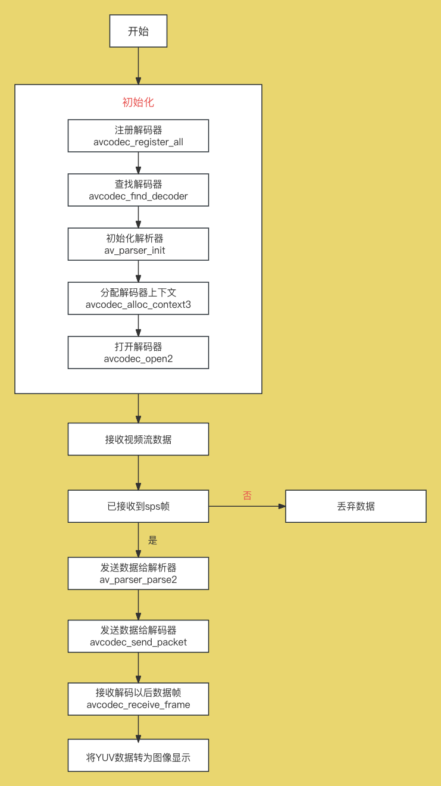

H264 Decoding
=================================

:link_to_translation:`zh_CN:[中文]`

1、H264 Decoding
--------------------

    The H264 decoding part is implemented on the mobile phone. This article uses the ffmpeg library for decoding

2、ffmpeg Official Website
----------------------------------------

	https://ffmpeg.org/

3、Decoding Process Diagram
----------------------------------------

    Figure 1. decode_flow

4、Process Explanation
-------------------------------

1. Register Decoder:``avcodec_register_all``

   Used to register all compiled codecs.

2. Find Decoder:``avcodec_find_decoder``

   Searches for the decoder corresponding to the specified decoder ID. The decoder ID for H.264 is: AV_CODEC_ID_H264.

3. Initialize Parser:``av_parser_init``

   Initializes the parser context. The parser can be used for preprocessing input data before processing the data stream, such as finding frame boundaries, extracting key information, etc.

4. Allocate Decoder Context:``avcodec_alloc_context3``

   Allocates an AVCodecContext structure and sets default values. AVCodecContext is a data structure in ffmpeg used to store the context information of the codec.

5. Open Decoder:``avcodec_open2``

   Opens the decoder and initializes its context (AVCodecContext). After initializing the decoder context, this function opens the decoder to start the decoding process.

6. Receive Data

   Before starting decoding each time, check if the data starts with an sps frame. Only start decoding when the data with sps beginning is found; otherwise, discard the data without decoding.

7. Send Data to Parser:``av_parser_parse2``

   Parses the input media data stream, usually used to find frame boundaries.

8. Send Data to Decoder:``avcodec_send_packet``

   Used to send data packets to the decoder for decoding. It sends the input data packet to the decoder context for decoding.

9. Receive Decoded Data Frames:``avcodec_receive_frame``

   Used to receive the decoded frames from the decoder. After using the ``avcodec_send_packet`` function to send data packets for decoding, ``avcodec_receive_frame`` can be used to obtain the decoded image frames from the decoder.
