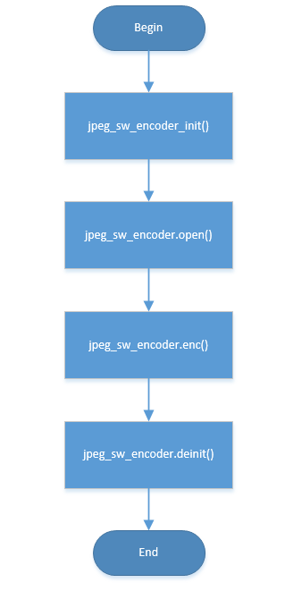

JPEG ENCODE SW
=================================

:link_to_translation:`en:[English]`

1.JPEG ENCODE SW FLOW
----------------------

The JPEG software encoding flow is as follows:

1)	Input data format convert(This step is optional:it is necessary to convert input data format if it is not YVYU422);

2)	Initialization /apply inner encoding buffer/image output buffer;

3)	Fill the JPEG header;

4)	excute DCT/quantization/huffman coding with 16x8 block size,fill the compressed bits to output buffer;

5)	repeat step 4 until error or end of encoding;

    Figure 1. jpeg soft encode process

2.Memory requirement
----------------------

JPEG software encoding thread need less than 3K bytes stack,other buffers and description of them is as follows:

1) one 512bytes inner buffer to save 16x8 block output compressed bits;
2) one 64k bytes buffer as image output buffer(This buffer size is modifiable according to the requirement)

3.JPEG softeware API usage
----------------------------

1) call `jpeg_sw_encoder_init` ,initialize JPEG software encoding module/register callback functions like:open/enc/reset/deinit;

2) call `jpeg_sw_encoder.open` ,initialize codec inner parameters /apply inner buffer;

3) call `jpeg_sw_encoder.enc` ,excute JPEG software encoding;

4) call `jpeg_sw_encoder.deinit` ,release inner buffer/close JPEG software encoder;

API Reference `API Reference : <../../api-reference/multi_media/bk_jpegenc_sw.html>`_

4.JPEG SW encoding example
----------------------------

See jpeg_sw_enc_test.c for details

