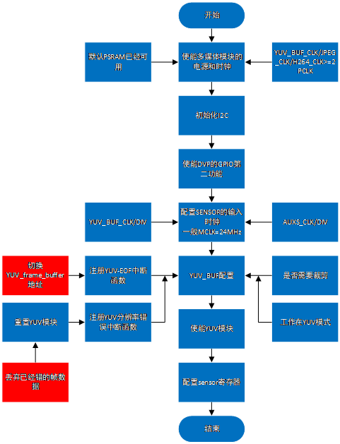

DVP Camera 详解
=======================

:link_to_translation:`en:[English]`

1 DVP简介
--------------------------
 当前DVP摄像头是基于CIS接口，仅支持20/24Pin的8bit数据输出。是通过I2C协议对sensor内部寄存器机型配置，以达到需要输出的分辨率、帧率以及曝光等性能调节。 
 另外针对sensor输出的数据，需要使用硬件模块做进一步的编辑，比如使用YUV_BUF模块对sensor输出的YUV422数据做裁剪，做转换，比如转换成YUV420，然后使用H264模块进行编码， 减小内存空间的使用，以做更多的功能；
 或者直接针对YUV422数据使用JPEG模块进行编码，输出更加稳定且内存空间使用较小的图像。

2 DVP目前支持的类型与规格
--------------------------

+----------+---------------+-----------+----------+---------+
| name     |     分辨率    |   帧率	  | MCLK(MHz)| 输出格式|        
+==========+===============+===========+==========+=========+
|  GC0328C | 640X480及以下 | 25及以下  |    24    | YUV422  |                      
+----------+---------------+-----------+----------+---------+
|  GC2145  | 1280X720及以下|  23及以下 |    24    | YUV422  |           
+----------+---------------+-----------+----------+---------+
|  OV2640  | 1280X720及以下|  20以下   |    16    | YUV422  |              
+----------+---------------+-----------+----------+---------+
|  HM1055  | 1280X720      |  25及以下 |   36     | YUV422  |                    
+----------+---------------+-----------+----------+---------+

3 DVP的使用流程
------------------------  

- 1、给各个多媒体硬件模块进行上电和时钟配置，包括YUV_BUF/JPEG/H264模块，并且给sensor供电；
- 2、初始化I2C，因为需要利用I2C配置DVP寄存器，明确DVP的write/read地址
- 3、配置DVP的GPIO第二功能，使输出能实时被检测
- 4、配置sensor的输入时钟，时钟的来源有两种：对YUV_BUF的时钟分频和对AUXS时钟分频
- 5、根据具体应用配置YUV_BUF/JPEG/H264的寄存器的值，同时配置DMA对数据进行处理，最后使能相关模块；
- 6、通过I2C配置sensor的寄存器值，达到理想的输出数据；

4 DVP工作模式的主要应用
------------------------

   DVP摄像头可以依赖不同的硬件模块，以达到不同的需求，下面列举了几种主要的应用。

1、DVP工作在YUV（或GRAY）模式下

   Figure 1.DVP工作在YUV（或GRAY）模式下

2、DVP工作在JPEG模式下

.. figure:: ../../../../common/_static/dvp_work_in_jpeg.png
   :align: center
   :alt: dvp_work_in jpeg
   :figclass: align-center

   Figure 2.DVP工作在JPEG模式下

3、DVP工作在H264模式下

.. figure:: ../../../../common/_static/dvp_work_in_h264.png
   :align: center
   :alt: dvp_work_in h264
   :figclass: align-center

   Figure 3.DVP工作在H264模式下

4、DVP工作在YUV和H264模式下

.. figure:: ../../../../common/_static/dvp_work_in_yuv_with_h264.png
   :align: center
   :alt: dvp_work_in——yuv_with h264
   :figclass: align-center

   Figure 4.DVP工作在YUV和H264模式下

