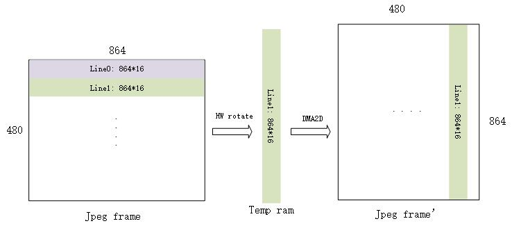

硬件旋转
=====================================

:link_to_translation:`en:[English]`

1、功能概述
--------------------

本文档主要介绍了硬件旋转的功能以及API使用。

硬件旋转的主要功能如下：

	1. 支持输入为YUV422，输出为RGB565，无旋转
	2. 支持输入RGB565数据，输出为RGB565，正/逆旋转90度
	3. 支持输入为YUV422， 输出为RGB565，正/逆旋转90度
	4. 旋转硬件是按块旋转，其中块与块旋转之间可以配置延时，减少总线压力
	5. 支持块watermark和complete中断

硬件旋转的主要限制如下：

.. ATTENTION::

	1. 旋转块长宽必须为偶数行
	2. 旋转块长的宽必须被图片长宽整除，如果不是整除，会导致旋转后显示异常
	3. 设置的源/目标地址需要4字节对齐，因为YUV数据1个word的连续性
	4. 只支持旋转后输出为RGB565的数据；

2、参考代码
--------------------

	参考工程为 `DOORBELL工程 <../../projects_work/media/doorbell/index.html>`_

	硬件旋转的组件代码请参考 ``components/multimedia/lcd/lcd_rotate.c`` 和 ``components/image_codec_unit/src/pipeline/yuv_rotate_pipeline.c`` 

	硬件旋转驱动代码参考 `hw_rotate驱动代码 <../../api-reference/multi_media/bk_hw_rotate.html>`_

3、API使用说明
----------------------------
硬件旋转的使用比较简单，只需要三步：

1) 初始化硬件模块,用户可以选择使能中断的类型，工程中默认都打开，其中ROTATE_WARTERMARK_INT为旋转一半中断。

::

	bk_rott_driver_init();
	bk_rott_int_enable(ROTATE_COMPLETE_INT | ROTATE_CFG_ERR_INT | ROTATE_WARTERMARK_INT, 1);
	bk_rott_isr_register(ROTATE_COMPLETE_INT, rotate_complete_cb);
	bk_rott_isr_register(ROTATE_WARTERMARK_INT, rotate_watermark_cb);
	bk_rott_isr_register(ROTATE_CFG_ERR_INT, rotate_cfg_err_cb);

2) 配置旋转参数，并使能旋转：

::

	rott_config_t rott_cfg = {0};
	dst->fmt = PIXEL_FMT_RGB565_LE;
	rott_cfg.input_addr = src->frame;   //旋转源数据地址
	rott_cfg.output_addr = dst->frame;  //旋转输出地址
	rott_cfg.rot_mode = ROTATE_90;      //旋转角度配置

	switch (src->fmt)                  // 数据源的像素格式
	{
		case PIXEL_FMT_YUYV:
			rott_cfg.input_fmt = src->fmt;
			rott_cfg.input_flow = ROTT_INPUT_NORMAL;
			rott_cfg.output_flow = ROTT_OUTPUT_NORMAL;
			break;
		case PIXEL_FMT_VUYY:
			rott_cfg.input_fmt = src->fmt;
			rott_cfg.input_flow = ROTT_INPUT_NORMAL;
			rott_cfg.output_flow = ROTT_OUTPUT_NORMAL;
			break;
		case PIXEL_FMT_RGB565_LE:
			rott_cfg.input_fmt = src->fmt;
			rott_cfg.input_flow = ROTT_INPUT_REVESE_HALFWORD_BY_HALFWORD;
			rott_cfg.output_flow = ROTT_OUTPUT_NORMAL;
			break;
		case PIXEL_FMT_RGB565:
		default:
			rott_cfg.input_fmt = src->fmt;
			rott_cfg.input_flow = ROTT_INPUT_REVESE_HALFWORD_BY_HALFWORD;
			rott_cfg.output_flow = ROTT_OUTPUT_NORMAL;
			break;
	}
	rott_cfg.picture_xpixel = src->width;
	rott_cfg.picture_ypixel = src->height;
	rott_config(&rott_cfg);
	bk_rott_enable();

3) 旋转完成后，进入旋转完成中断

4、 旋转和DMA2D结合，实现按行旋转
----------------------------------------
对于BK7258现有的工程，对图片解码有整帧和按行实现的两种方案，那么对于按行解码，就必须按行旋转，由于旋转模块的配置只有整帧旋转的功能，所以
需要将一次按行解码的数据作为一整帧去旋转，此时，需要开辟一个内存暂存旋转之后的数据，然后通过DMA2D组合为一整帧图片，
按行旋转的代码在 ``components/image_codec_unit/src/pipeline/yuv_rotate_pipeline.c`` 中,实现框图可以参考下图：

    Figure. 整帧图片按行旋转

其中：

::

	rott_cfg.picture_xpixel = 864;
	rott_cfg.picture_ypixel = 16;