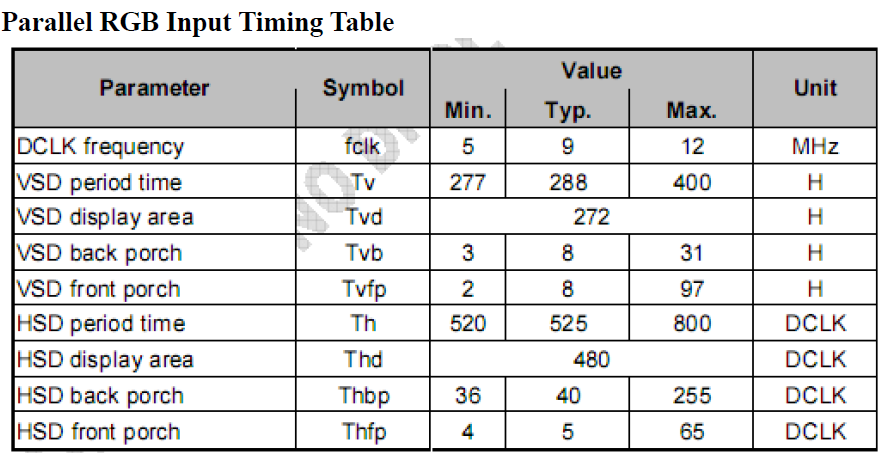

lcd user guide
=====================================

:link_to_translation:`en:[English]`

1、功能概述
--------------------

	本文档主要介绍了Display的API使用，

2、参考代码
--------------------

	参考工程为 `DOORBELL工程 <../../projects_work/media/doorbell/index.html>`_

	参考组件代码在 ``components\display_service``

	Display驱动代码参考 `display驱动 <../../api-reference/multi_media/bk_display.html>`_

3、LCD驱动接口
----------------------------

LCD Display模块支持3种LCD硬件接口，分别为I(intel)8080接口，RGB接口和QSPI接口。

3.1、8080 接口
***************************************

 - 支持MCU8080接口，数据支持最大18线DB[17:0]
 - 支持输入数据格式：RGB565, RGB888,YUV422
 - 支持TE中断
 - 支持输出的数据格式为RGB565，使用的D[7:0]8线传输
 - 支持输出RGB666，使用的D[17:0]18线传输
 - 支持输出 RGB888，包括16线输出和8线输出
 - 支持最大的刷屏时钟为80Mhz，支持的屏幕分辨率有屏幕类型与分辨率规格见 `外设支持 <../../support_peripherals/index.html>`_

3.2、RGB 接口
***************************************

 - 数据支持最大24线，包括R,G,B 各8根
 - 支持输入数据格式：RGB565, RGB888,YUV422
 - 支持输出的数据格式：RGB565, RGB666, RGB888
 - 最大刷屏时钟为80Mhz，支持的屏幕分辨率有屏幕类型与分辨率规格见 `外设支持 <../../support_peripherals/index.html>`_

3.3、QSPI 接口
***************************************

 - QSPI的用户使用代码请参考 ``components\display_service\src\lcd_qspi_display_service.c``
 - QSPI的驱动代码请参考 ``bk_idk\middleware\driver\lcd\lcd_qspi_driver.c``

3.4、SPI 接口
***************************************

 - SPI的用户使用代码请参考 ``components\display_service\src\lcd_spi_display_service.c``

4、 新增屏幕适配
-----------------------------

4.1、8080/RGB 接口
***************************************

1) 用户在 ``.components/bk_peripheral/src/lcd`` 路径下新增屏幕，具体可以参考其中某一个屏幕，比如新增lcd_xxx.c。

2) 针对RGB屏幕需要根据lcd spec 修改hsync/vsync proch，取值范围参考 ``./include/lcd_types.h``  结构体lcd_rgb_t注释。

::

	static const lcd_rgb_t lcd_rgb =
	{
		.clk = LCD_20M,          //lcd 工作合适的时钟
		.data_out_clk_edge = NEGEDGE_OUTPUT, //rgb输出数据时钟边沿

		.hsync_pulse_width = 2,
		.vsync_pulse_width = 2,
		.hsync_back_porch = 40, 
		.hsync_front_porch = 5, 
		.vsync_back_porch = 8,  
		.vsync_front_porch = 8, 
	};

    Figure. rgb sync params config

3) 背光控制
用户的开发板可能使用和BK7258不同的背光引脚，需要在 ``bk_idk/middleware/driver/lcd/lcd_driver.c`` 中修改如下宏：

 - #define LCD_BACKLIGHT_PWM           PWM_ID_1
 - #define LCD_BACKLIGHT_GPIO          GPIO_7

4) 初始化屏幕结构体参数

其结构体参数初始化如下：

::

	typedef struct
	{
		lcd_device_id_t id;  /**< lcd device type, user can add if you want to add another lcd device */
		char *name;          /**< lcd device name */
		lcd_type_t type;     /**< lcd device hw interface */
		media_ppi_t ppi;     /**< lcd device x y size */
		pixel_format_t src_fmt;  /**< source data format: input to display module data format(rgb565/rgb888/yuv)*/
		pixel_format_t out_fmt;   /**< display module output data format(rgb565/rgb666/rgb888), input to lcd device,*/
		union {
			const lcd_rgb_t *rgb;  /**< RGB interface lcd device config */
			const lcd_mcu_t *mcu;  /**< MCU interface lcd device config */
			const lcd_qspi_t *qspi;/**< QSPI interface lcd device config */
		};
		void (*init)(void);                   /**< lcd device initial function */
		bk_err_t (*lcd_off)(void);            /**< lcd off */
	} lcd_device_t;

比如lcd_st7701sn屏幕:

::

	const lcd_device_t lcd_device_st7701sn =
	{
		.id = LCD_DEVICE_ST7701SN, //屏幕ID num
		.name = "st7701sn",        //屏幕 name
		.type = LCD_TYPE_RGB565,    //屏幕接口类型 LCD_TYPE_RGB565 和LCD_TYPE_RGB 相同
		.ppi = PPI_480X854,         //屏幕分辨率
		.rgb = &lcd_rgb,            //RGB屏幕的参数配置
		.src_fmt = PIXEL_FMT_YUYV   //display取数据的像素格式
		.out_fmt = PIXEL_FMT_RGB888,//通过display模块转换后，输出给LCD的数据像素格式
		.init = lcd_st7701sn_init,  //屏幕需要初始化
		.lcd_off = NULL,
	};

其中屏幕分辨率未定义，需要在 ``./include/driver/media_types.h`` 中定义。 
新增的屏幕ID需要在 ``./include/driver/lcd_types.h`` 中定义，如下：

::

	typedef enum {
		LCD_DEVICE_UNKNOW,
		LCD_DEVICE_ST7282,  /**< 480X270  RGB */
		LCD_DEVICE_HX8282,  /**< 1024X600 RGB  */
		LCD_DEVICE_GC9503V, /**< 480X800 RGB  */
		LCD_DEVICE_ST7796S, /**< 320X480 MCU  */
		LCD_DEVICE_NT35512,
	} lcd_device_id_t;

	
屏幕的初始化代码 lcd_st7701sn_init 函数一般是屏幕厂商提供，需要SPI接口给LCD发送初始化命令，一般为GPIO模拟SPI，所以需要初始化GPIO，以及根据初始化命令适配对应的SP，目前SDK中已适配了SPI3线和4线协议。

.. note::

	如果客户的电路板与BEKEN不同，则需要用户在 ``bk_idk/middleware/driver/lcd/lcd_driver.c`` 的API int32_t lcd_driver_get_spi_gpio(LCD_SPI_GPIO_TYPE_E gpio_type)中增加特定的IO;

至此，屏幕驱动的适配已经完成,调用下面的接口打开屏幕。

::

	lcd_open_t lcd_open;
	lcd_open.device_ppi = 480X800;
	lcd_open.device_name = "nt35512";
	ret = lcd_display_open(&lcd_open);

另外，有一点需要特别注意：
	 - 对于lcd设备有多个设备有相同的分辨率的情况下，必须添加使用名字传参， 不然只有分辨率不能找到指定的屏幕。
	 - 对于设备中的分辨率是唯一的（没有其他LCD有相同的分辨率），使用分辨率或者名字之一也可以找到指定的屏幕。

4.2、QSPI 接口
***************************************

1) 在 ``components/bk_peripheral/src/lcd/qspi`` 路径下新增一个QSPI接口屏幕的.c文件，命名为lcd_qspi_xxx.c，并在config.cmake文件中添加新增的.c文件参与编译

2) 根据新增QSPI屏的spec，确定屏幕的刷屏方式是按帧刷数据还是按行刷数据，并且确定读写寄存器的cmd（有些型号的QSPI屏不支持读寄存器）和写数据的cmd，若是按行刷数据的屏幕，还会存在帧开始同步cmd、行开始同步cmd以及帧结束的cmd，将这些CMD在lcd_qspi_xxx.c文件中进行定义

::

    #define LCD_QSPI_ST77903_H0165Y008T_REGISTER_WRITE_COMMAND      0xDE
    #define LCD_QSPI_ST77903_H0165Y008T_REGISTER_READ_COMMAND       0xDD
    #define LCD_QSPI_ST77903_H0165Y008T_HSYNC_COMMAND               0x60
    #define LCD_QSPI_ST77903_H0165Y008T_VSYNC_COMMAND               0x61
    #define LCD_QSPI_ST77903_H0165Y008T_VSW     (1)
    #define LCD_QSPI_ST77903_H0165Y008T_HFP     (8)
    #define LCD_QSPI_ST77903_H0165Y008T_HBP     (8)

3) 根据屏厂提供的初始化配置，在lcd_qspi_xxx.c文件中按照lcd_qspi_init_cmd_t的结构体格式编写屏幕的初始化cmd数组。其中，数据长度为0xFF时，数据的值表示延时的时间，接着定义屏幕发送数据的cmd。

::

    static const lcd_qspi_init_cmd_t st77903_h0165y008t_init_cmds[] =
    {
        {0x00, {0x14}, 0xff},
        {0x00, {0x78}, 0xff},
        {0xf0, {0xc3}, 1},
        {0xf0, {0x96}, 1},
        {0xf0, {0xa5}, 1},
        {0xe9, {0x20}, 1},
        {0xe7, {0x80, 0x77, 0x1f, 0xcc}, 4},
        {0xc1, {0x77, 0x07, 0xcf, 0x16}, 4},
        {0xc2, {0x77, 0x07, 0xcf, 0x16}, 4},
        {0xc3, {0x22, 0x02, 0x22, 0x04}, 4},
        {0xc4, {0x22, 0x02, 0x22, 0x04}, 4},
        {0xc5, {0xed}, 1},
        {0xe0, {0x87, 0x09, 0x0c, 0x06, 0x05, 0x03, 0x29, 0x32, 0x49, 0x0f, 0x1b, 0x17, 0x2a, 0x2f}, 14},
        {0xe1, {0x87, 0x09, 0x0c, 0x06, 0x05, 0x03, 0x29, 0x32, 0x49, 0x0f, 0x1b, 0x17, 0x2a, 0x2f}, 14},
        {0xe5, {0xbe, 0xf5, 0xb1, 0x22, 0x22, 0x25, 0x10, 0x22, 0x22, 0x22, 0x22, 0x22, 0x22, 0x22}, 14},
        {0xe6, {0xbe, 0xf5, 0xb1, 0x22, 0x22, 0x25, 0x10, 0x22, 0x22, 0x22, 0x22, 0x22, 0x22, 0x22}, 14},
        {0xec, {0x40, 0x03}, 2},
        {0x36, {0x0c}, 1},
    #if (CONFIG_LCD_QSPI_COLOR_DEPTH_BYTE == 3)
        {0x3a, {0x07}, 1},  //#07-RGB888
    #else
        {0x3a, {0x05}, 1},  //#05-RGB565
    #endif
        {0xb2, {0x00}, 1},
        {0xb3, {0x01}, 1},
        {0xb4, {0x00}, 1},
        {0xb5, {0x00, 0x08, 0x00, 0x08}, 4},
        {0xa5, {0x00, 0x00, 0x00, 0x00, 0x00, 0x15, 0x2a, 0x8a, 0x02}, 9},
        {0xa6, {0x00, 0x00, 0x00, 0x00, 0x00, 0x15, 0x2a, 0x8a, 0x02}, 9},
        {0xba, {0x0a, 0x5a, 0x23, 0x10, 0x25, 0x02, 0x00}, 7},
        {0xbb, {0x00, 0x30, 0x00, 0x2c, 0x82, 0x87, 0x18, 0x00}, 8},
        {0xbc, {0x00, 0x30, 0x00, 0x2c, 0x82, 0x87, 0x18, 0x00}, 8},
        {0xbd, {0xa1, 0xb2, 0x2b, 0x1a, 0x56, 0x43, 0x34, 0x65, 0xff, 0xff, 0x0f}, 11},
        {0x35, {0x00}, 1},
        {0x21, {0x00}, 0},
        {0x11, {0x00}, 0},
        {0x00, {0x78}, 0xff},
        {0x29, {0x00}, 0},
    };

4) 按照lcd_device_t的结构体格式，定义屏幕的一些基本信息，若没有相应的分辨率，需要在media_types.h文件的media_ppi_t中新增分辨率，并在lcd_types.h文件中新增屏幕的id，同时按照lcd_qspi_t结构体的格式编写qspi屏的具体信息。

::

    static uint8_t st77903_h0165y008t_cmd[4] = {0xDE, 0x00, 0x60, 0x00};

    static const lcd_qspi_t lcd_qspi_st77903_h0165y008t_config =
    {
        .clk = LCD_QSPI_48M, // MAX CLK is 50M
        .refresh_method = LCD_QSPI_REFRESH_BY_LINE,
        .reg_write_cmd = LCD_QSPI_ST77903_H0165Y008T_REGISTER_WRITE_COMMAND,
        .reg_read_cmd = LCD_QSPI_ST77903_H0165Y008T_REGISTER_READ_COMMAND,
        .reg_read_config.dummy_clk = 0,
        .reg_read_config.dummy_mode = LCD_QSPI_NO_INSERT_DUMMMY_CLK,
        .pixel_write_config.cmd = st77903_h0165y008t_cmd,
        .pixel_write_config.cmd_len = sizeof(st77903_h0165y008t_cmd),
        .init_cmd = st77903_h0165y008t_init_cmds,
        .device_init_cmd_len = sizeof(st77903_h0165y008t_init_cmds) / sizeof(lcd_qspi_init_cmd_t),

        .refresh_config.hsync_cmd = LCD_QSPI_ST77903_H0165Y008T_HSYNC_COMMAND,
        .refresh_config.vsync_cmd = LCD_QSPI_ST77903_H0165Y008T_VSYNC_COMMAND,
        .refresh_config.vsw = LCD_QSPI_ST77903_H0165Y008T_VSW,
        .refresh_config.hfp = LCD_QSPI_ST77903_H0165Y008T_HFP,
        .refresh_config.hbp = LCD_QSPI_ST77903_H0165Y008T_HBP,
    #if (CONFIG_LCD_QSPI_COLOR_DEPTH_BYTE == 3)
        .refresh_config.line_len = (PPI_400X400 >> 16) * 3,
        .frame_len = (PPI_400X400 >> 16) * 3 * (PPI_400X400 & 0xFFFF),
    #else
        .refresh_config.line_len = (PPI_400X400 >> 16) * 2,
        .frame_len = (PPI_400X400 >> 16) * 2 * (PPI_400X400 & 0xFFFF),
    #endif
    };

    //st77903 screen without display ram, and need to send data continuously.
    const lcd_device_t lcd_device_st77903_h0165y008t =
    {
        .id = LCD_DEVICE_ST77903_H0165Y008T,
        .name = "st77903_h0165y008t",
        .type = LCD_TYPE_QSPI,
        .ppi = PPI_400X400,
        .qspi = &lcd_qspi_st77903_h0165y008t_config,
        .init = NULL,
        .lcd_off = NULL,
    };

5) 在lcd_panel_devices.c文件中的lcd_devices数组中，按照格式添加新增屏幕的设备结构体地址，直到参与编译成功，此时可以通过传入LCD ID或LCD name找到设备。

::

    const lcd_device_t *lcd_devices[] =
    {
        //其他LCD设备
        ......

        #if CONFIG_LCD_QSPI_SH8601A
        &lcd_device_sh8601a,
        #endif

        #if CONFIG_LCD_QSPI_ST77903_WX20114
            &lcd_device_st77903_wx20114,
        #endif

        #if CONFIG_LCD_QSPI_ST77903_SAT61478M
            &lcd_device_st77903_sat61478m,
        #endif

        #if CONFIG_LCD_QSPI_ST77903_H0165Y008T
            &lcd_device_st77903_h0165y008t,
        #endif

        #if CONFIG_LCD_QSPI_SPD2010
            &lcd_device_spd2010,
        #endif

        #if CONFIG_LCD_SPI_ST7796U
            &lcd_device_st7796u,
        #endif
    }

4.3、SPI 接口
***************************************

    SPI屏的初始化和QPSI屏大致一样，新增设备的lcd_spi_xxx.c可参考上述QSPI接口的内容，唯一的差异是SPI屏发送每个byte前包含一个D/CX（data/command）比特位，表示data和command的区分，当D/CX为0时表示command bye，当D/CX为1时表示发送的是data byte。此外，SPI_LCD既支持使用SPI模块刷屏，又支持使用QSPI模块一线模式刷屏，默认使用QSPI模块刷屏，可通过 ``# define LCD_SPI_REFRESH_WITH_QSPI`` 进行切换。

关于不同的接口的API使用demo请参考：

RGB LCD的使用请参考工程  “https://docs.bekencorp.com/arminodoc/bk_avdk/bk7258/zh_CN/v2.0.1/projects_work/peripheral/rgb_lcd/index.html”

8080 LCD的使用请参考工程 “https://docs.bekencorp.com/arminodoc/bk_avdk/bk7258/zh_CN/v2.0.1/projects_work/peripheral/8080_lcd/index.html”

QSPI LCD的使用请参考工程 “https://docs.bekencorp.com/arminodoc/bk_avdk/bk7258/zh_CN/v2.0.1/projects_work/peripheral/qspi_lcd/index.html”

SPI LCD的使用请参考工程 “https://docs.bekencorp.com/arminodoc/bk_avdk/bk7258/zh_CN/v2.0.1/projects_work/peripheral/spi_lcd/index.html”

