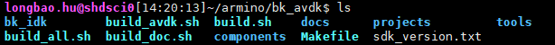

快速入门
=======================

:link_to_translation:`en:[English]`

Armino AVDK SDK代码下载
------------------------------------

您可从 gitlab 上下载 Armino AVDK SDK::

    mkdir -p ~/armino
    cd ~/armino
    git clone http://gitlab.bekencorp.com/armino/bk_avdk.git

您也可从 github 上下载 Armino AVDK SDK::

	mkdir -p ~/armino
	cd ~/armino
	git clone --recurse-submodules https://github.com/bekencorp/bk_avdk.git 
   
    
然后切换到稳定分支Tag节点, 如v2.0.1.8::

    cd ~/armino/bk_avdk
    git checkout -B your_branch_name v2.0.1.8
    git submodule update --init --recursive
    ls

    Figure 1. AVDK Directiry structure

.. note::

    从官网的gitlab下载的为最近的SDK代码，相关账号找项目上审核申请。

构建编译环境
------------------------------------

.. note::

    Armino，当前支持Linux环境下编译，本章节将以 Ubuntu 20.04 LTS 版本为例，介绍整个编译环境的搭建。

安装工具链
*************************************

点击 `下载 <https://dl.bekencorp.com/tools/toolchain/arm/gcc-arm-none-eabi-10.3-2021.10-x86_64-linux.tar.bz2>`_ 下载 BK7258 工具链。

工具包下载后，通过如下操作命令解压至 /opt/ 目录下::

    $ sudo tar -xvjf gcc-arm-none-eabi-10.3-2021.10-x86_64-linux.tar.bz2 -C /opt/

.. note::

    工具链默认路径在 middleware/soc/bk7258/bk7258.defconfig 文件中定义，您也可以在项目配置文件中更改工具链路径::

        CONFIG_TOOLCHAIN_PATH="/opt/gcc-arm-none-eabi-10.3-2021.10/bin"

安装依赖库
*************************************

在终端输入下述命令安装 python3，CMake，Ninja 以及依赖库::

    sudo dpkg --add-architecture i386
    sudo apt-get update
    sudo apt-get install build-essential cmake python3 python3-pip doxygen ninja-build libc6:i386 libstdc++6:i386 libncurses5-dev lib32z1 -y
    sudo pip3 install pycrypto click

安装 python 依赖库
*************************************

在 Armino 根目录下输入下述命令安装 python 依赖库::

    sudo pip3 install sphinx_rtd_theme future breathe blockdiag sphinxcontrib-seqdiag sphinxcontrib-actdiag sphinxcontrib-nwdiag sphinxcontrib.blockdiag

如果您的 Python 默认为 Python2，请使用下述命令更改成 Python3::

    sudo ln -s /usr/bin/python3 /usr/bin/python

编译工程
------------------------------------

在终端下输入下述命令编译 Armino AVDK默认工程，PROJECT为可选参数，默认为media/doorbell::

    cd ~/armino/bk_avdk
    make bk7258

您也可以通过 PROJECT 参数来编译 projects 下其他工程，如 make bk7258 PROJECT=media/doorbell
可以编译 projects/media/doorbell 工程。

配置工程
------------------------------------

您可以通过工程配置文件来进行更改默认配置或者针对不同芯片进行差异化配置::

    工程配置文件 Override 芯片配置文件 Override 默认配置
    如： config >> bk7258.defconfig >> KConfig
    + 工程配置文件示例：
        projects/media/doorbell/config/bk7258/config
    + 芯片配置文件示例：
        middleware/soc/bk7258/bk7258.defconfig
    + KConfig 配置文件示例：
        middleware/arch/cm33/Kconfig
        components/bk_cli/Kconfig

新建工程
------------------------------------

BK7258 默认工程为 projects/media/doorbell，新建工程可参考 projects/media下面的其他工程

烧录代码
------------------------------------

Armino 支持在 Windows/Linux 平台进行固件烧录, 烧录方法参考烧录工具中指导文档。
以Windows 平台为例， Armino 目前支持 UART 烧录。

具体 `烧录流程 <https://docs.bekencorp.com/arminodoc/bk_idk/bk7258/zh_CN/v2.0.1/get-started/index.html>`_ 请参考 `IDK <https://docs.bekencorp.com/arminodoc/bk_idk/bk7258/zh_CN/v2.0.1/index.html>`_