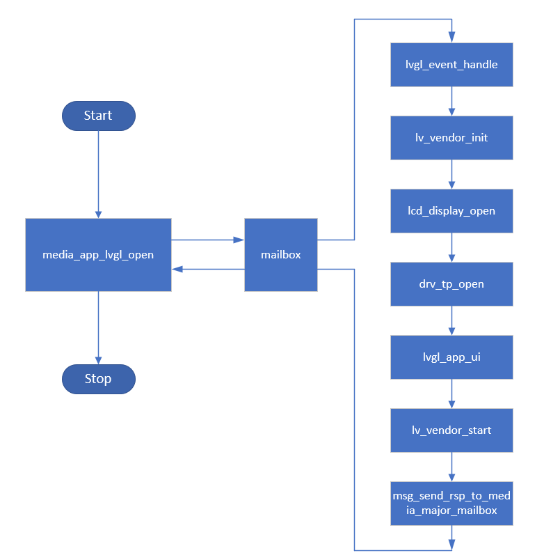

LVGL
=================================

:link_to_translation:`en:[English]`

1、功能概述
--------------------

	LVGL(Light and Versatile Graphics Library，轻量级多功能图形库)是一种免费、开源且低消耗的嵌入式图形库，具有丰富且强大的模块化图像组件，可以为任何MCU、MPU及显示类型创建美观的界面，且支持多种输入设备，已成为当前热门的图形用户界面库。LVGL官方网站地址：https://lvgl.io 。

2、参考工程
--------------------

	当前avdk提供了多种类型和用途的LVGL demo参考工程，参考工程的代码路径： ``\projects\lvgl\...``，编译命令： ``make bk7258 PROJECT=lvgl/xxx``，具体工程介绍见：
	`参考工程 <../../projects_work/lvgl/index.html>`_

3、开发步骤
--------------------

由于BK7258多媒体执行在CPU1上，lvgl的执行需要在CPU0上先启动CPU1，然后发送mailbox消息到CPU1上执行相关代码，最后在CPU1上执行完成后返回执行状态。该部分执行代码已封装成独立接口，如图所示，具体可按照以下步骤：

    Figure 1. lvgl framework diagram
..

 - 根据LCD屏幕的数据类型设置宏 ``CONFIG_LV_COLOR_DEPTH`` 的值，并根据需求打开LVGL所提供功能的相应宏配置；
 - 在CPU0上调用 ``media_app_lvgl_open()`` 启动CPU1并发送执行LVGL event的消息；
 - 在CPU1上定义 ``void lvgl_event_handle(media_mailbox_msg_t *msg)``，并根据 ``msg->event`` 参数执行相应的open或close代码；
 - 根据 ``msg->param`` 获取lcd的结构体信息，选择draw_buffer的内存类型并配置 ``lv_vnd_config_t`` 结构体的相应参数；
 - 调用 ``lv_vendor_init(lv_vnd_config_t *config)`` 的接口初始化lvgl的相关配置；
 - 调用 ``lcd_display_open(lcd_open_t *config)`` 初始化并打开LCD显示；
 - 若存在触摸功能，调用 ``drv_tp_open(int hor_size, int ver_size, tp_mirror_type_t tp_mirror)`` 的接口初始化TP的功能；
 - 调用lvgl提供的组件接口绘制相应的UI；
 - 调用 ``lv_vendor_start()`` 的接口创建LVGL的task开始调度执行；
 - 调用 ``msg_send_rsp_to_media_major_mailbox(media_mailbox_msg_t msg, uint32_t result, uint32_t dest)`` 返回执行状态，dest的参数为APP_MODULE。

.. note::
	lvgl的draw_buffer在选择使用sram内存时，其大小根据官方的推荐为十分之一屏幕大小的size，可以在不损失帧率的情况下节省内存。

4. 代码讲解
---------------------

::

    void lvgl_event_handle(media_mailbox_msg_t *msg)
    {
        //根据CPU0上传入的msg—>event执行相应的事件
        switch (msg->event)
        {
            case EVENT_LVGL_OPEN_IND:
                lvgl_event_open_handle(msg);
                break;

            case EVENT_LVGL_CLOSE_IND:
                lvgl_event_close_handle(msg);
                break;

            default:
                break;
        }

        //回复执行的结果到CPU0
        msg_send_rsp_to_media_major_mailbox(msg, BK_OK, APP_MODULE);
    }

    void lvgl_event_open_handle(media_mailbox_msg_t *msg)
    {
        os_printf("%s EVENT_LVGL_OPEN_IND \n", __func__);

        lv_vnd_config_t lv_vnd_config = {0};
        lcd_open_t *lcd_open = (lcd_open_t *)msg->param;

    #ifdef CONFIG_LVGL_USE_PSRAM
    #define PSRAM_DRAW_BUFFER ((0x60000000UL) + 5 * 1024 * 1024)
        lv_vnd_config.draw_pixel_size = ppi_to_pixel_x(lcd_open->device_ppi) * ppi_to_pixel_y(lcd_open->device_ppi);
        lv_vnd_config.draw_buf_2_1 = (lv_color_t *)PSRAM_DRAW_BUFFER;
        lv_vnd_config.draw_buf_2_2 = (lv_color_t *)(PSRAM_DRAW_BUFFER + lv_vnd_config->draw_pixel_size * sizeof(lv_color_t));
    #else
    #define PSRAM_FRAME_BUFFER ((0x60000000UL) + 5 * 1024 * 1024)
        //配置是否使用双draw_buffer和双frame_buffer
        lv_vnd_config.draw_pixel_size = (45 * 1024) / sizeof(lv_color_t);   //十分之一LCD屏幕大小的内存
        lv_vnd_config.draw_buf_2_1 = LV_MEM_CUSTOM_ALLOC(lv_vnd_config.draw_pixel_size * sizeof(lv_color_t));
        lv_vnd_config.draw_buf_2_2 = NULL;
        lv_vnd_config.frame_buf_1 = (lv_color_t *)PSRAM_FRAME_BUFFER;
        lv_vnd_config.frame_buf_2 = (lv_color_t *)(PSRAM_FRAME_BUFFER + ppi_to_pixel_x(lcd_open->device_ppi) * ppi_to_pixel_y(lcd_open->device_ppi) * sizeof(lv_color_t));
    #endif
        lv_vnd_config.lcd_hor_res = ppi_to_pixel_x(lcd_open->device_ppi);
        lv_vnd_config.lcd_ver_res = ppi_to_pixel_y(lcd_open->device_ppi);
        lv_vnd_config.rotation = ROTATE_NONE;   //是否进行旋转

        lv_vendor_init(&lv_vnd_config);    //初始化LVGL

        lcd_display_open(lcd_open);     //打开LCD

    #if (CONFIG_TP)
        //打开TP
        drv_tp_open(ppi_to_pixel_x(lcd_open->device_ppi), ppi_to_pixel_y(lcd_open->device_ppi), TP_MIRROR_NONE);
    #endif

        //LVGL应用UI
        lv_vendor_disp_lock();
        lv_demo_widgets();
        lv_vendor_disp_unlock();

        lv_vendor_start();  //启动LVGL绘制
    }

5、开发说明
---------------------

 - 关于draw_buffer的选择，可通过 ``CONFIG_LVGL_USE_PSRAM`` 设置draw_buffer使用psram内存还是sram内存。
 - 调用LVGL提供的组件接口绘制相应的UI时需要使用 ``lv_vendor_disp_lock()`` 和 ``lv_vendor_disp_unlock()`` 的接口进行代码保护。
 - LVGL源码本身额外提供了许多第三方的库，包含文件系统接口、JPG解码器、BMP解码器、PNG解码器以及GIF解码器等等，由于系统SRAM内存的限制，这些解码器只能解码小分辨率的图片进行显示，对于大分辨率的图像，可使用PSRAM内存进行解码。
 - LVGL使用PNG、JPG和GIF解码器进行解码时，需要打开lv_conf.h文件中对应的宏，分别为 ``LV_USE_PNG`` ``LV_USE_SJPG`` 和 ``LV_USE_GIF``。
 - 关于LVGL文件系统：sdk目前即可支持fatfs，也可支持littlefs，是基于bk_vfs的posix接口实现（可参考cli_vfs.c)，在使用时，打开 ``CONFIG_VFS``，依据需要选择littlefs还是fatfs（``CONFIG_FATFS / CONFIG_LITTLEFS``），若使用FATFS文件系统，还可选择另外一种方式进行，只需打开 ``CONFIG_FATFS``，并将lv_conf.h文件中的 ``LV_USE_FS_FATFS`` 设置为1。
 - 在使用PNG、JPG和GIF解码器选择PSRAM内存进行解码时，不需要打开 ``CONFIG_LVGL_USE_PSRAM`` 的宏。
 - 关于LVGL旋转功能的使用方法，LVGL本身自带软件旋转功能，可通过函数 ``lv_disp_set_rotation()`` 传入参数 ``LV_DISP_ROT_90`` 、 ``LV_DISP_ROT_180`` 和 ``LV_DISP_ROT_270`` 实现90度、180度和270度的图像旋转，但由于该功能存在缺陷，仅适用于显示屏宽和高相同的屏幕，对于宽和高不相同的屏幕，旋转90度和270度就会造成图像显示异常。针对该问题，且在显示屏硬件无法更改显示方向的情况下，SDK提供了一种额外的旋转功能，通过该功能可以实现图像90度旋转显示、180度旋转显示和270度旋转显示，具体实现是：在主函数中调用函数 ``lv_vendor_init(lv_vnd_config_t *config)`` 初始化LVGL时，对结构体 ``lv_vnd_config_t`` 中的 ``rotation`` 参数进行赋值，可传入 ``ROTATE_NONE``、 ``ROTATE_90``、 ``ROTATE_180`` 和 ``ROTATE_270`` 四种值，分别表示不旋转、旋转90度、旋转180度和旋转270度。
 - 关于freetype字体库的使用，需要将自己文件打包成bin文件并烧录到user分区地址，同时将lv_conf.h文件中的 ``LV_USE_FREETYPE`` 设置为1，并配置 ``CONFIG_MEDIA_UI_TASK_STACK_SIZE`` 来扩大栈空间，使用freetype字体需要消耗更大的栈空间。
 - 关于资源文件如何打包成bin文件，根据选择的文件系统类型，选择对应的打包工具，工具可咨询FAE。
 - LVGL的工程已加入到自动化分区列表中，若要重新配置分区大小，只需直接设置工程中的 ``bk7258_partitions.csv`` 文件即可，并注意一些对齐要求。

6、示例工程说明
---------------------

如下表所示，BK7258上提供了多种LVGL demo工程，用于演示不同类型不同场景的功能，具体细节可见参考工程中：`图形界面工程 <../../projects/lvgl/index.html>`_。

    +--------------------+---------------+---------------+-------------------------+
    |工程名              |LCD分辨率      |数据格式       |工程说明                 |
    +====================+===============+===============+=========================+
    |86box               |480*480        |RGB565         |86盒子演示               |
    +--------------------+---------------+---------------+-------------------------+
    |86box_smart_panel   |480*480        |RGB565         |带语音识别的86盒子演示   |
    +--------------------+---------------+---------------+-------------------------+
    |benchmark           |480*480        |RGB565         |LVGL性能跑分展示         |
    +--------------------+---------------+---------------+-------------------------+
    |camera              |480*854        |RGB565         |LVGL和camera图像切换演示 |
    +--------------------+---------------+---------------+-------------------------+
    |keypad_encoder      |800*480        |RGB565         |LVGL官方demo             |
    +--------------------+---------------+---------------+-------------------------+
    |meter               |400*400        |RGB565         |QSPI LCD动画演示         |
    +--------------------+---------------+---------------+-------------------------+
    |meter_rgb_16M       |720*1280       |RGB888         |RGB888 LCD动画演示       |
    +--------------------+---------------+---------------+-------------------------+
    |meter_spi           |320*480        |RGB565         |SPI LCD动画演示          |
    +--------------------+---------------+---------------+-------------------------+
    |music               |720*1280       |RGB565         |LVGL官方demo             |
    +--------------------+---------------+---------------+-------------------------+
    |stress              |800*480        |RGB565         |LVGL官方demo             |
    +--------------------+---------------+---------------+-------------------------+
    |widgets             |1024*600       |RGB565         |LVGL官方demo             |
    +--------------------+---------------+---------------+-------------------------+
