字库生成
=================================

:link_to_translation:`en:[English]`

1、功能概述
--------------------

	本文档主要介绍OSD中所用到的字库生成以及在代码中的适配。

2、参考路径
--------------------

	OSD参考代码在 ``components/bk_draw_blend`` 和 ``components/display_service/src/lcd_draw_blend.c``

3、字库生成
--------------------

1) 字库定义路径在 ``../components/bk_draw_blend/string.c``

::

	#if FONT_ANTI4BPP_BLACK24
	………
	#endif

2) 字库的头文件声明路径 ``../bk_idk/include/modules/lcd_font.h``

3) 字库生成的工具：FontCvt.exe

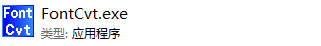

4) 双击打开FomtCvt.exe，出现下面界面：默认选择Extended，antialiased，4bpp，点击OK 

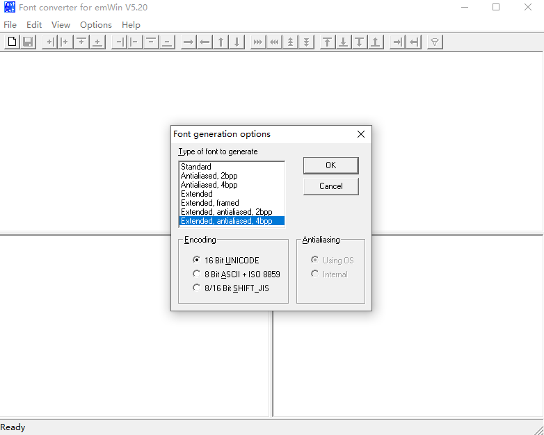

5) 出现下面的弹框，根据自己需求去修改字体、字形或者字体大小。

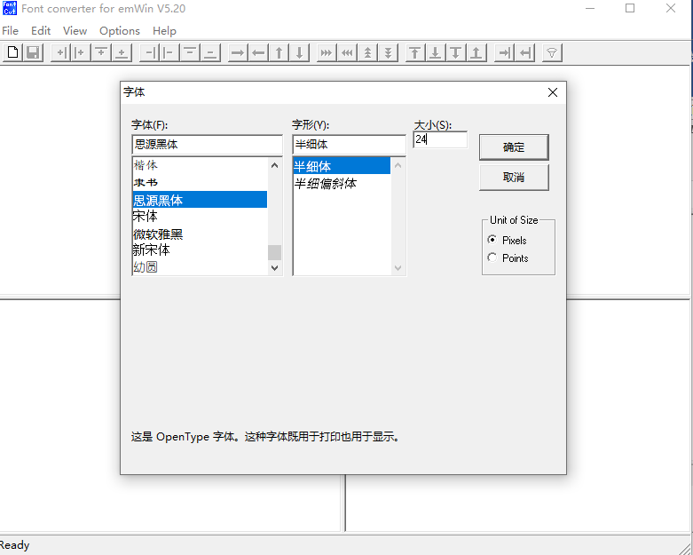

6) 选择菜单栏的edit选项，选择展开的“Disable all characters”选项

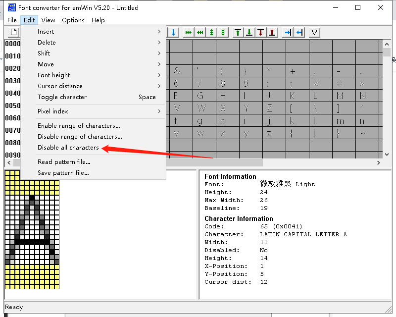

7) 选择“enable range of characters”选项,选择特定的汉字

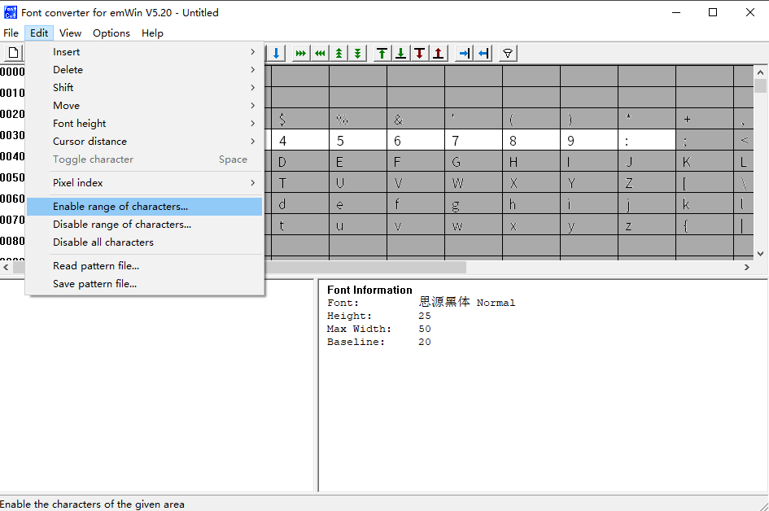

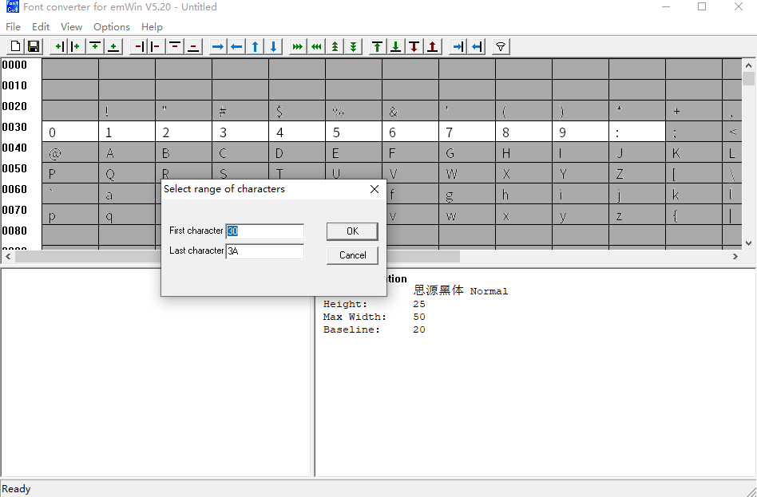

8) 或者将第7步使用下面的方式，这种方式更加便捷简单
打开记事本将所需的字另存为unicode编码格式：

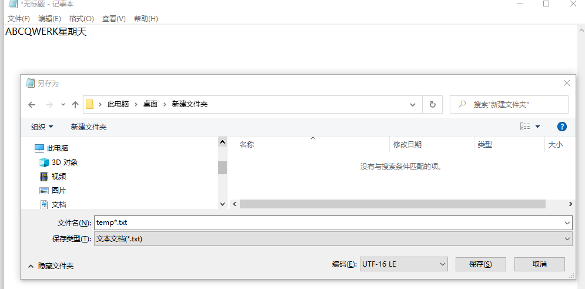

然后读入刚才的temp.txt文件

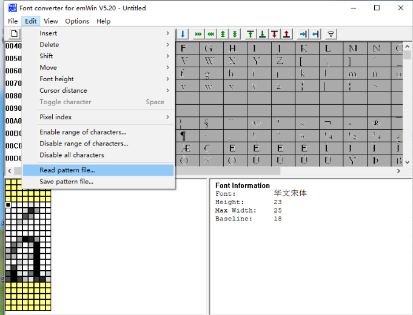

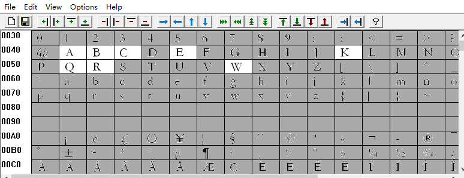

9) 选择菜单栏的File选项，选择展开的“Save AS”选项, 把生成的c文另存为，注意文件名字改成英文

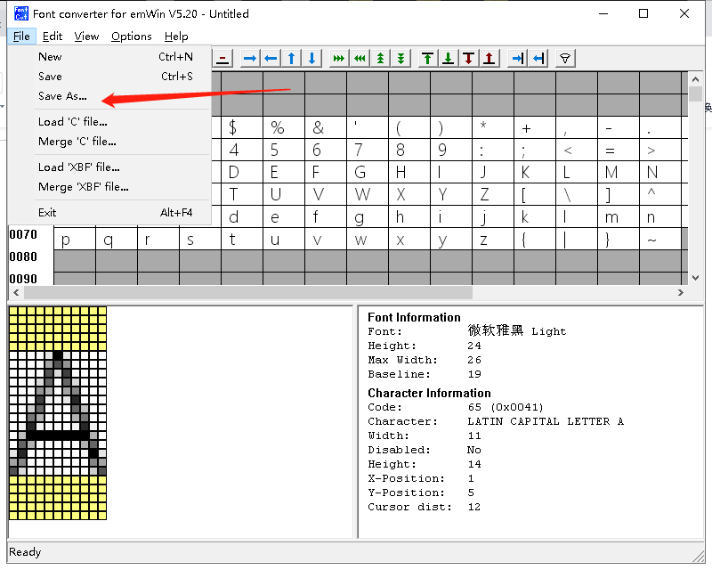

10) 用编译器打开该C文件，去掉下图的部分

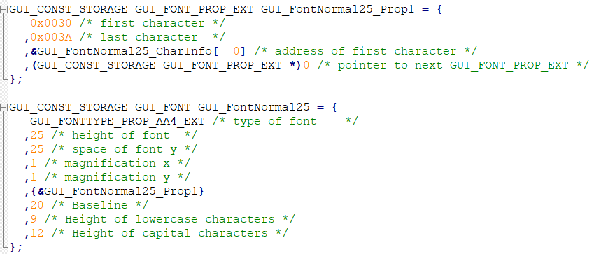

将剩余的拷贝到string.c中

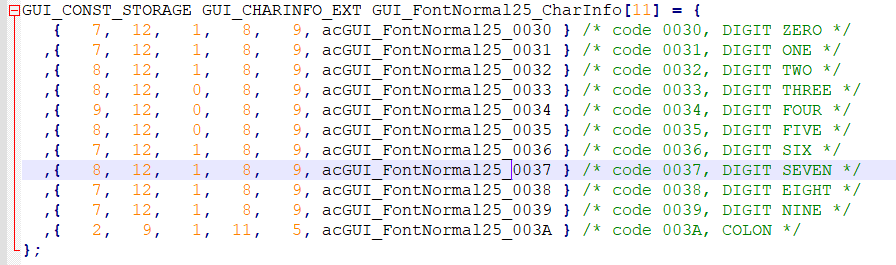

11) 参考其他的字体，将文件修改完善

::

	GUI_CONST_STORAGE gui_font_digit_struct GUI_Fontnoanti_newsong48_CharInfo[95] = {

		{1, 1, 24,  34,   0,  0,   24, NULL} //the first must 1.

		,{ 0x002E, 1, 6,   6,	3,	35, 24, acGUI_Fontnoanti_newsong48_002E } /* code 002E, FULL STOP */
		,{ 0x0030, 1,20,  33,	2,	8,	24, acGUI_Fontnoanti_newsong48_0030 } /* code 0030, DIGIT ZERO */
		,{ 0x0031, 1,13,  33,	6,	8,	24, acGUI_Fontnoanti_newsong48_0031 } /* code 0031, DIGIT ONE */
		,{ 0x0032, 1,19,  33,	2,	8,	24, acGUI_Fontnoanti_newsong48_0032 } /* code 0032, DIGIT TWO */
		,{ 0x0033, 1,18,  33,	3,	8,	24, acGUI_Fontnoanti_newsong48_0033 } /* code 0033, DIGIT THREE */
		,{ 0x0034, 1,20,  33,	2,	8,	24, acGUI_Fontnoanti_newsong48_0034 } /* code 0034, DIGIT FOUR */
		,{ 0x0035, 1,18,  33,	3,	8,	24, acGUI_Fontnoanti_newsong48_0035 } /* code 0035, DIGIT FIVE */
		,{ 0x0036, 1,20,  33,	2,	8,	24, acGUI_Fontnoanti_newsong48_0036 } /* code 0036, DIGIT SIX */
		,{ 0x0037, 1,18,  33,	3,	8,	24, acGUI_Fontnoanti_newsong48_0037 } /* code 0037, DIGIT SEVEN */
		,{ 0x0038, 1,19,  33,	2,	8,	24, acGUI_Fontnoanti_newsong48_0038 } /* code 0038, DIGIT EIGHT */
		,{ 0x0039, 1,19,  33,	2,	8,	24, acGUI_Fontnoanti_newsong48_0039 } /* code 0039, DIGIT NINE */
		,{ 0x003A, 1, 5,  23,	9,	18, 24, acGUI_Fontnoanti_newsong48_003A } /* code 003A, COLON */

		,{ 0x0056, 1,22,  33,	1,	8,	24, acGUI_Fontnoanti_newsong48_0056 } /* code 0056, LATIN CAPITAL LETTER V */
		,{ 0x004C, 1,20,  33,	2,	8,	24, acGUI_Fontnoanti_newsong48_004C } /* code 004C, LATIN CAPITAL LETTER L */

		,{0, 1, 24,  34,   0,  0,   24, NULL} //the end must 0.
	};

在刚才的字体文件中补全数组的第一行和最后一行，注意补全下方红色边框框出的逗号

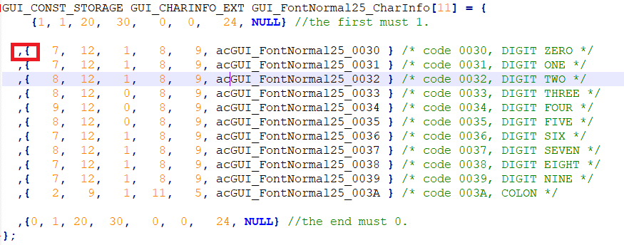

需要对文件进行如下的替换操作，下图中指向部分填充4个空格，选全部替换。

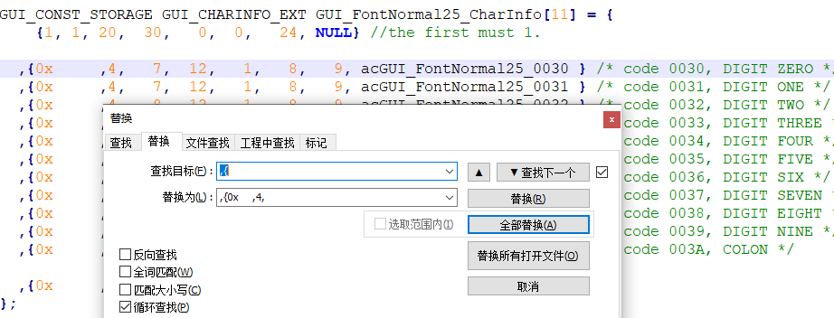

在将下图中红色框2中所有选择部分填充到前面红色框1处，可用Alt+左键，进行竖向选择。

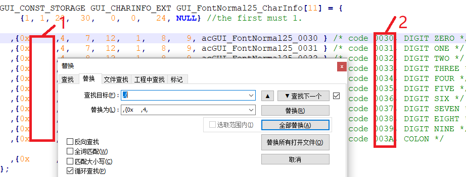

替换操作后，需要去掉下图中圈出的参数。

 .. figure::  ../../../../common/_static/osd/fontcvt-15.png
    :align: center
    :figclass: align-center

12) 最后，声明字库

::

	#if FONT_NOANTI_NEWSONG42
	extern const gui_font_digit_struct *const font_noanti_newsong42;
	#endif

.. note::

	如何确认生成字库的尺寸?
	字库的结构体中是如下定义的：

::

	typedef struct
	{
		const unsigned short value;
		const unsigned char bit_point; //every point user bit.
		const unsigned char x_size;
		const unsigned char y_size;
		const signed char x_pos;
		const signed char y_pos;
		const unsigned char width;
		const unsigned char *const data;
	}gui_font_digit_struct;

所以，字符的高度最大是用工具生成的最大像素，比如按48pixel生成的汉字，最大高度为48，实际是字符高度加上y_pos, 但是结构体中没有字符高度的表示，用户只能在工具中看到。
每个字符的宽度是结构体中的width，但是还需要加上x_pos。
所以，在做OSD中确定字符串的长宽一般是(最大宽度，最大高度), 但是可能以适当减小，只要满足实际长宽加坐标偏移量即可。

