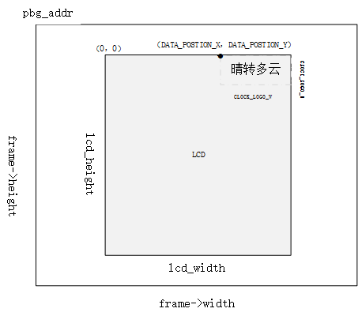

OSD视频叠加
=================================

:link_to_translation:`en:[English]`

1、功能概述
--------------------

	OSD(on screen display)，视频叠加显示, 在视频或图片上叠加字符和图标显示。
	其中，字符叠加使用的是CPU运算实现，图标叠加可以使用CPU，也可以使用DMA2D的方式实现。

2、参考代码
--------------------

	OSD参考工程在工程在 `doorbell <../../projects_work/media/doorbell/index.html>`_

	用户使用参考 `DMA2D用户手册参考 <../../display/dma2d_user_guide/dma2d_user_guide.html>`_

	OSD参考代码在 ``components/bk_draw_blend`` 和 ``components/display_service/src/lcd_draw_blend.c``

3、字库融合
--------------------

字库融合需要先生成字库，然后融合到图片上，关于字库生成的文档请参考 `字库生成 <font_generate.html>`_
调用字库的app层接口在lcd_draw_blend.c中， API具体的使用如下:

 -  start_x，start_y 刷屏的起始位置，是在图片比LCD屏幕尺寸大时，display取居中数据刷屏。
 - pixel_bytes是根据背景像素是RGB888还是YUV或RGB565定义
 - frame_addr_offset：即图标显示基于基地址的偏移量，比如时钟clock显示在屏幕坐标的（0，0）位置，那么frame_addr_offset = (start_y * frame->width + start_x) * pixel_bytes

比如天气显示在屏幕坐标的的(DATA_POSTION_X,DATA_POSTION_Y)那么 frame_addr_offset = ((start_y + DATA_POSTION_Y) * frame->width + start_x + DATA_POSTION_X) * pixel_bytes;
用户需要考虑当屏幕宽度不足够显示字符时，可能需要更改坐标计算偏移地址。

字库融合的示意图如下：

	Figure. font_osd

::

	bk_err_t lcd_font_handle(frame_buffer_t *frame, uint16_t lcd_width, uint16_t lcd_height)
	{
		#if (CONFIG_LCD_FONT_BLEND)
		lcd_font_config_t lcd_font_config = {0};

		uint16_t start_x = 0;
		uint16_t start_y = 0;
		uint32_t frame_addr_offset = 0;
		uint8_t pixel_bytes;
		if(g_blend_data.lcd_blend_type == 0)
		{
			return BK_OK;
		}
			if ((lcd_width < frame->width) || (lcd_height < frame->height)) //for lcd size is small then frame image size
			{
				if (lcd_width < frame->width)
					start_x = (frame->width - lcd_width) / 2;
				if (lcd_height < frame->height)
					start_y = (frame->height - lcd_height) / 2;
			}
			if (frame->fmt == PIXEL_FMT_RGB888)
				pixel_bytes = 3;
			else
				pixel_bytes = 2;  
		///示例一：时间融合到（0，0）位置
		if ((g_blend_data.lcd_blend_type & LCD_BLEND_TIME) != 0)         /// start display lcd (0,0)
		{
			frame_addr_offset = (start_y * frame->width + start_x) * pixel_bytes;

			lcd_font_config.pbg_addr = (uint8_t *)(frame->frame + frame_addr_offset);
			lcd_font_config.bg_offline = frame->width - CLOCK_LOGO_W;  //不需要，在DMA2D中使用
			lcd_font_config.xsize = CLOCK_LOGO_W;                      // 显示汉字的宽度
			lcd_font_config.ysize = CLOCK_LOGO_H;                      //显示汉字的高度
			lcd_font_config.str_num = 1;
			if (frame->fmt == PIXEL_FMT_VUYY)
				lcd_font_config.font_format = FONT_VUYY;               //字库融合的输出像素
			else if (frame->fmt == PIXEL_FMT_YUYV)
				lcd_font_config.font_format = FONT_YUYV;
			else
				lcd_font_config.font_format = FONT_RGB565;

			lcd_font_config.str[0] = (font_str_t){(const char *)g_blend_data.time_data, FONT_WHITE, font_digit_Roboto53, 0,0};
			lcd_font_config.bg_data_format = frame->fmt;             //背景的像素格式
			lcd_font_config.bg_width = frame->width;                 //背景的图片宽度
			lcd_font_config.bg_height = frame->height;               //背景的图片高度
			lcd_driver_font_blend(&lcd_font_config);
		 }

		///示例二：日期融合到（DATA_POSTION_X，DATA_POSTION_Y）位置
		if ((g_blend_data.lcd_blend_type & LCD_BLEND_DATA) != 0)   /// tart display lcd (DATA_POSTION_X,DATA_POSTION_Y)
		{
			if ((DATA_POSTION_X + DATA_LOGO_W) > lcd_width)
				frame_addr_offset = ((start_y + DATA_POSTION_Y + lcd_height - DATA_LOGO_H) * frame->width + start_x) * pixel_bytes;
			else
				frame_addr_offset = ((start_y + DATA_POSTION_Y) * frame->width + start_x + DATA_POSTION_X) * pixel_bytes;
			lcd_font_config.pbg_addr = (uint8_t *)(frame->frame + frame_addr_offset);
			lcd_font_config.bg_offline = frame->width - DATA_LOGO_W;
			lcd_font_config.xsize = DATA_LOGO_W;
			lcd_font_config.ysize = DVP_LOGO_H;
			lcd_font_config.str_num = 1;
			if (frame->fmt == PIXEL_FMT_VUYY)
				lcd_font_config.font_format = FONT_VUYY;
			else if (frame->fmt == PIXEL_FMT_YUYV)
				lcd_font_config.font_format = FONT_YUYV;
			else
				lcd_font_config.font_format = FONT_RGB565;

			lcd_font_config.str[0] = (font_str_t){(const char *)("晴转多云, 27℃"), FONT_WHITE, font_digit_black24, 0, 2};
			lcd_font_config.bg_data_format = frame->fmt;
			lcd_font_config.bg_width = frame->width;
			lcd_font_config.bg_height = frame->height;
			lcd_driver_font_blend(&lcd_font_config);

			lcd_font_config.pbg_addr += DVP_LOGO_H * frame->width * 2;
			lcd_font_config.str[0] = (font_str_t){(const char *)("2022-12-12 星期三"), FONT_WHITE, font_digit_black24, 0, 0};
			lcd_driver_font_blend(&lcd_font_config);
		}
			......
			
	#endif
		return BK_OK;
	}

对于lcd_driver_font_blend驱动中的实现, 关键代码如下,用户可不做了解。

:: 

		font_t font;
		font.info = (ui_display_info_struct){(unsigned char *)p_yuv_dst,0,lcd_font->ysize,0,{0}};
		font.width = lcd_font->xsize;
		font.height = lcd_font->ysize;
		font.font_fmt = lcd_font->font_format;
		for(int i = 0; i < lcd_font->str_num; i++)
		{
			font.digit_info = lcd_font->str[i].font_digit_type;
			font.s = lcd_font->str[i].str;
			font.font_color = lcd_font->str[i].font_color;
			font.x_pos = lcd_font->str[i].x_pos;
			font.y_pos = lcd_font->str[i].y_pos;
			lcd_draw_font(&font);
		}

.. note::

	需要注意的是，融合需要先将背景图片拷贝到sram中，融合后再拷贝回去，拷贝的大小是根据 lcd_font_config.xsize和lcd_font_config.ysize
	决定，所以用户需要注意的是图标的尺寸不能超过定义的尺寸,即lcd_font_config.xsize和lcd_font_config.ysize，
	图标的尺寸如何确定请参考字库生成文档 `font generate <../osd/font_generate.html>`_

4、图标融合
---------------------

图标融合需要准备如下：

 -  准备需要融合的小图标的png图片或者jpg图片（又称前景图片）
 -  将png转换为rgba8888的数据，该转换可以实现保持png的透明度，适合融合背景是透明的图标。判断图片背景是否透明，可以用photoshop查看背景是否是镂空。

 - png转换工具路径： ``components/multimedia/tools/ffmpeg_bat/png2argb`` 将所有的png图片访在该路径下，双击run.bat.

 .. figure:: ../../../../common/_static/png2rgba.png
    :align: center
    :alt: RealtimeVideo_app
    :figclass: align-center

    Figure. png to rgba8888.rgb

 - 或将jpg转换为rgb565(大端)的数据，该转换过程中将所有不透明的jpg像素默认转换为不透明，适合对背景框没有要求的融合。
 
 - 工具路径： ``components/multimedia/tools/ffmpeg_bat/jpeg2rgb565`` 将所有的jpg图片访在该路径下，双击run.bat.

 .. figure:: ../../../../common/_static/jpg2rgb565.png
    :align: center
    :alt: RealtimeVideo_app
    :figclass: align-center

    Figure. png to rgb565le.rgb

 - 使用 "HxD"或其他工具将rgb数据转成const数组并保存到flash中。
 - 在 “components/media/include/blend_logo.h” 中定义前景图片，以及前景图片的长和宽:

::

	#define WIFI_LOGO_W 32
	#define WIFI_LOGO_H 36

	const unsigned char wifi_full_rgb565[2304] = {
		0xFF, 0xFF, 0xFF, 0xFF, 0xFF, 0xFF, 0xFF, 0xFF, 0xFF, 0xFF, 0xFF, 0xFF,
		0xFF, 0xFF, 0xFF, 0xFF, 0xFF, 0xFF, 0xFF, 0xFF, 0xFF, 0xFF, 0xFF, 0xFF,
		....
	};

如果想要将前景图标融合在LCD屏幕的固定位置，还需要设置前景融合的坐标
比如：想要将版本号的前景图标(16x36)从屏幕(480x800)的第500行，居中的位置开始融合，可以这样设置：

::

	#define VERSION_POSTION_Y   500   //HIGH 800
	#define VERSION_POSTION_X   144   //WIDTH 480 "BK7 V1.23.45"  (480-(12*16))/2    12个字节, 图标宽16

4.1 DMA2D融合
*****************************

	DMA2D融合需要用到硬件DMA2D模块，该硬件模块只有一个，应该尽量避免DMA2D在别处使用。
	DMA2D融合的参考代码如下，用户需要传入logo图片的地址，图标的长宽，图标在LCD上显示的坐标等。
	比如要融合的wifi图标在在屏幕的右上角，即屏幕坐标 lcd_blend.xpos = lcd_width - WIFI_LOGO_W 处开始融合，代码如下：

::

	bk_err_t lcd_dma2d_handle(frame_buffer_t *frame,  uint16_t lcd_width, uint16_t lcd_height)
	{
	#if (CONFIG_LCD_DMA2D_BLEND)
		lcd_blend_t lcd_blend = {0};

		if(g_blend_data.lcd_blend_type == 0)
		{
			return BK_OK;
		}
		if ((g_blend_data.lcd_blend_type & LCD_BLEND_WIFI) != 0)      /// start display lcd (xpos,ypos)
		{
			if(g_blend_data.wifi_data > WIFI_LEVEL_MAX - 1)
				return BK_FAIL;
			lcd_blend.pfg_addr = (uint8_t *)wifi_logo[g_blend_data.wifi_data];
			lcd_blend.pbg_addr = (uint8_t *)(frame->frame);
			lcd_blend.xsize = WIFI_LOGO_W;               //logo width
			lcd_blend.ysize = WIFI_LOGO_H;               //logo height
			lcd_blend.xpos = lcd_width - WIFI_LOGO_W;   
			lcd_blend.ypos = WIFI_LOGO_YPOS;
			lcd_blend.fg_alpha_value = FG_ALPHA;
			lcd_blend.fg_data_format = ARGB8888;
			lcd_blend.bg_data_format = frame->fmt;
			lcd_blend.bg_width = frame->width;
			lcd_blend.bg_height = frame->height;
			lcd_blend.lcd_width = lcd_width;
			lcd_blend.lcd_height = lcd_height;
			lcd_dma2d_driver_blend(&lcd_blend);
		}
	#endif
	return BK_OK;
	}

下面为具体的DMA2D实现,用户可以简单了解，感兴趣的话可以详细参考DMA2D驱动代码``/api-reference/multi_media/bk_dma2d.html``

::

	bk_err_t lcd_dma2d_driver_blend(lcd_blend_t *lcd_blend)
	{
	#if CONFIG_LCD_DMA2D_BLEND
		uint16_t lcd_start_x = 0;
		uint16_t lcd_start_y = 0;
		if ((lcd_blend->lcd_width < lcd_blend->bg_width)  || (lcd_blend->lcd_height < lcd_blend->bg_height)) //for lcd size is small then frame image size
		{
			if (lcd_blend->lcd_width < lcd_blend->bg_width)
				lcd_start_x = (lcd_blend->bg_width - lcd_blend->lcd_width) / 2;
			if (lcd_blend->lcd_height < lcd_blend->bg_height)
				lcd_start_y = (lcd_blend->bg_height - lcd_blend->lcd_height) / 2;
		}
			//if bg data is rgb565(after hw rotate)
			dma2d_offset_blend_t dma2d_config;

			dma2d_config.pfg_addr = (char *)lcd_blend->pfg_addr;
			dma2d_config.pbg_addr = (char *)lcd_blend->pbg_addr;
			dma2d_config.pdst_addr = (char *)lcd_blend->pbg_addr;
			dma2d_config.fg_color_mode = DMA2D_INPUT_ARGB8888; 
			switch (lcd_blend->bg_data_format)
			{
				case PIXEL_FMT_YUYV:
					dma2d_config.bg_color_mode = DMA2D_INPUT_YUYV;
					dma2d_config.dst_color_mode = DMA2D_OUTPUT_YUYV;
					break;
				case PIXEL_FMT_VUYY:
					dma2d_config.bg_color_mode = DMA2D_INPUT_VUYY;
					dma2d_config.dst_color_mode = DMA2D_OUTPUT_YUYV;
					break;
				case PIXEL_FMT_RGB888:
					dma2d_config.bg_color_mode = DMA2D_INPUT_RGB888;
					dma2d_config.dst_color_mode = DMA2D_OUTPUT_RGB888;
					break;
				case PIXEL_FMT_RGB565:
					default:
					dma2d_config.bg_color_mode = DMA2D_INPUT_RGB565;
					dma2d_config.dst_color_mode = DMA2D_OUTPUT_RGB565;
					break;
			}
			dma2d_config.fg_red_blue_swap = DMA2D_RB_SWAP ;
			dma2d_config.bg_red_blue_swap = DMA2D_RB_REGULAR;
			dma2d_config.dst_red_blue_swap = DMA2D_RB_REGULAR;
			
			dma2d_config.fg_frame_width = lcd_blend->xsize;
			dma2d_config.fg_frame_height = lcd_blend->ysize;
			dma2d_config.bg_frame_width = lcd_blend->bg_width;
			dma2d_config.bg_frame_height = lcd_blend->bg_height;
			dma2d_config.dst_frame_width = lcd_blend->bg_width;
			dma2d_config.dst_frame_height = lcd_blend->bg_height;

			dma2d_config.fg_frame_xpos = 0;
			dma2d_config.fg_frame_ypos = 0;
			dma2d_config.bg_frame_xpos = lcd_start_x + lcd_blend->xpos;
			dma2d_config.bg_frame_ypos = lcd_start_y + lcd_blend->ypos;
			dma2d_config.dst_frame_xpos = lcd_start_x + lcd_blend->xpos;
			dma2d_config.dst_frame_ypos = lcd_start_y + lcd_blend->ypos;
			
			dma2d_config.fg_pixel_byte = FOUR_BYTES;
			dma2d_config.bg_pixel_byte = TWO_BYTES;
			dma2d_config.dst_pixel_byte = TWO_BYTES;
			
			dma2d_config.dma2d_width = lcd_blend->xsize;
			dma2d_config.dma2d_height = lcd_blend->ysize;
			dma2d_config.fg_alpha_mode = DMA2D_NO_MODIF_ALPHA;
			dma2d_config.bg_alpha_mode = DMA2D_REPLACE_ALPHA;
			bk_dma2d_offset_blend(&dma2d_config);
			bk_dma2d_start_transfer();
	#if (USE_DMA2D_BLEND_ISR_CALLBACKS == 1)
			if (rtos_get_semaphore(&s_blend.dma2d_complete_sem, BEKEN_NEVER_TIMEOUT) != BK_OK)
			{
				LOGE("%s, dma2d_complete_sem get failed: %d\n", __func__);
			}
	#else
			while (bk_dma2d_is_transfer_busy()) {}
	#endif

	#endif  //CONFIG_LCD_DMA2D_BLEN
		return BK_OK;
	}

4.2 CPU融合
**************************

CPU融合主要是将ARGB8888和yuv数据通过CPU计算叠加到背景图片中
CPU融合的代码如下：

::

	bk_err_t lcd_font_handle(frame_buffer_t *frame, uint16_t lcd_width, uint16_t lcd_height)
	{
		 ...........
		 
		if ((g_blend_data.lcd_blend_type & LCD_BLEND_WIFI) != 0)      /// start display lcd (lcd_width,0)
		{
			lcd_blend_t lcd_blend = {0};
			LOGD("lcd wifi blend level =%d \n", g_blend_data.wifi_data);
			frame_addr_offset = (start_y * frame->width + start_x + (lcd_width - WIFI_LOGO_W)) * pixel_bytes;

			lcd_blend.pfg_addr = (uint8_t *)wifi_logo[g_blend_data.wifi_data];
			lcd_blend.pbg_addr = (uint8_t *)(frame->frame + frame_addr_offset);
			lcd_blend.fg_offline = 0;
			lcd_blend.bg_offline = frame->width - WIFI_LOGO_W;
			lcd_blend.xsize = WIFI_LOGO_W;
			lcd_blend.ysize = WIFI_LOGO_H;
			lcd_blend.fg_alpha_value = FG_ALPHA;
			lcd_blend.fg_data_format = ARGB8888;
			lcd_blend.bg_data_format = frame->fmt;
			lcd_blend.bg_width = frame->width;
			lcd_blend.bg_height = frame->height;
			lcd_driver_blend(&lcd_blend);
		}
		
		.........
		
		return BK_OK;
	}

5. 注意事项
---------------------------------

.. attention::

	对于CPU进行图片小图标融合，背景数据为YUV数据（一般为解码后的YUV数据），软件实现是将融合坐标点处的背景拷贝出来，拷贝的大小和小图标size一样,将拷贝的数据暂存在blend_addr1内存中，
	然后直接将ARGB8888的小图标数据和背景融合到该地址blend_addr1中，如果小图标还需要额外的旋转，则需要增加一块相同内存大小的内存blend_addr2。
	如果不需要小图标的旋转，则只需要一块内存即可，该内存的大小应大于小图标的大小。
	
	
	blend_addr1 和 blend_addr2 内存的申请在 “components/bk_draw_blend/draw_blend.c" 的API: bk_err_t lcd_blend_malloc_buffer(void)中，
	用户可以根据需要修改该内存的大小，如果不需要blend_addr2 可以不申请。
	
	即:

	::
	
		lcd_blend.xsize = WIFI_LOGO_W;
		lcd_blend.ysize = WIFI_LOGO_H;
	
		需要保证 WIFI_LOGO_W * WIFI_LOGO_H * 2 < blend_addr1

	其中 lcd_blend_malloc_buffer中的实现如下：

	::
	
		blend_addr1 = (uint8_t *)os_malloc(LCD_BLEND_MALLOC_SIZE);
		blend_addr2 = (uint8_t *)os_malloc(LCD_BLEND_MALLOC_RG4B_SIZE);

.. attention::

	对于CPU进行字库小图标融合，背景数据为YUV（一般为解码后的YUV数据）或RGB565数据，软件实现是直接将汉字画到背景YUV/RGB565数据中，所以需要将背景中的YUV数据拷贝到blend_addr1中，
	如果不需要小图标的旋转，即不需要申请blend_addr2,只需要保证：

	::
	
		lcd_font_config.xsize = CLOCK_LOGO_W;
		lcd_font_config.ysize = CLOCK_LOGO_H;
		
		CLOCK_LOGO_W * CLOCK_LOGO_H * 2 < blend_addr1

.. attention::

	对于DMA2D硬件融合，是硬件直接将前景图片融合到背景的指定坐标点，不需要申请额外的内存，背景数据格式可以为YUV/RGB565/RGB888，前景为ARGB8888，还可以设置前景的透明度。所以，
	对于图标的融合使用优先选择硬件DMA2D，但是由于DMA2D在doorbell工程中（按行解码旋转模式）作为拷贝数据已经使用，所以工程中默认使用CPU融合。