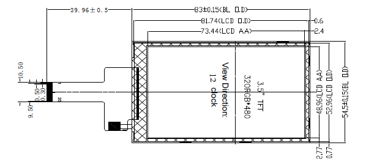
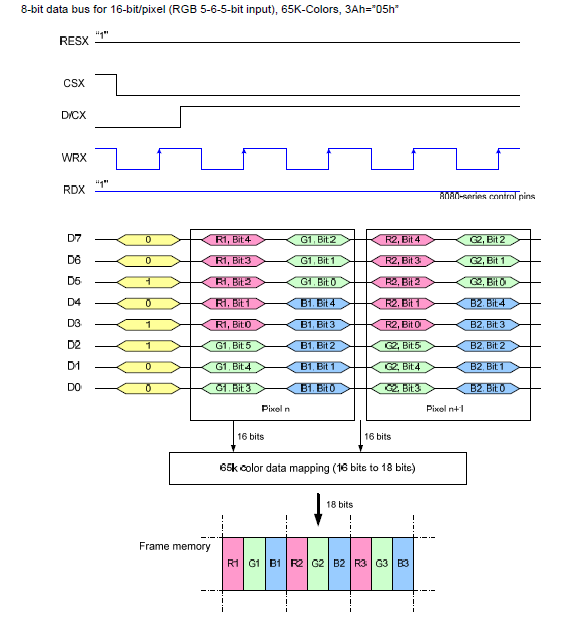
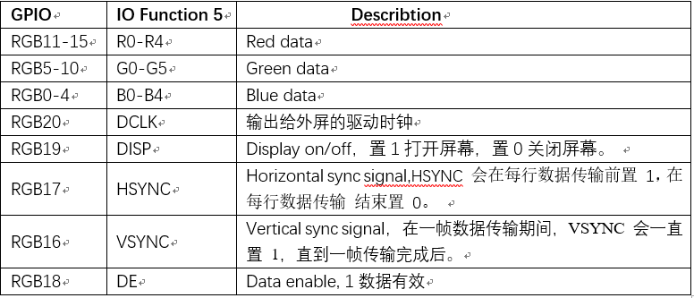
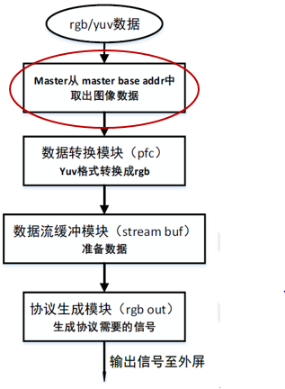
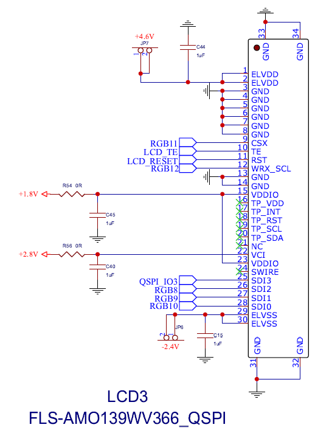
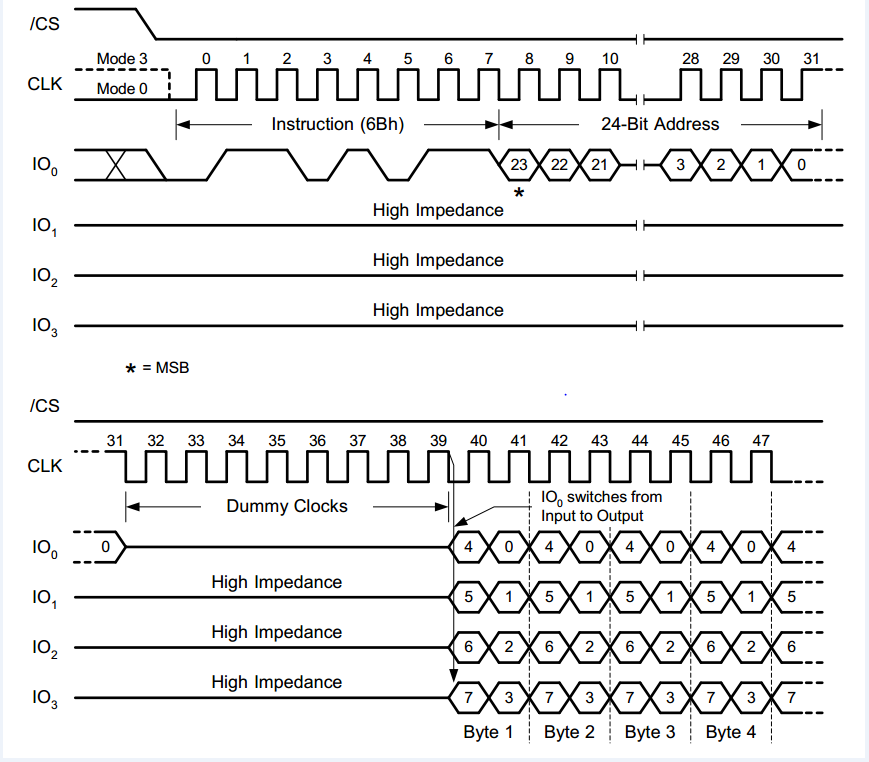
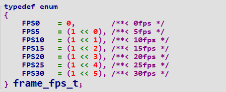
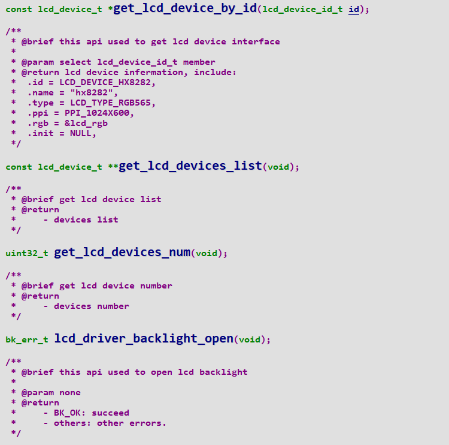
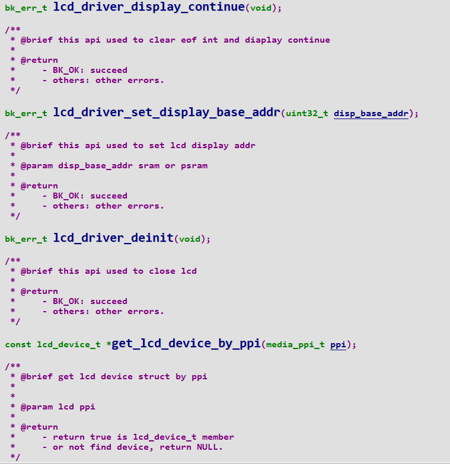
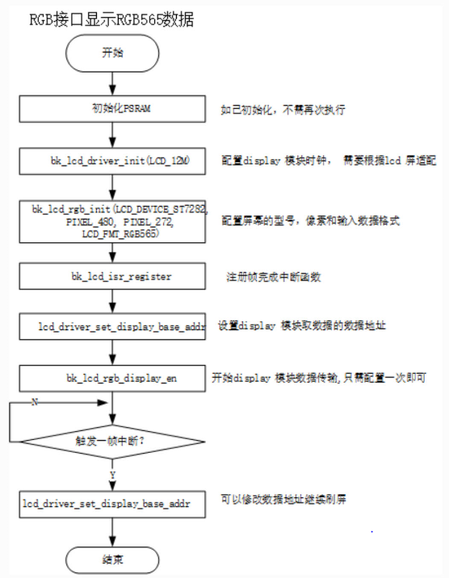

LCD
=======================

:link_to_translation:`en:[English]`

LCD 液晶屏是 Liquid Crystal Display 的简称，LCD 的构造是在两片平行的玻璃当中放置液态的晶体，两片玻璃中间有许多垂直和水平的细小电线，
透过通电与否来控制杆状水晶分子改变方向，将光线折射出来产生画面。液晶是一种有机复合物，由长棒状的分子构成。在自然状态下，这些棒状分子的长轴大致平行。

LCD 物理结构
----------------------------

Lcd液晶屏面板主要是由：玻璃基板、偏光板、彩色滤光片、液晶材料、配向膜、光学膜片、驱动电路等元器件组成。

1、玻璃基板
玻璃基板其实是一种表面上很平整的薄玻璃片。表面上蒸镀的有一层In2O3或者SnO2的透明导电层，就是ITO膜层，经过光刻以及加工制成了透明的导电图形。
这些图形是由一幅图像的全部色度和亮度的最小图像单元、像素图形以及外引线图形所组成。因此呢，外引线是绝对不能进行传统的锡焊的，
只能够通过导电橡胶条或着导电胶带等等来进行连接。如果划伤、割断或者腐蚀后，那么就会造成器件报废。

2．彩色滤光片
液晶面板之所以可以显示出彩色，就是因为光通过了彩色滤光片的缘故。然后液晶面板再通过驱动芯片的电压而改变，从而使得液晶分子排排站立或者呈现扭转状态，
形成闸门来后再选择背光源的光线穿透与否，最后产生了画面。但是这样仅仅只有透光程度的一个差别，产生的颜色也只有黑和白这两种，如果想要形成彩色的画面，
需要依靠红、绿、蓝这三种光源组合而成。

3．配向膜
配向膜（AlignmentLayer）是控制住LCD显示品质的最关键材料，为了使液晶材料达到一个很良好的旋转效果，则需要在LCD显示屏的上下两电极基板的内侧涂上一层配向膜。
涂好配向膜之后，接着要进行摩擦的（Rubbing）制程，配向膜的表面将会因为摩擦而形成一个按一定方向排列着的沟槽，配向膜上面的液晶材料也会因为分子之间的作用力
而达到一个定向效果，产生配向的（Align）作用。这样我们就可以控制住液晶分子预定的方向和预定的倾斜角度排列，很有利于LCD显示屏的动作。

4．液晶材料
液晶材料则是LCD显示屏的主体材料。液晶材料大多都是由几种甚至于十几种的单体液晶材料混合而成。每一种液晶材料都有着自己很固定的清亮点TL以及结晶点TS。
因此必须要求每一种LCD显示屏在使用或保存在TS～TL之间的一定的温度范围之内，如使用或者保存的温度太过于低，结晶就会破坏掉LCD显示屏的定向层；而温度如果过高，
液晶将会失去液晶态，那么也就失去了LCD显示屏的所有功能。

5．偏光片
偏光片的最主要用途就是使通过偏光膜二向色性介质的光线产生出偏振性。

6．驱动电路
驱动电路的最大作用就是通过调整施加到像素电极上面的电压、相位、峰值、频率、时序、有效值、占空比等等一系列的参数来建立在驱动电路上。

.. figure:: ../../_static/tft_lcd.png
    :align: center
    :alt: lcd
    :figclass: align-center

    Figure 1. lcd

LCD 驱动接口
----------------------------

目前主流的LCD驱动接口有SPI、I8080、QSPI、RGB等

.. figure:: ../../_static/driver_interface.png
    :align: center
    :alt: driver interface
    :figclass: align-center

    Figure 2. 驱动接口

8080 LCD 硬件接口
----------------------------

8080接口的数据传输有8位，9位，16位和18位，本文档介绍的接口总线为8位，其硬件原理图如下：

 - 3.5”(diagonal), 320x3 RGB x 480 dots, 262K colors TFT LCD module
 - Driving IC: ST7796S
 - RGB serial interface
    
.. figure:: ../../_static/lcd_8080_pin.png
    :align: center
    :alt: lcd
    :figclass: align-center

    Figure 3. 8080 lcd 管脚

        
    Figure 4. 8080 lcd 平面图

Display 8080接口占用的芯片IO资源如下:

.. figure:: ../../_static/lcd_8080_gpio.png
    :align: center
    :alt: lcd
    :figclass: align-center

    Figure 5. 8080 lcd 管脚功能

8080 LCD 接口驱动原理
----------------------------

I8080协议其数据传输是通过cmd+parameter的格式进行的。通过cmd + param的这种方式，实现对屏幕的初始化，模块功能的配置，图像数据传输。
下面是一个写命令和数据的时序图：

 - RESET 在传输时置1
 - 发送DB数据时，CSX 置低，WRX 拉低。
 - 如果是COMMAND 数据，DCX置低，如果是DATA 数据，DCX置高
 - 在写数据传输期间，DB线需要在WR的上升沿保持稳定。

.. figure:: ../../_static/lcd_8080_timing_1.png
    :align: center
    :alt: lcd
    :figclass: align-center

    Figure 6. 8080 lcd 时序

    Figure 7. 8080 lcd 数据传输

8080 LCD的硬件实现如下:

.. figure:: ../../_static/lcd_8080_timing_3.png
    :align: center
    :alt: lcd
    :figclass: align-center

    Figure 8. 8080 lcd 硬件流程

RGB LCD 硬件接口
----------------------------

RGB 接口又称 DPI（Display Pixel Iterface）接口，是并行接口，采用普通的同步时钟和信号线来传输数据。 其接口的数据线和控制线分离，因为屏幕内部没有 GRAM，
所以协议数据速度快，成本低，可以直接刷屏，通常用于大屏的驱动。
RGB 协议其数据类型有 RGB565,RGB88,RGB666等，颜色分量为红、绿、蓝三底色，通过对三个颜色通道的变化，颜色的相互叠加得到各式各样的颜色。本模块采用的是 RGB565 数据类型。

 - Resolution : 480(H) x 3(RGB) x 272(V) pixels
 - Input Data: Parallel RGB565 16-bit
 - Driver IC:  ST7282

.. figure:: ../../_static/lcd_rgb_pin.png
    :align: center
    :alt: lcd
    :figclass: align-center

    Figure 9. rgb lcd 管脚

.. figure:: ../../_static/lcd_rgb.png
    :align: center
    :alt: lcd
    :figclass: align-center
    
    Figure 10. rgb lcd 平面图

Display rgb接口占用的芯片IO资源如下:

    Figure 11. rgb lcd 管脚功能

RGB LCD 接口驱动原理
----------------------------

RGB LCD协议时序图如下:

 - DCLK像素时钟信号：输出给外屏的驱动时钟, 确保数据传输的正确性,在时钟下降沿（或上升沿）对RGB数据进行读取
 - VSYNC 表示扫描一帧的开始，在一帧数据传输期间，VSYNC 会一直置 1，直到一帧传输完成后.
 - HSYNC 表示扫描一行的开始，会在每行数据传输前置 1，在每行数据传输结束置 0。

.. figure:: ../../_static/lcd_rgb_timing_1.png
    :align: center
    :alt: lcd
    :figclass: align-center
    
    Figure 12. rgb lcd 时序

RGB 协议数据格式如下：

.. figure:: ../../_static/lcd_rgb_timing_2.png
    :align: center
    :alt: lcd
    :figclass: align-center

    Figure 13. rgb lcd 协议

RGB LCD的硬件实现

    Figure 14. rgb lcd 硬件流程

QSPI LCD 硬件接口
----------------------------

 - Resolution: 454(W) x RGB x 454(H)
 - Driver IC: SH8601A
 - Interface: QSPI
 - Display mode: MOLED

    Figure 15. qspi lcd 管脚

.. figure:: ../../_static/lcd_qspi.png
    :align: center
    :alt: lcd
    :figclass: align-center
    
    Figure 16. qspi lcd 平面图

Display qspi接口占用的芯片IO资源如下:

.. figure:: ../../_static/lcd_qspi_gpio.png
    :align: center
    :alt: lcd
    :figclass: align-center

    Figure 17. qspi lcd 管脚功能

QSPI LCD 接口驱动原理
----------------------------

QSPI LCD协议时序图如下:

    Figure 18. qspi lcd 时序

qspi驱动接口与spi类似，区别在于数据管脚的数量，qspi多了两根数据传输管脚，速度要比spi快

QSPI LCD的硬件实现：

.. figure:: ../../_static/lcd_rgb_timing_2.png
    :align: center
    :alt: lcd
    :figclass: align-center

    Figure 19. qspi lcd 硬件流程

软件设计
----------------------------

项目中软件代码的设计分层思想如下：

.. figure:: ../../_static/lcd_software.png
    :align: center
    :alt: lcd
    :figclass: align-center

    Figure 20. 软件架构

Driver层意义：对不同的芯片board, 即使soc层是不同的，其调用的LCD driver接口是相同的。
代码设计思想：由于LCD有三种不同的接口，所以对于每个接口需要独立封装的API，在命名上需要以8080_lcd, rgb_lcd, qspi_lcd做区分，对于公共的API命名则不做区分。

相关数据结构
----------------------------

图片格式的枚举定义：

.. figure:: ../../_static/pixel_format.png
    :align: center
    :alt: lcd
    :figclass: align-center

    Figure 21. 格式枚举

LCD屏设备的枚举定义：

.. figure:: ../../_static/lcd_device_id.png
    :align: center
    :alt: lcd
    :figclass: align-center
    
    Figure 22. lcd 设备型号枚举

LCD像素的枚举定义：

.. figure:: ../../_static/media_ppi.png
    :align: center
    :alt: lcd
    :figclass: align-center

    Figure 23. 像素枚举

FPS的枚举定义：

    Figure 24. fps 枚举

代码接口
----------------------------

代码API如下：

.. figure:: ../../_static/api_1.png
    :align: center
    :alt: lcd
    :figclass: align-center

    Figure 25. api_1

.. figure:: ../../_static/api_2.png
    :align: center
    :alt: lcd
    :figclass: align-center

    Figure 25. api_2

.. figure:: ../../_static/api_3.png
    :align: center
    :alt: lcd
    :figclass: align-center

    Figure 25. api_3

.. figure:: ../../_static/api_4.png
    :align: center
    :alt: lcd
    :figclass: align-center

    Figure 25. api_4

.. figure:: ../../_static/api_5.png
    :align: center
    :alt: lcd
    :figclass: align-center

    Figure 25. api_5

.. figure:: ../../_static/api_6.png
    :align: center
    :alt: lcd
    :figclass: align-center

    Figure 25. api_6

.. figure:: ../../_static/api_7.png
    :align: center
    :alt: lcd
    :figclass: align-center

    Figure 25. api_7

    Figure 25. api_8

.. figure:: ../../_static/api_9.png
    :align: center
    :alt: lcd
    :figclass: align-center

    Figure 25. api_9

    Figure 25. api_10

.. figure:: ../../_static/api_11.png
    :align: center
    :alt: lcd
    :figclass: align-center

    Figure 25. api_11

代码配置流程
----------------------------

LCD 8080配置流程图如下：

.. figure:: ../../_static/lcd_8080_config.png
    :align: center
    :alt: lcd
    :figclass: align-center

    Figure 26. 8080 配置流程图

LCD RGB配置流程图如下:

    Figure 27. rgb 配置流程图

设置特殊区域显示流程图如下：

.. figure:: ../../_static/lcd_parcical_display.png
    :align: center
    :alt: lcd
    :figclass: align-center

    Figure 28. 特殊区域配置图

局部显示示意图：

.. figure:: ../../_static/lcd_area.png
    :align: center
    :alt: lcd
    :figclass: align-center

    Figure 29. 特殊区域显示图

LCD_RGB演示工程
========================

1 功能概述
-------------------------------------
	本工程主要验证了lcd_RGB驱动st7701sn屏幕的功能，上电后会在屏幕上每隔一秒生成随机颜色进行显示。

2 代码路径
-------------------------------------
	demo路径：``./projects/media/lcd_rgb``

3 cli命令简介
-------------------------------------
	本功能主要依靠APP去使用配置，暂时不需要cli命令辅助控制

4.编译命令
-------------------------------------
	编译命令：``make bk7258 PROJECT=media/lcd_rgb``

5 演示介绍
-------------------------------------
	上电后，显示屏会显示随机颜色的矩形方块

LCD_8080演示工程
========================

1 功能概述
-------------------------------------
	本工程主要验证了lcd_8080驱动st7796屏幕的功能，上电后会在屏幕上每隔一秒生成随机颜色随机大小的区域进行显示。

2 代码路径
-------------------------------------
	demo路径：``./projects/media/lcd_8080``

3 cli命令简介
-------------------------------------
	本功能主要依靠APP去使用配置，暂时不需要cli命令辅助控制

4.编译命令
-------------------------------------
	编译命令：``make bk7258 PROJECT=media/lcd_8080``

5 演示介绍
-------------------------------------
	上电后，显示屏会在随机位置上显示随机大小随机颜色的矩形方块
