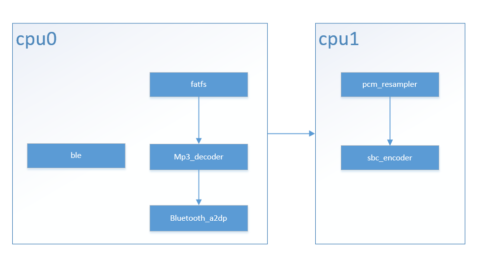
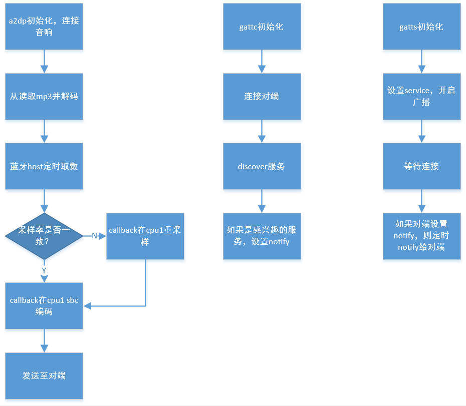

中控(Central)
======================================

:link_to_translation:`en:[English]`

1 功能概述
-------------------------------------

	本工程用于手机、拨号盘等主设备场景，主要功能有

	| 1.作为a2dp source向对端音响传输音乐数据
	| 2.接受对端的控制（播放暂停）
	| 3.ble gatt server/gatt client

1.1 软件规格
,,,,,,,,,,,,,,,,,,,,,,,,,,,,,,,,,

    * a2dp：
        * avdtp source
    * avrcp：
        * tg
        * ct
    * ble:
        * gap
        * gatt server
        * gatt client
        * smp legacy pair/secure connection pair

1.2 代码路径及编译命令
,,,,,,,,,,,,,,,,,,,,,,,,,,,,,,,,,

	Demo路径：`./projects/bluetooth/central <https://gitlab.bekencorp.com/wifi/armino/-/tree/main/projects/bluetooth/central>`_

	编译命令：``make bk7258 PROJECT=bluetooth/central``

2 cmd命令简介
-------------------------------------

2.1 a2dp source
,,,,,,,,,,,,,,,,,,,,,,,,,,,,,,,,,

    +--------------------------------------------------+---------------------------+
    | a2dp_player connect <xx:xx:xx:xx:xx:xx>          | 连接音响                  |
    +--------------------------------------------------+---------------------------+
    | a2dp_player disconnect <xx:xx:xx:xx:xx:xx>       | 断开连接                  |
    +--------------------------------------------------+---------------------------+
    | a2dp_player play <xxx.mp3>                       | 播放mp3                   |
    +--------------------------------------------------+---------------------------+
    | a2dp_player stop                                 | 停止播放                  |
    +--------------------------------------------------+---------------------------+
    | a2dp_player pause                                | 暂停                      |
    +--------------------------------------------------+---------------------------+
    | a2dp_player resume                               | 恢复                      |
    +--------------------------------------------------+---------------------------+
    | a2dp_player abs_vol <xxx>                        | 设置音响绝对音量 0 ~ 127  |
    |                                                  | (是否有效视对端而定)      |
    +--------------------------------------------------+---------------------------+

2.2 ble gatt
,,,,,,,,,,,,,,,,,,,,,,,,,,,,,,,,,

    +-------------------------------------------------------------+--------------------------------------+
    | ble_gatt_demo -h                                            | 显示详细命令                         |
    +-------------------------------------------------------------+--------------------------------------+
    | ble_gatt_demo <gatts|gattc> init                            | gatts/gattc初始化                    |
    +-------------------------------------------------------------+--------------------------------------+
    | ble_gatt_demo gatts disconnect <xx:xx:xx:xx:xx:xx>          | gatts断开连接                        |
    +-------------------------------------------------------------+--------------------------------------+
    | ble_gatt_demo gattc connect <xx:xx:xx:xx:xx:xx> <0|1>       | 连接gatts，0为public，1为random      |
    +-------------------------------------------------------------+--------------------------------------+
    | ble_gatt_demo gattc disconnect <xx:xx:xx:xx:xx:xx>          | gattc断开连接                        |
    +-------------------------------------------------------------+--------------------------------------+
    | ble_gatt_demo gattc connect_cancel                          | 取消连接                             |
    +-------------------------------------------------------------+--------------------------------------+
    | ble_gatt_demo update_param <xx:xx:xx:xx:xx:xx>              | 更新连接参数                         |
    | <interval> <timeout>                                        |                                      |
    +-------------------------------------------------------------+--------------------------------------+

3 a2dp source 测试
-------------------------------------

3.1 测试过程
,,,,,,,,,,,,,,,,,,,,,,,,,,,,,,,,,

    | 1.准备一张sd卡，格式化成exfat，将project/bluetooth/central/1_qcs.mp3放入根目录。(必须是16bits的mp3)
    | 2.插入sd卡，开机。
    | 3.令音响进入配对模式
    | 4.输入 ``a2dp_player connect xx:xx:xx:xx:xx:xx``，其中xx为音响地址。等待连接成功
    | 5.如果连接成功，会提示"a2dp connect complete"，如果连接失败，会提示"Unsuccessful Connection Complete"之类的log。
    | 6.输入 ``a2dp_player play xxx.mp3``。
    | 7.如果sd卡正常，会提示"f_mount OK"，如果音乐文件存在，会提示"mp3 file open successfully"
    | 8.此时可听到播出声音
    | 9.正在播放的情况下，可以stop pause，停止播放的情况下可以play。(尽量连接后立刻play，不要stop，参见本章节兼容性说明)
    | 10.如果音响支持avrcp，可以通过音响控制播放暂停。(存在兼容性问题，参见本章节兼容性说明)

3.2 兼容性说明
,,,,,,,,,,,,,,,,,,,,,,,,,,,,,,,,,

    | 1.仅播放歌曲场景，某些音响如果长时间处于stop(本地a2dp_player stop 或对端avdtp suspend)状态，会主动断开连接。log会提示bt_api_event_cb:Disconnected from xx:xx:xx:xx:xx:xx
    | 2.某些音响不会向本地注册avrcp playback notify，会导致两端操作播放暂停时状态不一致的现象。
    | 3.某些音响不会向本地报告avrcp volume change，此时音响调节音量，central无法得知。
    | 4.某些音响不支持设置绝对音量。

3.3 其他注意事项
,,,,,,,,,,,,,,,,,,,,,,,,,,,,,,,,,

    | 1.如果sdcard有问题，会出现 f_mount failed 或 read data crc error 的提示

4 ble gatt 测试
-------------------------------------

4.1 单板作为client与手机连接测试
,,,,,,,,,,,,,,,,,,,,,,,,,,,,,,,,,

    | 1.手机使用nrf connect开启广播
    | 2.开发板a输入 ``ble_gatt_demo gattc init``
    | 3.开发板a输入 ``ble_gatt_demo gattc connect <手机adv地址> 1``
    | 3.连接成功会有log打印 ``BK_BLE_GAP_CONNECT_COMPLETE_EVT``
    | 4.discover完成会有打印 ``BK_GATTC_DIS_SRVC_CMPL_EVT``

4.2 双板对测
,,,,,,,,,,,,,,,,,,,,,,,,,,,,,,,,,

    | 1.开发板a输入 ``ble_gatt_demo gatts init``
    | 2.开发板b输入 ``ble_gatt_demo gattc init``
    | 3.开发板b输入 ``ble_gatt_demo gattc connect <a板地址> 1``
    | 4.连接成功会有log打印 ``BK_BLE_GAP_CONNECT_COMPLETE_EVT``
    | 5.b板discover完成会有打印 ``BK_GATTC_DIS_SRVC_CMPL_EVT``
    | 6.后续a板会定时给b板notify

5 结构图
-------------------------------------

5.1 运行时
,,,,,,,,,,,,,,,,,,,,,,,,,,,,,,,,,

    Figure 1. software module architecture

5.2 流程图
,,,,,,,,,,,,,,,,,,,,,,,,,,,,,,,,,

    Figure 2. flow chart

6 重要流程说明
-------------------------------------

6.1 连接音响
,,,,,,,,,,,,,,,,,,,,,,,,,,,,,,,,,

::

    int bt_a2dp_source_demo_connect(uint8_t *addr)
    {
        ...

        //连接对端
        err = bk_bt_a2dp_source_connect(a2dp_env.peer_addr.addr);

        if (err)
        {
            a2dp_loge("connect a2dp err %d", err);
            goto error;
        }

        a2dp_logi("start wait a2dp connect cb");
        //等待连接成功
        err = rtos_get_semaphore(&s_bt_api_event_cb_sema, 12 * 1000);

        if (err)
        {
            a2dp_loge("get sem for connect err");
            goto error;
        }

        a2dp_logi("start wait a2dp cap report cb");
        //等待获取a2dp cap
        err = rtos_get_semaphore(&s_bt_api_event_cb_sema, 6 * 1000);

        if (err)
        {
            a2dp_loge("get sem for cap select err");
            goto error;
        }

        a2dp_logi("a2dp connect complete");

        ...
    }

6.2 mp3解码
,,,,,,,,,,,,,,,,,,,,,,,,,,,,,,,,,

::

    static void bt_a2dp_source_decode_task(void *arg)
    {
        ...

        while (*task_ctrl)
        {
            ...

            if (0 != mp3_read_end_ptr - current_mp3_read_ptr - bytesleft)
            {
                //读取文件
                fr = f_read(&mp3file, current_mp3_read_ptr + bytesleft, mp3_read_end_ptr - current_mp3_read_ptr - bytesleft, &num_rd);

                if (fr != FR_OK)
                {
                    a2dp_loge("read %d %s failed!", num_rd, full_path);
                    goto error;
                }

                if (!num_rd)
                {
                    //回到文件头
                    a2dp_logi("file end, return to begin");

                    os_memmove(mp3_read_start_ptr, current_mp3_read_ptr, bytesleft);
                    current_mp3_read_ptr = mp3_read_start_ptr;

                    f_lseek(&mp3file, frame_start_offset);
                    continue;
                }

                ...
            }

            a2dp_logv("bytesleft %d %p", bytesleft, current_mp3_read_ptr);

            do
            {
                ...

                //判断ring buffer是否满
                while (ring_buffer_particle_len(&s_rb_ctx) > s_decode_trigger_size)
                {
                    if (!*task_ctrl)
                    {
                        goto error;
                    }

                    a2dp_logd("ring buffer not read too much, wait %d", ring_buffer_particle_len(&s_rb_ctx));
                    rtos_get_semaphore(&s_source_need_decode_sema, BEKEN_WAIT_FOREVER);
                }

                //解码
                ret = MP3Decode(s_mp3_decoder, &current_mp3_read_ptr, &bytesleft, (int16_t *)pcm_write_ptr, 0);

                //异常处理
                if (ret != ERR_MP3_NONE)
                {
                    if (ERR_MP3_INDATA_UNDERFLOW == ret)
                    {
                        bytesleft = last_success_bytesleft;
                        current_mp3_read_ptr = last_success_read_ptr;
                        break;
                    }

                    goto error;
                }

                //写ring buffer
                if (ring_buffer_particle_write(&s_rb_ctx, pcm_write_ptr, tmp_mp3_frame_info.outputSamps * tmp_mp3_frame_info.bitsPerSample / 8))
                {
                    a2dp_logd("ring_buffer full %d", ring_buffer_particle_len(&s_rb_ctx));

                    ...
                    continue;
                }
                else
                {
                    a2dp_logv("write %d, %d", tmp_mp3_frame_info.outputSamps * tmp_mp3_frame_info.bitsPerSample / 8, ring_buffer_particle_len(&s_rb_ctx));
                }

                pcm_decode_size += tmp_mp3_frame_info.outputSamps * tmp_mp3_frame_info.bitsPerSample / 8;
            }
            while (tmp_mp3_frame_info.outputSamps && *task_ctrl);
        }

        ...
    }

6.3 host a2dp 取数回调(pcm)
,,,,,,,,,,,,,,,,,,,,,,,,,,,,,,,,,

::

    static int32_t a2dp_source_data_cb(uint8_t *buf, int32_t len)
    {
        uint32_t read_len = 0;
        ...
        //从ring buffer读取
        if (ring_buffer_particle_len(&s_rb_ctx) < len)
        {
            a2dp_loge("ring buffer not enough data %d < %d ", ring_buffer_particle_len(&s_rb_ctx), len);
        }
        else
        {
            ring_buffer_particle_read(&s_rb_ctx, buf, len, &read_len);
        }

        //通知mp3继续解码
        if (s_source_need_decode_sema)
        {
            rtos_set_semaphore(&s_source_need_decode_sema);
        }

        return read_len;
    }

6.3 host a2dp 重采样回调
,,,,,,,,,,,,,,,,,,,,,,,,,,,,,,,,,

::

    static int32_t a2dp_source_pcm_resample_cb(uint8_t *in_addr, uint32_t *in_len, uint8_t *out_addr, uint32_t *out_len)
    {
        ...

        bt_audio_resample_req_t rsp_req;

        os_memset(&rsp_req, 0, sizeof(rsp_req));

        input_len = *in_len;
        output_len = *out_len;

        rsp_req.in_addr = in_addr;
        rsp_req.out_addr = out_addr;
        rsp_req.in_bytes_ptr = &input_len;
        rsp_req.out_bytes_ptr = &output_len;

        //发送给cpu1重采样
        ret = media_send_msg_sync(EVENT_BT_PCM_RESAMPLE_REQ, (uint32_t)&rsp_req);

        if (ret)
        {
            a2dp_loge("EVENT_BT_PCM_RESAMPLE_REQ err %d !!", ret);
            ret = -1;
        }

        ...

        return ret;
    }

6.4 host a2dp sbc编码回调
,,,,,,,,,,,,,,,,,,,,,,,,,,,,,,,,,

::

    static int32_t a2dp_source_pcm_encode_cb(uint8_t type, uint8_t *in_addr, uint32_t *in_len, uint8_t *out_addr, uint32_t *out_len)
    {
        ...

        bt_audio_encode_req_t rsp_req;
        int ret = 0;

        os_memset(&rsp_req, 0, sizeof(rsp_req));

        rsp_req.handle = &s_sbc_software_encoder_ctx;
        rsp_req.in_addr = in_addr;
        rsp_req.type = type;
        rsp_req.out_len_ptr = (typeof(rsp_req.out_len_ptr))&encode_len;

        //发送给cpu1编码
        ret = media_send_msg_sync(EVENT_BT_PCM_ENCODE_REQ, (uint32_t)&rsp_req);

        if (ret)
        {
            a2dp_loge("EVENT_BT_PCM_ENCODE_REQ err %d !!", ret);
            return -1;
        }

        ...
        return 0;
    }

6.5 ble gap初始化
,,,,,,,,,,,,,,,,,,,,,,,,,,,,,,,,,

::

    int dm_gatt_main(cli_gatt_param_t *param)
    {
        ...
        //注册gap回调
        bk_ble_gap_register_callback(dm_ble_gap_private_cb);
        dm_gatt_add_gap_callback(dm_ble_gap_common_cb);

        //读取本地ir/er
        bluetooth_storage_read_local_key(&s_dm_gap_local_key);

        //向host设置ir/er
        ret = bk_ble_gap_set_security_param(BK_BLE_SM_SET_ER, (void *)s_dm_gap_local_key.er, sizeof(s_dm_gap_local_key.er));
        ...
        ret = bk_ble_gap_set_security_param(BK_BLE_SM_SET_IR, (void *)s_dm_gap_local_key.ir, sizeof(s_dm_gap_local_key.ir));

        //生成rpa地址
        ...
        ret = bk_ble_gap_generate_rpa(NULL);
        ...

        //设置privacy
        ret = bk_ble_gap_config_local_privacy(s_dm_gatt_privacy_enable);

        //循环添加已配对设备
        for()
        {
            ret = bk_ble_gap_bond_dev_list_operation(BK_GAP_BOND_DEV_LIST_OPERATION_ADD, &bond_dev);
        }

        //设置iocap
        ret = bk_ble_gap_set_security_param(BK_BLE_SM_IOCAP_MODE, (void *)&s_dm_gatt_iocap, sizeof(s_dm_gatt_iocap));

        //设置配对请求auth参数
        ret = bk_ble_gap_set_security_param(BK_BLE_SM_AUTHEN_REQ_MODE, (void *)&s_dm_gatt_auth_req, sizeof(s_dm_gatt_auth_req));

        //设置密钥分发种类
        ret = bk_ble_gap_set_security_param(BK_BLE_SM_SET_INIT_KEY, (void *)&s_dm_gatt_init_key_distr, sizeof(s_dm_gatt_init_key_distr));
        ret = bk_ble_gap_set_security_param(BK_BLE_SM_SET_RSP_KEY, (void *)&s_dm_gatt_rsp_key_distr, sizeof(s_dm_gatt_rsp_key_distr));

        //设置gatt mtu
        bk_ble_gatt_set_local_mtu(517);
    }

6.6 ble gatts初始化
,,,,,,,,,,,,,,,,,,,,,,,,,,,,,,,,,

::

    int dm_gatts_main(cli_gatt_param_t *param)
    {
        //初始化gap
        dm_gatt_main(NULL);

        //注册gatts回调，注册gatts app
        bk_ble_gatts_register_callback(bk_gatts_cb);
        ret = bk_ble_gatts_app_register(0);

        //设置service
        ret = bk_ble_gatts_create_attr_tab(s_gatts_attr_db_service_1, s_gatts_if, sizeof(s_gatts_attr_db_service_1) / sizeof(s_gatts_attr_db_service_1[0]), 30);
        ret = bk_ble_gatts_create_attr_tab(s_gatts_attr_db_service_2, s_gatts_if, sizeof(s_gatts_attr_db_service_2) / sizeof(s_gatts_attr_db_service_2[0]), 30);

        //开启service
        bk_ble_gatts_start_service(s_service_attr_handle);
        //注册gap回调(仅gatts关心)
        dm_gatt_add_gap_callback(dm_ble_gap_cb);

        //设置adv参数
        ret = dm_gatts_set_adv_param(s_dm_gatts_local_addr_is_public);

        //设置adv random addr(仅rpa开启或自定义addr)
        if (need_set_random_addr)
        {
            ret = bk_ble_gap_set_adv_rand_addr(ADV_HANDLE, current_addr);

            if (ret)
            {
                gatt_loge("bk_ble_gap_set_adv_rand_addr err %d", ret);
                goto error;
            }

            ret = rtos_get_semaphore(&s_ble_sema, SYNC_CMD_TIMEOUT_MS);

            if (ret != kNoErr)
            {
                gatt_loge("wait set adv rand addr err %d", ret);
                goto error;
            }
        }

        //设置adv data
        ret = bk_ble_gap_set_adv_data((bk_ble_adv_data_t *)&adv_data);

        //开启adv
        ret = bk_ble_gap_adv_start(1, &ext_adv);

        ...
    }

6.7 ble gattc初始化
,,,,,,,,,,,,,,,,,,,,,,,,,,,,,,,,,

::

    int dm_gattc_main(cli_gatt_param_t *param)
    {
        ...
        //注册gap回调(仅gattc关心)
        dm_gatt_add_gap_callback(dm_ble_gap_cb);
        ...
        //注册gattc回调
        bk_ble_gattc_register_callback(bk_gattc_cb);
        ...
        //注册gattc app
        ret = bk_ble_gattc_app_register(0);
        ...
        //设置connect/scan rand addr(仅rpa开启或自定义addr)
        if (need_set_random_addr)
        {
            ret = bk_ble_gap_set_rand_addr(current_addr);

            if (ret)
            {
                gatt_loge("bk_ble_gap_set_rand_addr err %d", ret);
                goto error;
            }

            ret = rtos_get_semaphore(&s_ble_sema, SYNC_CMD_TIMEOUT_MS);

            if (ret != kNoErr)
            {
                gatt_loge("wait set rand addr err %d", ret);
                goto error;
            }
        }

        ...
    }

6.8 ble gattc 连接
,,,,,,,,,,,,,,,,,,,,,,,,,,,,,,,

::

    int32_t dm_gattc_connect(uint8_t *addr, uint32_t addr_type)
    {
        ...

        //设置连接参数
        bk_gap_create_conn_params_t param = {0};
        bk_bd_addr_t peer_id_addr = {0};
        bk_ble_addr_type_t peer_id_addr_type = BLE_ADDR_TYPE_PUBLIC;

        param.scan_interval = 800;
        param.scan_window = param.scan_interval / 2;
        param.initiator_filter_policy = 0;

        //决定是否用rpa连接
        if (g_dm_gap_use_rpa && 0 == dm_gatt_find_id_info_by_nominal_info(addr, addr_type, peer_id_addr, &peer_id_addr_type))
        {
            gatt_logi("local use rpa");
            param.local_addr_type = (s_dm_gattc_local_addr_is_public ? BLE_ADDR_TYPE_RPA_PUBLIC : BLE_ADDR_TYPE_RPA_RANDOM);
            os_memcpy(param.peer_addr, addr, sizeof(param.peer_addr));
            param.peer_addr_type = addr_type;
        }
        else
        {
            param.local_addr_type = (s_dm_gattc_local_addr_is_public ? BLE_ADDR_TYPE_PUBLIC : BLE_ADDR_TYPE_RANDOM);
            os_memcpy(param.peer_addr, addr, sizeof(param.peer_addr));
            param.peer_addr_type = addr_type;
        }

        //设置连接参数
        param.conn_interval_min = 16;
        param.conn_interval_max = 16;
        param.conn_latency = 0;
        param.supervision_timeout = 500;
        param.min_ce = 0;
        param.max_ce = 0;

        err = bk_ble_gap_connect(&param);

        ...
        return err;
    }
