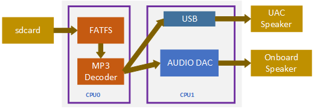
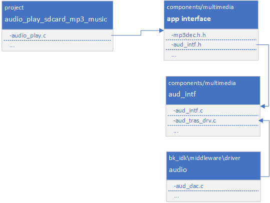

播放sdcard MP3音乐工程
=================================

:link_to_translation:`en:[English]`

1. 简介
--------------------

本工程是播放sdcard mp3音乐的一个demo，支持从sdcard中读取mp3歌曲文件，并解码播放。

1.1 规格
,,,,,,,,,,,,,,,,,,,,,,,,,,,,,,,,,

	* 硬件配置：
		* 核心板，**BK7258_QFN88_9X9_V3.2**
		* 喇叭小板，**BK_Module_Speaker_V1.1**
		* PSRAM 8M/16M
		* tfcard
	* 支持，UAC

1.2 路径
,,,,,,,,,,,,,,,,,,,,,,,,,,,,,,,,,

	工程路径: ``<bk_avdk源代码路径>/media/audio_play_sdcard_mp3_music``

2. 框架图
---------------------------------

2.1 软件模块架构图
,,,,,,,,,,,,,,,,,,,,,,,,,,,,,,,,,

	如下图所示，speaker数据播放运行在 ``cpu1`` 上，读取sdcard音乐，mp3解码运行在cpu0上。

    Figure 1. software module architecture
    audio_play_sdcard_mp3_music software module architecture

2.2 代码模块关系图
,,,,,,,,,,,,,,,,,,,,,,,,,,,,,,,,,

    如下图所示，音频播放接口和mp3解码接口分别定义在 **aud_intf.h** 和 **mp3dec.h** 中。

    Figure 1. module relationship diagram

    audio_play_sdcard_mp3_music relationship diagram

3. 演示说明
---------------------------------

    通过发送uart命令来控制mp3音乐播放，命令说明如下：

    ``audio_play_sdcard_mp3_music start xxx.mp3``

    * 开始播放指令，其中 ``xxx.mp3`` 是音乐文件名

    ``audio_record_to_sdcard stop``

    * 停止播放指令

.. note::
    启动播放后无法自动停止，需要上层应用根据文件的读取结果（是否已经读取完毕）来主动控制停止播放。
	demo中会打印log ``playback is over, please input the stop command!`` 

4. 代码讲解
---------------------------------

4.1 启动播放
,,,,,,,,,,,,,,,,,,,,,,,,,,,,,,,,,

::

    //Path      ： projects/media/audio_play_sdcard_mp3_music/main/audio_play.c
    //Loaction  :  CPU0

	//获取speaker数据的回调函数
    static bk_err_t mp3_decode_handler(unsigned int size)
    {

        ...

        //判断文件是否读取完毕，读取完毕打印log提醒用户发送停止播放指令
        if (audio_play_info->mp3_file_is_empty && empty_already_flag == false) {
            empty_already_flag = true;
		    BK_LOGW(TAG, "==========================================================\n");
		    BK_LOGW(TAG, "%s playback is over, please input the stop command!\n", audio_play_info->mp3_file_name);
		    BK_LOGW(TAG, "==========================================================\n");
		    return BK_FAIL;
	    }

        //根据上次解码未使用的剩余数据，继续读取补充数据
        if (audio_play_info->bytesLeft < MAINBUF_SIZE) {
            os_memmove(audio_play_info->readBuf, audio_play_info->g_readptr, audio_play_info->bytesLeft);
            fr = f_read(&audio_play_info->mp3file, (void *)(audio_play_info->readBuf + audio_play_info->bytesLeft), MAINBUF_SIZE - audio_play_info->bytesLeft, &uiTemp);

            ...

            //检查文件是否读取完毕
            if ((uiTemp == 0) && (audio_play_info->bytesLeft == 0)) {
                BK_LOGI(TAG, "uiTemp = 0 and bytesLeft = 0\n");
                audio_play_info->mp3_file_is_empty = true;
                BK_LOGI(TAG, "the %s is empty\n", audio_play_info->mp3_file_name);
                return ret;
            }

        ...

        }

        //检查获取每帧mp3数据的帧头，并解析帧头读取有效数据解码
        int offset = MP3FindSyncWord(audio_play_info->g_readptr, audio_play_info->bytesLeft);
        if (offset < 0) {
            BK_LOGE(TAG, "MP3FindSyncWord not find\n");
            audio_play_info->bytesLeft = 0;
        } else {
            audio_play_info->g_readptr += offset;
            audio_play_info->bytesLeft -= offset;

            //解码一帧mp3数据
            ret = MP3Decode(audio_play_info->hMP3Decoder, &audio_play_info->g_readptr, &audio_play_info->bytesLeft, audio_play_info->pcmBuf, 0);

            ...

            //获取帧信息
            MP3GetLastFrameInfo(audio_play_info->hMP3Decoder, &audio_play_info->mp3FrameInfo);

		    //将解码出的pcm数据写入aud_intf组件播放
            ret = bk_aud_intf_write_spk_data((uint8_t*)audio_play_info->pcmBuf, audio_play_info->mp3FrameInfo.outputSamps * 2);

            ...

        }

        ...

    }

    //启动播放
    bk_err_t audio_play_sdcard_mp3_music_start(char *file_name)
    {
        ...

	    //挂载tfcard
        ret = tf_mount();

        //初始化mp3解码器
        audio_play_info->hMP3Decoder = MP3InitDecoder();

        //打开需要播放的mp3音乐文件
        sprintf(audio_play_info->mp3_file_name, "%d:/%s", DISK_NUMBER_SDIO_SD, file_name);
        FRESULT fr = f_open(&audio_play_info->mp3file, audio_play_info->mp3_file_name, FA_OPEN_EXISTING | FA_READ);

        //检查 "ID3" 文件头并跳过头，直接读取待解码的数据帧
        fr = f_read(&audio_play_info->mp3file, (void *)tag_header, 10, &uiTemp);
        if (fr != FR_OK)
        {
            BK_LOGE(TAG, "read %s fail\n", audio_play_info->mp3_file_name);
            goto fail;
        }

        if (os_memcmp(tag_header, "ID3", 3) == 0)
        {
            tag_size = ((tag_header[6] & 0x7F) << 21) | ((tag_header[7] & 0x7F) << 14) | ((tag_header[8] & 0x7F) << 7) | (tag_header[9] & 0x7F);
            BK_LOGI(TAG, "tag_size = %d\n", tag_size);
            f_lseek(&audio_play_info->mp3file, tag_size + 10);
            BK_LOGI(TAG, "tag_header has found\n");
        }
        else
        {
            BK_LOGI(TAG, "tag_header not found\n");
            f_lseek(&audio_play_info->mp3file, 0);
        }

        //初始化aud_intf组件，注册获取speaker数据的回调
        aud_intf_drv_setup.aud_intf_rx_spk_data = mp3_decode_handler;
        ret = bk_aud_intf_drv_init(&aud_intf_drv_setup);

        //设置aud_intf组件工作在普通模式
        ret = bk_aud_intf_set_mode(AUD_INTF_WORK_MODE_GENERAL);

        //预解码一帧数据，获取mp3音乐的帧信息（采样率、声道数、位宽等）
        ret = mp3_decode_handler(audio_play_info->mp3FrameInfo.outputSamps * 2);

        //根据帧信息初始化speaker
        switch (audio_play_info->mp3FrameInfo.nChans)
        {
            case 1:
                aud_intf_spk_setup.spk_chl = AUD_INTF_SPK_CHL_LEFT;
                break;

            case 2:
                aud_intf_spk_setup.spk_chl = AUD_INTF_SPK_CHL_DUAL;
                break;

            default:
                BK_LOGE(TAG, "nChans:%d is not support\n", audio_play_info->mp3FrameInfo.nChans);
                goto fail;
                break;
        }
        aud_intf_spk_setup.samp_rate = audio_play_info->mp3FrameInfo.samprate;
        aud_intf_spk_setup.frame_size = audio_play_info->mp3FrameInfo.outputSamps * 2;
        aud_intf_spk_setup.spk_gain = 0x20;
        aud_intf_spk_setup.work_mode = AUD_DAC_WORK_MODE_DIFFEN;
        //aud_intf_spk_setup.spk_type = AUD_INTF_SPK_TYPE_UAC;   //配置为uac speaker
        ret = bk_aud_intf_spk_init(&aud_intf_spk_setup);

        //开启解码和播放
        ret = bk_aud_intf_spk_start();

        ...
    }

4.2 停止播放
,,,,,,,,,,,,,,,,,,,,,,,,,,,,,,,,,

::

    //Path      ： projects/media/audio_play_sdcard_mp3_music/main/audio_play.c
    //Loaction  :  CPU0

    bk_err_t audio_play_sdcard_mp3_music_stop(void)
    {

        ...

        //停止喇叭播放
        ret = bk_aud_intf_spk_stop();

        //释放喇叭播放的配置
        ret = bk_aud_intf_spk_deinit();

        //重置aud_intf组件的工作模式
        ret = bk_aud_intf_set_mode(AUD_INTF_WORK_MODE_NULL);

        //注销aud_intf组件
        ret = bk_aud_intf_drv_deinit();

        //关闭mp3文件
        f_close(&audio_play_info->mp3file);

        //注销MP3解码器
        MP3FreeDecoder(audio_play_info->hMP3Decoder);

        //卸载tfcard
        tf_unmount();

        ...

    }
