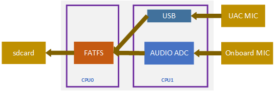
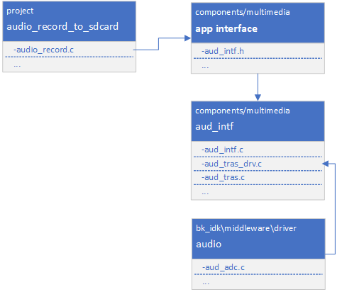

sdcard录音工程
=================================

:link_to_translation:`en:[English]`

1. 简介
--------------------

本工程是录音到sdcard的一个demo，支持录音并存储到sdcard功能。

1.1 规格
,,,,,,,,,,,,,,,,,,,,,,,,,,,,,,,,,

	* 硬件配置：
		* 核心板，**BK7258_QFN88_9X9_V3.2**
		* 麦克小板，**BK_Module_Microphone_V1.1**
		* PSRAM 8M/16M
		* tfcard
	* 支持，UAC

1.2 路径
,,,,,,,,,,,,,,,,,,,,,,,,,,,,,,,,,

	工程路径: ``<bk_avdk源代码路径>/media/audio_record_to_sdcard``

2. 框架图
---------------------------------

2.1 软件模块架构图
,,,,,,,,,,,,,,,,,,,,,,,,,,,,,,,,,

	如下图所示，mic数据采集运行在 ``cpu1`` 上，存储sdcard运行在cpu0上。

    Figure 1. software module architecture
    audio_record_to_sdcard software module architecture

..

    * 方案中，我们采用在aud_intf方式来采集获取mic数据，然后存储到tfcard。

2.2 代码模块关系图
,,,,,,,,,,,,,,,,,,,,,,,,,,,,,,,,,

    如下图所示，音频的接口，都定义在 **aud_intf.h** 中。

    Figure 1. module relationship diagram

    audio_record_to_sdcard relationship diagram

3. 演示说明
---------------------------------

    通过发送uart命令来控制录音，命令说明如下：

    ``audio_record_to_sdcard start xxx.pcm sample_rate``

    * 启动录音指令，其中 ``xxx.pcm`` 是存储录音的文件名， ``sample_rate`` 是采样率

    ``audio_record_to_sdcard stop``

    * 停止录音指令

.. note::
    录制的音频文件存储在tfcard的根目录。

4. 代码讲解
---------------------------------

4.1 启动录音
,,,,,,,,,,,,,,,,,,,,,,,,,,,,,,,,,

::

    //Path      ： projects/media/audio_record_to_sdcard/main/audio_record.c
    //Loaction  :  CPU0

	//获取mic数据的回调函数
    static int send_mic_data_to_sd(uint8_t *data, unsigned int len)
    {

        ...

        //写mic数据到tfcard
        fr = f_write(&mic_file, (void *)data, len, &uiTemp);

	    ...

    }

    //启动录音
    bk_err_t audio_record_to_sdcard_start(char *file_name, uint32_t samp_rate)
    {
        ...

	    //挂载tfcard
        ret = tf_mount();

        //打开存储录音的文件
        fr = f_open(&mic_file, mic_file_name, FA_CREATE_ALWAYS | FA_WRITE);

        //初始化aud_intf组件
        aud_intf_drv_setup.aud_intf_tx_mic_data = send_mic_data_to_sd;
        ret = bk_aud_intf_drv_init(&aud_intf_drv_setup);

        //设置aud_intf组件工作在普通模式
        ret = bk_aud_intf_set_mode(AUD_INTF_WORK_MODE_GENERAL);

        //初始化mic
        //aud_intf_mic_setup.mic_type = AUD_INTF_MIC_TYPE_UAC;	//设置mic的类型为uac mic，默认为板载mic
        ret = bk_aud_intf_mic_init(&aud_intf_mic_setup);

        //开启mic采样和存储
        ret = bk_aud_intf_mic_start();

        ...
    }

4.2 停止录音
,,,,,,,,,,,,,,,,,,,,,,,,,,,,,,,,,

::

    //Path      ： projects/media/audio_record_to_sdcard/main/audio_record.c
    //Loaction  :  CPU0

    bk_err_t audio_record_to_sdcard_stop(void)
    {

        ...

        //停止mic采样
        ret = bk_aud_intf_mic_stop();

        //释放mic采样的配置
        ret = bk_aud_intf_mic_deinit();

        //重置aud_intf组件的工作模式
        ret = bk_aud_intf_set_mode(AUD_INTF_WORK_MODE_NULL);

        //注销aud_intf组件
        ret = bk_aud_intf_drv_deinit();

        //关闭录音文件
        f_close(&mic_file);

        //卸载tfcard
        tf_unmount();

        ...

    }
