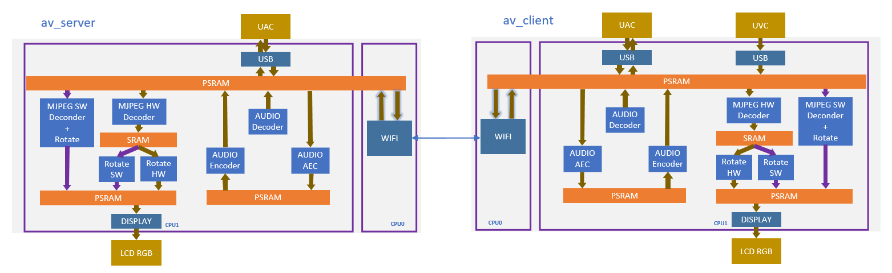
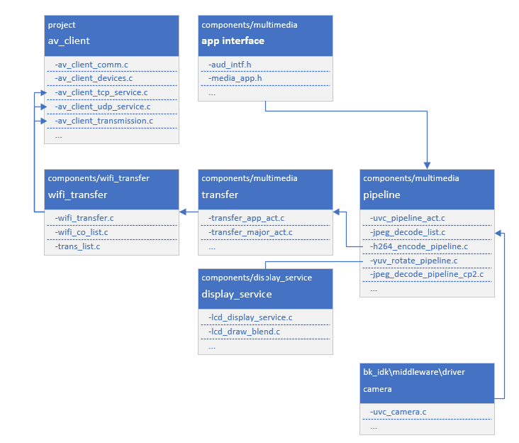

Double-Board Intertransfer Mission (Client)
======================================================

:link_to_translation:`en:[English]`

1 功能概述
-------------------------------------

    本工程展示两块BK7258板子之间视频单向传输，音频双向传输的的功能;
    client端接入实体摄像头dvp/uvc，且支持当前板子接入LCD屏实时显示摄像头拍摄的画面

1.1 规格
,,,,,,,,,,,,,,,,,,,,,,,,,,,,,,,,,

	* 硬件配置：
		* 核心板，**BK7258_QFN88_9X9_V3.2**
		* 显示转接板，**BK7258_LCD_Interface_V3.0**
		* 麦克小板，**BK_Module_Microphone_V1.1**
		* 喇叭小板，**BK_Module_Speaker_V1.1**
		* PSRAM 8M/16M
	* 支持，UVC
		* 参考外设，**864 * 480** 分辨率的UVC
	* 支持，UAC
	* 支持，TCP局域网图传
	* 支持，UDP局域网图传
	* 支持，LCD RGB/MCU I8080显示
		* 参考外设，**ST7701SN**，480 * 854 RGB LCD
		* RGB565/RGB888
	* 支持，硬件旋转
		* 0°，90°，180°，270°
	* 支持，板载喇叭
	* 支持，麦克
	* 支持，MJPEG硬件解码
		* YUV422
	* 支持，MJPEG软件解码
		* YUV420

1.2 路径
,,,,,,,,,,,,,,,,,,,,,,,,,,,,,,,,,

	<bk_avdk源代码路径>/projects/media/av_client

2. 框架图
---------------------------------

2.1 软件模块架构图
,,,,,,,,,,,,,,,,,,,,,,,,,,,,,,,,,

    如下图所示，av_client负责采集USB摄像头图像，通过wifi传输给av_server，
    同时av_client本地lcd会显示采集的图像，av_server显示av_client传输的图像

    * CPU0，运行WIFI/BLE，作为低功耗CPU。

    * CPU1，运行多媒体，作为多媒体高性能CPU。 

    Figure 1. software module architecture

2.2 代码模块关系图
,,,,,,,,,,,,,,,,,,,,,,,,,,,,,,,,,

    如下图所示，多媒体的接口，都定义在 **media_app.h** 和 **aud_intf.h** 中。

    Figure 2. module relationship diagram

3. 配置
---------------------------------

3.1 图像传输方式配置
,,,,,,,,,,,,,,,,,,,,,,,,,,,,,,,,,

    在工程路径下config/bk7258/config，修改宏来配置图像传输方式，当前默认传输方式为UDP；

    //使用UDP连接进行传输
    CONFIG_AV_DEMO_MODE_UDP=y
    CONFIG_AV_DEMO_MODE_TCP=n

    //使用TCP连接进行传输
    CONFIG_AV_DEMO_MODE_UDP=n
    CONFIG_AV_DEMO_MODE_TCP=y

4. 演示说明
---------------------------------

    双板对传需要两个开发板，A开发板上下载av_client, B开发板上下载av_server；

    B板为AP，固定SSID为"av_demo"，无密码，需要在A板前上电；需要连接LCD

    A板为STA，固定连接SSID "av_demo"；需要连接USB摄像头和LCD

    A板上电后默认连接B板的wifi，连接成功后打开摄像头和LCD, 
    在A板连接成功后，B板上LCD显示A板上USB输出的图像

5. 代码讲解
---------------------------------

5.1 UVC摄像头
,,,,,,,,,,,,,,,,,,,,,,,,,,,,,,,,,

    已支持的外设，请参考 `支持外设 <../../../support_peripherals/index.html>`_

5.1.1 打开UVC
.................................

5.1.1.1 应用代码
*********************************
::

    //Path      ： projects/media/av_client/main/src/av_client_devices.c
    //Loaction  :  CPU0

    int av_client_camera_turn_on(camera_parameters_t *parameters)
    {
        ...

        //打开UVC摄像头
        ret = media_app_camera_open(&device);

        //设置本地显示旋转。
        media_app_pipline_set_rotate(rot_angle);

        ...
    }

5.1.1.2 接口代码
*********************************

::

    //Path      ： components/multimedia/app/media_app.c
    //Loaction  :  CPU0

    bk_err_t media_app_camera_open(media_camera_device_t *device)
    {
        ...

        //卸载蓝牙
        #ifdef CONFIG_BT_REUSE_MEDIA_MEMORY
        #if CONFIG_BLUETOOTH
	        bk_bluetooth_deinit();
        #endif
        #endif

        //投票启动CPU1。投票的目的是，确保CPU1不用的时候能够被自动关闭，以达到低功耗的目的。
        bk_pm_module_vote_boot_cp1_ctrl(PM_BOOT_CP1_MODULE_NAME_VIDP_JPEG_EN, PM_POWER_MODULE_STATE_ON);

        //通知CPU1，去打开UVC摄像头
        ret = media_send_msg_sync(EVENT_CAM_UVC_OPEN_IND, (uint32_t)device);

        ...
    }

5.2 LCD显示
,,,,,,,,,,,,,,,,,,,,,,,,,,,,,,,,,

    已支持的外设，请参考 `支持外设 <../../../support_peripherals/index.html>`_

5.2.1 打开LCD
.................................

5.2.1.1 应用代码
*********************************

::

    //Path      ： projects/media/av_client/main/src/av_client_devices.c
    //Loaction  :  CPU0

    int av_client_display_turn_on(uint16_t id, uint16_t rotate, uint16_t fmt)
    {
        ...

        //设置显示的像素格式
        if (fmt == 0)
        {
            media_app_lcd_fmt(PIXEL_FMT_RGB565_LE);
        }
        else if (fmt == 1)
        {
            media_app_lcd_fmt(PIXEL_FMT_RGB888);
        }

        //设置旋转的角度。
        switch (rotate)
        {
            case 90:
                rot_angle = ROTATE_90;
                break;
            case 180:
                rot_angle = ROTATE_180;
                break;
            case 270:
                rot_angle = ROTATE_270;
                break;
            case 0:
            default:
                rot_angle = ROTATE_NONE;
                break;
        }

        media_app_pipline_set_rotate(rot_angle);

        //打开本地LCD显示
		media_app_lcd_pipeline_open(&lcd_open);

        ...
    }

5.2.1.2 接口代码
*********************************

::

    //Path      ： components/multimedia/app/media_app.c
    //Loaction  :  CPU0

    bk_err_t media_app_lcd_pipeline_open(void *lcd_open)
    {
        ...

        //
        ret = media_app_lcd_pipeline_disp_open(config);

        //
        ret = media_app_lcd_pipeline_jdec_open();

        ...
    }

    bk_err_t media_app_lcd_pipeline_disp_open(void *config)
    {
        ...

        //投票启动CPU1。投票的目的是，确保CPU1不用的时候能够被自动关闭，以达到低功耗的目的。
        bk_pm_module_vote_boot_cp1_ctrl(PM_BOOT_CP1_MODULE_NAME_VIDP_LCD, PM_POWER_MODULE_STATE_ON);

        //通知CPU1打开LCD
        ret = media_send_msg_sync(EVENT_PIPELINE_LCD_DISP_OPEN_IND, (uint32_t)ptr);

        ...
    }

    bk_err_t media_app_lcd_pipeline_jdec_open(void)
    {
        int ret = BK_OK;

        //投票启动CPU1。投票的目的是，确保CPU1不用的时候能够被自动关闭，以达到低功耗的目的。
        bk_pm_module_vote_boot_cp1_ctrl(PM_BOOT_CP1_MODULE_NAME_VIDP_JPEG_DE, PM_POWER_MODULE_STATE_ON);

        //设置旋转角度
        ret = media_send_msg_sync(EVENT_PIPELINE_SET_ROTATE_IND, jpeg_decode_pipeline_param.rotate);

        //打开显示依赖的旋转，缩放，解码模块
        ret = media_send_msg_sync(EVENT_PIPELINE_LCD_JDEC_OPEN_IND, 0);

        return ret;
    }

5.3 Audio
,,,,,,,,,,,,,,,,,,,,,,,,,,,,,,,,,

5.3.1 打开UAC，板载MIC/SPEAKER
.................................

::

    //Path      ： projects/media/av_client/main/src/av_client_devices.c
    //Loaction  :  CPU0

    int av_client_audio_turn_on(audio_parameters_t *parameters)
    {
        ...

        //启用AEC
        if (parameters->aec == 1)
        {
            aud_voc_setup.aec_enable = true;
        }
        else
        {
            aud_voc_setup.aec_enable = false;
        }

        //设置SPEAKER单端模式
        ud_voc_setup.spk_mode = AUD_DAC_WORK_MODE_SIGNAL_END;

        //启用UAC
        if (parameters->uac == 1)
        {
            aud_voc_setup.mic_type = AUD_INTF_MIC_TYPE_UAC;
            aud_voc_setup.spk_type = AUD_INTF_SPK_TYPE_UAC;
        }
        else //启动板载MIC和SPEAKER
        {
            aud_voc_setup.mic_type = AUD_INTF_MIC_TYPE_BOARD;
            aud_voc_setup.spk_type = AUD_INTF_SPK_TYPE_BOARD;
        }

        if (aud_voc_setup.mic_type == AUD_INTF_MIC_TYPE_BOARD && aud_voc_setup.spk_type == AUD_INTF_SPK_TYPE_BOARD) {
            aud_voc_setup.data_type = parameters->rmt_recoder_fmt - 1;
        }

        //设置采样率
        switch (parameters->rmt_recorder_sample_rate)
        {
            case DB_SAMPLE_RARE_8K:
                aud_voc_setup.samp_rate = 8000;
            break;

            case DB_SAMPLE_RARE_16K:
                aud_voc_setup.samp_rate = 16000;
            break;

            default:
                aud_voc_setup.samp_rate = 8000;
            break;
        }

        //注册MIC数据回调
        aud_intf_drv_setup.aud_intf_tx_mic_data = av_client_udp_voice_send_callback;

        ...
    }

5.3.2 获取上行MIC数据
.................................

::

    //Path      ： projects/media/av_client/main/src/av_client_devices.c
    //Loaction  :  CPU0

    //注册MIC回调
	aud_intf_drv_setup.aud_intf_tx_mic_data = av_client_udp_voice_send_callback;
	ret = bk_aud_intf_drv_init(&aud_intf_drv_setup);

    int av_client_udp_voice_send_callback(unsigned char *data, unsigned int len)
    {
        ...

        //通常实现的回调是往WIFI方向传输。
        return db_device_info->audio_transfer_cb->send(buffer, len, &retry_cnt);
    }

5.3.3 播放下行SPEAKER数据
.................................

::

    //Path      ： projects/media/av_client/main/src/av_client_devices.c
    //Loaction  :  CPU0

    void av_client_audio_data_callback(uint8_t *data, uint32_t length)
    {
        ...

        //往SPEAKER送数据
        ret = bk_aud_intf_write_spk_data(data, length);

        ...
    }

