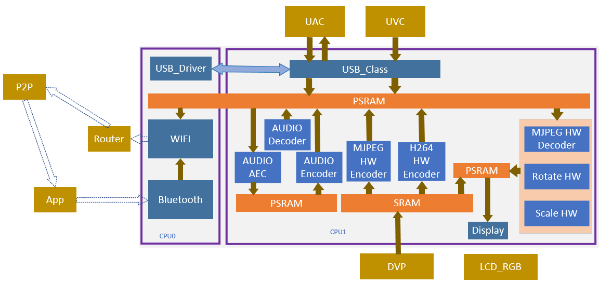
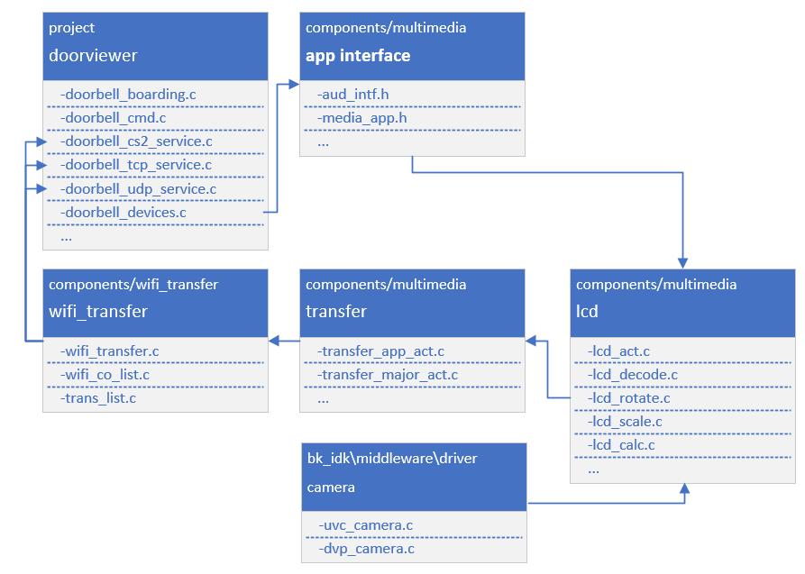
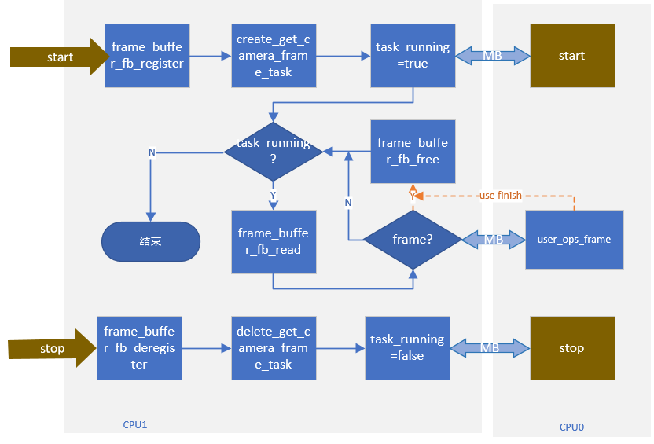

Doorviewer
=================================

:link_to_translation:`en:[English]`

1. 简介
---------------------------------

本工程是USB/DVP摄像头门锁的一个demo，支持端（BK7258设备）到端（手机APP端）的演示。默认使用16Mbyte PSRAM

1.1 规格
,,,,,,,,,,,,,,,,,,,,,,,,,,,,,,,,,

    * 硬件配置：
        * 核心板，**BK7258_QFN88_9X9_V3.2**
        * 显示转接板，**BK7258_LCD_Interface_V3.0**
        * 麦克小板，**BK_Module_Microphone_V1.1**
        * 喇叭小板，**BK_Module_Speaker_V1.1**
        * PSRAM 16M
    * 支持，UVC/DVP
        * 参考外设，**864 * 480** 分辨率的UVC
        * DVP参考外设，**640 * 480**，**1280 * 720** 分辨率的DVP
    * 支持，UAC
    * 支持，TCP局域网图传
    * 支持，UDP局域网图传
    * 支持，尚云，P2P图传
    * 支持，LCD RGB/MCU I8080显示
        * 参考外设，**ST7282**，480 * 272 RGB LCD
        * RGB565/RGB888
    * 支持，硬件/软件旋转
        * 0°，90°，180°，270°
    * 支持，板载喇叭
    * 支持，麦克
    * 支持，MJPEG硬件解码
        * YUV422
    * 支持，MJPEG软件解码
        * YUV420
    * 支持，H264硬件解码
    * 支持，OSD显示
        * ARGB888[PNG]
        * 自定义字体

.. warning::
    请使用参考外设，进行demo工程的熟悉和学习。如果外设规格不一样，代码可能需要重新配置。

1.2 路径
,,,,,,,,,,,,,,,,,,,,,,,,,,,,,,,,,

    <bk_avdk源代码路径>/projects/media/doorviewer

2. 框架图
---------------------------------

2.1 软件模块架构图
,,,,,,,,,,,,,,,,,,,,,,,,,,,,,,,,,

    如下图所示，BK7258有三个CPU：
        * CPU0，运行WIFI/BLE/USB，作为低功耗CPU。
        * CPU1，运行多媒体，作为多媒体高性能CPU。

.. tip::
    通常用户不必关心CPU2，同时不需要客户在CPU2开发。
    可以将CPU2关闭，以节省内存，此工程并未将CPU2关闭。

    Figure 1. software module architecture
    doorviewer software module architecture

..

    * UVC方案中，采用frame方式，产生一帧JPEG图像，会触发另一个task执行解码、旋转或者缩放等操作，最终显示到期望的LCD屏幕上。
    * UVC摄像头输出的图像可以分为两种，一种是YUV420 MJPEG，一种是YUV422 MJPEG。
        * JPEG图像直接通过wifi进行图传显示。
        * 软件会自动识别，并使用硬件解码器进行YUV422 MJPEG解码。而YUV420 MJPEG，则采用CPU1进行软件解码。
        * 硬件解码时，图像分辨率的宽需要时32的倍数，高的需要时16的倍数。
        * YUV像素排列分为，平面格式（planar）、打包格式（packed）、半平面格式（semi-planar）。硬件编码的数据，需要时packed格式。
    * DVP方案中，采用双码流方式，产生一帧JPEG/H264图像的同时，同步生成一帧YUV图像，会触发另一个task执行旋转或者缩放等操作，最终显示到期望的LCD屏幕上。
        * DVP摄像头支持单/双码流模式，使用者依据需求进行配置。
        * 单码流只支持YUV422/JPEG/H264中的任意一种。
        * 双码流支持JPEG/H264中的任意一种，并同时输出YUV422。
        * DVP输出的MJPEG图像，是YUV422 MJPEG。
    * MJPEG HW Decoder，获取到一帧JPEG图像后，直接解码。
    * MJPEG SW Decoder，直接解码
    * Rota HW 和Rota SW，同一时间，只会使用一种旋转模块。
        * Rota HW，支持RGB 565的图像输出，支持0°、90°、270°。
        * Rota SW，支持0°、90°、180°、270°。
        * 如果需要使用RGB888输出，或者支持180°，满足其中一个条件，都需要切换成软件解码。
        * 当前Rota HW和Rota SW，如何决策，由SDK软件决定。用户只需要在打开LCD时，将旋转角度和输出图像格式参数，输入给对应接口即可。
    * Scale，需要明确输入和输出的分辨率，以及输入和输出的图像格式。

2.2 代码模块关系图
,,,,,,,,,,,,,,,,,,,,,,,,,,,,,,,,,

    如下图所示，多媒体的接口，都定义在 **media_app.h** 和 **aud_intf.h** 中。

    Figure 2. module relationship diagram

    doorviewer module relationship diagram

3. 配置
---------------------------------

3.1 蓝牙与多媒体内存复用
,,,,,,,,,,,,,,,,,,,,,,,,,,,,,,,,,

    使用doorviewer工程，解码、旋转、缩放都是整帧执行的，故内存不需要与蓝牙共用。

    +-------------------------------------+---------------+-------------------------------------+
    |          marco                      |     value     |           implication               |
    +-------------------------------------+---------------+-------------------------------------+
    | CONFIG_BT_REUSE_MEDIA_MEMORY        |       N       | 多媒体和蓝牙共用一块sram（分时复用）|
    +-------------------------------------+---------------+-------------------------------------+

3.1.1 卸载蓝牙
.................................

::

    #ifdef CONFIG_BT_REUSE_MEDIA_MEMORY
    #if CONFIG_BLUETOOTH
        bk_bluetooth_deinit();
    #endif
    #endif

3.1.2 初始化蓝牙
.................................

::

    bk_bluetooth_init();

4. 演示说明
---------------------------------

    请访问
    `APP使用文档 <https://docs.bekencorp.com/arminodoc/bk_app/app/zh_CN/v2.0.1/app_usage/app_usage_guide/index.html#debug>`__
    查看。

    演示结果：运行时会启动UVC/DVP，LCD和AUDIO，LCD显示UVC输出JPEG（864X480）图像经过解码和旋转90°后显示到LCD(480X854)上，
    同样的JPEG图像会经过WIFI图传到手机上显示(864X480)。

.. hint::
    如果您没有云账号权限，可以使用debug模式，设置局域网TCP图传方式。

5. 代码讲解
---------------------------------

5.1 摄像头
,,,,,,,,,,,,,,,,,,,,,,,,,,,,,,,,,

    已支持的外设，请参考 `支持外设 <../../../support_peripherals/index.html>`_

5.1.1 打开摄像头
.................................

5.1.1.1 应用代码
*********************************

::

    //Path      ： projects/media/doorbell/main/src/doorbell_devices.c
    //Loaction  :  CPU0

    int doorbell_camera_turn_on(camera_parameters_t *parameters)
    {
        ...

        if (parameters->id == UVC_DEVICE_ID)
        {
            device.type = UVC_CAMERA;
        }
        else
        {
            device.type = DVP_CAMERA;
        }

        device.info.resolution.width = parameters->width;
        device.info.resolution.height = parameters->height;
        device.info.fps = FPS30;

        //打开UVC/DVP摄像头
        ret = media_app_camera_open(&device);

        ...
    }

5.1.1.2 接口代码
*********************************

::

    //Path      ： components/multimedia/app/media_app.c
    //Loaction  :  CPU0

    bk_err_t media_app_camera_open(media_camera_device_t *device)
    {
        ...

        //卸载蓝牙
        #ifdef CONFIG_BT_REUSE_MEDIA_MEMORY
        #if CONFIG_BLUETOOTH
            bk_bluetooth_deinit();
        #endif
        #endif

        //投票启动CPU1。投票的目的是，确保CPU1不用的时候能过够被自动关闭，以达到低功耗的目的。
        bk_pm_module_vote_boot_cp1_ctrl(PM_BOOT_CP1_MODULE_NAME_VIDP_JPEG_EN, PM_POWER_MODULE_STATE_ON);

        //通知CPU1，去打开UVC摄像头
        ret = media_send_msg_sync(EVENT_CAM_UVC_OPEN_IND, (uint32_t)device);

        ...
    }

5.1.2 获取一张图像
.................................

    因为当前多媒体运行在CPU1上，无论是DVP/UVC存储一帧图像，都是放在PSRAM上。当在CPU1需要获取一帧图像，需要调用如下接口：

::

    //Path      ： components/multimedia/comm/frame_buffer.c
    //Loaction  :  CPU1

    bk_err_t frame_buffer_fb_register(frame_module_t index, fb_type_t type)
    {
        bk_err_t ret = BK_FAIL;

        ...

        //index：表示需要读取图像的模块，参考对应结构体含义。

        //type：该模块表示需要获取的图像类型

        return ret;
    }

    frame_buffer_t *frame_buffer_fb_read(frame_module_t index)
    {
        frame_buffer_t *frame = NULL;

        ...

        //index：表示需要读取图像的模块，参考对应结构体含义。

        //返回可能是一个无效的frame，需要针对此函数的返回值进行判断，若为NULL，则需要继续调用，
        // 一般放在task中循环调用此接口。
        return frame;
    }

    void frame_buffer_fb_free(frame_buffer_t *frame, frame_module_t index)
    {
        ...

        //当使用上面接口frame_buffer_fb_read，读取到一帧有效帧时，在使用完成之后，需要将该帧图像释放，需要调用此接口。
    }

    bk_err_t frame_buffer_fb_deregister(frame_module_t index, fb_type_t type)
    {
        bk_err_t ret = BK_FAIL;

        ...

        //与frame_buffer_fb_register类似，当不需要读取时，需要注销
        return ret;
    }

    当在CPU0上获取一帧图像时，需要通过mailbox进行传输，大致流程如下。当不需要CPU0时，CPU0上的操作可以删除。具体可以参考图传：
    ``transfer_app_act.c``、``transfer_major_act.c``。

    Figure 3. get frame diagram

    multimeida get frame diagram

5.1.2.1 应用代码
*********************************

::

    //Path      ： components/multimedia/camera/uvc.c
    //Loaction  :  CPU1

    bk_err_t bk_uvc_camera_open(media_camera_device_t *device)
    {
        ...

        //注册了UVC图像的获取的MJPEG数据回调。
        //如果需要做丢帧处理，可以在这个回调里面去做丢帧处理。
        uvc_camera_config_st->jpeg_cb.push   = frame_buffer_fb_push;

        ...
    }

    //Path      ： components/multimedia/camera/dvp.c
    //Loaction  :  CPU1

    bk_err_t bk_dvp_camera_open(media_camera_device_t *device)
    {
        ...

        //注册了DVP图像的获取的MJPEG数据回调。
        //如果需要做丢帧处理，可以在这个回调里面去做丢帧处理。
        config.fb_complete = frame_buffer_fb_push;

        ...

        return bk_dvp_camera_driver_init(&config);
    }

5.1.2.2 接口代码
*********************************

::

    //Path      ： bk_idk/middleware/driver/camera/uvc_camera.c
    //Loaction  :  CPU1

    static void uvc_camera_eof_handle(uint32_t idx_uvc)
    {
        ...

        //这里是从USB的通过ISO或BULK传输，获取一堆数据流。并进行拆包，组包，最终获取到一帧完整的UVC数据。并回调给应用层。
        uvc_camera_config_ptr->jpeg_cb.push(curr_frame_buffer);

        ...
    }

    //Path      ： bk_idk/middleware/driver/camera/dvp_camera.c
    //Loaction  :  CPU1

    static void dvp_camera_jpeg_eof_handler(jpeg_unit_t id, void *param)
    {
        ...

        //这里是硬件JPEG编码的完成中断，在此处最终获取到一帧完整的DVP数据，并回调给应用层。
        dvp_camera_config->fb_complete(curr_encode_frame);
    }

.. attention::
    这里介绍的是MJPEG图像，在CPU1上如何获取。如果您的应用运行在CPU0上，需要通过mailbox发送到CPU0上使用，并且在使用完毕后，需要回到CPU1取释放。

5.1.2 关闭摄像头
.................................

5.1.2.1 应用代码
*********************************

::

    //Path      ： projects/media/doorbell/main/src/doorbell_devices.c
    //Loaction  :  CPU0

    int doorbell_camera_turn_off(void)
    {
        ...

        if (db_device_info->camera_id == UVC_DEVICE_ID)
        {
            //关闭UVC摄像头
            media_app_camera_close(UVC_CAMERA);
        }
        else
        {
            //关闭DVP摄像头
            media_app_camera_close(DVP_CAMERA);
        }

        ...
    }

5.1.2.2 接口代码
*********************************

::

    //Path      ： components/multimedia/app/media_app.c
    //Loaction  :  CPU0

    bk_err_t media_app_camera_close(camera_type_t type)
    {
        ...

        //关闭UVC
        if (type == UVC_CAMERA)
        {
            ret = media_send_msg_sync(EVENT_CAM_UVC_CLOSE_IND, 0);
        }
        else
        {
            ret = media_send_msg_sync(EVENT_CAM_DVP_CLOSE_IND, 0);
        }

        //投票允许关闭CPU1。投票的目的是，确保CPU1不用的时候能过够被自动关闭，以达到低功耗的目的。
        bk_pm_module_vote_boot_cp1_ctrl(PM_BOOT_CP1_MODULE_NAME_VIDP_JPEG_EN, PM_POWER_MODULE_STATE_OFF);

        ...
    }

.. warning::
        * 所有涉及到多媒体的操作，都需要注意低功耗的要求。即打开设备，必须关闭设备，否则无法让整个系统进入低功耗模式。
        * 涉及到CPU1投票的操作，打开和关闭，必须成对出现，否则会出现CPU1无法关闭，功耗增加的问题。
        * 可以参考低功耗章节

5.2 LCD显示
,,,,,,,,,,,,,,,,,,,,,,,,,,,,,,,,,

    已支持的外设，请参考 `支持外设 <../../../support_peripherals/index.html>`_

5.2.1 打开LCD
.................................

5.2.1.1 应用代码
*********************************

::

    //Path      ： projects/media/doorbell/main/src/doorbell_devices.c
    //Loaction  :  CPU0

    int doorbell_display_turn_on(uint16_t id, uint16_t rotate, uint16_t fmt)
    {
        ...

        //设置旋转角度
        if (rotate == 90)
        {
            media_app_lcd_rotate(ROTATE_90);
        }

        //打开期望的lcd屏幕显示
        media_app_lcd_open(&lcd_open);

        ...
    }

5.2.1.2 接口代码
*********************************

::

    //Path      ： components/multimedia/app/media_app.c
    //Loaction  :  CPU0

    bk_err_t media_app_lcd_open(void *lcd_open)
    {
        ...

        //投票允许关闭CPU1。投票的目的是，确保CPU1不用的时候能过够被自动关闭，以达到低功耗的目的。
        bk_pm_module_vote_boot_cp1_ctrl(PM_BOOT_CP1_MODULE_NAME_VIDP_LCD, PM_POWER_MODULE_STATE_ON);

        //通知CPU1打开LCD
        ret = media_send_msg_sync(EVENT_LCD_OPEN_IND, (uint32_t)ptr);

        ...
    }

5.2.2 关闭LCD
.................................

5.2.2.1 应用代码
*********************************

::

    //Path      ： projects/media/doorbell/main/src/doorbell_devices.c
    //Loaction  :  CPU0

    int doorbell_display_turn_off(void)
    {
        ...

        //关闭本地LCD显示
        media_app_lcd_close();

        ...
    }

5.2.2.2 接口代码
*********************************

::

    //Path      ： components/multimedia/app/media_app.c
    //Loaction  :  CPU0

    bk_err_t media_app_lcd_close(void)
    {
        ...

        //关闭LCD显示
        ret = media_send_msg_sync(EVENT_LCD_CLOSE_IND, 0);

        //投票允许关闭CPU1。投票的目的是，确保CPU1不用的时候能过够被自动关闭，以达到低功耗的目的。
        bk_pm_module_vote_boot_cp1_ctrl(PM_BOOT_CP1_MODULE_NAME_VIDP_LCD, PM_POWER_MODULE_STATE_OFF);

        ...
    }

5.2.3 OSD显示
.................................

    请参考 `OSD视频叠加 <../../../gui/osd/osd_blend.html>`_

5.3 Audio

    请参考 `Audio <../../doorbell/index.html#audio>`_

5.4 H264编解码
,,,,,,,,,,,,,,,,,,,,,,,,,,,,,,,,,

    请参考 `H264编码 <../../../video_codec/h264_encoding/index.html>`_

5.5 WIFI传输
,,,,,,,,,,,,,,,,,,,,,,,,,,,,,,,,,

    请参考 `WIFI传输 <../../doorbell/index.html#wifi>`_
