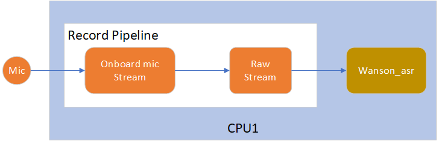
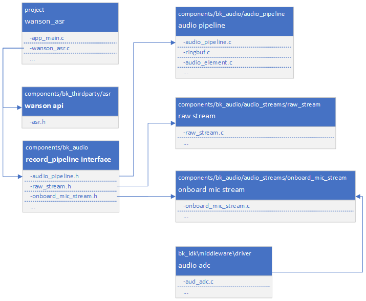

华镇语音识别工程
=================================

:link_to_translation:`en:[English]`

1. 简介
--------------------

本工程是本地语音识别的一个demo，基于第三方公司 ``华镇`` 提供的本地语音识别库，实现本地离线语音唤醒词和命令词识别功能。

1.1 规格
,,,,,,,,,,,,,,,,,,,,,,,,,,,,,,,,,

	* 硬件配置：
		* 核心板，**BK7258_QFN88_9X9_V3.2**
		* 麦克小板，**BK_Module_Microphone_V1.1**
		* PSRAM 8M/16M
	* 支持的唤醒词
		* ``小蜂管家``
		* ``阿尔米诺``
	* 支持的命令词
		* ``会客模式``
		* ``用餐模式``
		* ``离开模式``
		* ``回家模式``

.. warning::
	- 1、华镇语音识别库要求音频流格式为：单声道、16K采样率、16bit位宽。
	- 2、华镇语音识别库基于浮点运算。
	- 3、当修改唤醒词或命令词后，需要替换 ``libasr.a`` 库。

1.2 路径
,,,,,,,,,,,,,,,,,,,,,,,,,,,,,,,,,

	工程路径: ``<bk_avdk源代码路径>/thirdparty/wanson_asr``

	语音识别算法demo路径: ``<bk_avdk源代码路径>/components/audio_algorithm/wanson_asr``

	华镇的本地语音识别库（浮点库）路径: ``<bk_avdk源代码路径>/components/bk_thirdparty/asr/wanson/bk7258``

	华镇的本地语音识别库API接口的详细说明请参考源文件: ``<bk_avdk源代码路径>/components/bk_thirdparty/asr/wanson/include/asr.h``

	project编译指令: ``make bk7258 PROJECT=thirdparty/wanson_asr``

2. 框架图
---------------------------------

2.1 软件模块架构图
,,,,,,,,,,,,,,,,,,,,,,,,,,,,,,,,,

    bk7258的CPU1拥有更高的主频和性能，可以确保运行语音识别算法的效率更高。
	所以如下图所示，整个语音识别应用都运行在 ``cpu1`` 上。

    Figure 1. software module architecture
    wanson_asr software module architecture

..

    * 方案中，我们采用pipeline方式来采集获取mic数据，然后送给wanson_asr算法进行实时语音识别。

2.2 代码模块关系图
,,,,,,,,,,,,,,,,,,,,,,,,,,,,,,,,,

    如下图所示，方案使用的onboard_mic_stream、raw_stream和audio_pipeline模块接口分别定义在 ``onboard_mic_stream.h`` ，``raw_stream.h`` 和 ``audio_pipeline.h`` 中。

    Figure 1. module relationship diagram

    wanson_asr module relationship diagram

3. 配置
---------------------------------

	板载mic采样基于audio pipeline实现，因此需要在 ``cpu1`` 上打开以下配置:
	
    ========================================  ===============  ===============  ===============
    Kconfig                                     CPU             Format            Value    
    ========================================  ===============  ===============  ===============
    CONFIG_FREERTOS_USE_QUEUE_SETS              CPU0 && CPU1    bool                y    
    CONFIG_ASDF               	               	CPU0 && CPU1    bool                y
    CONFIG_ASDF_WORK_CPU1                       CPU0 && CPU1    bool                y    
    CONFIG_ASDF_ONBOARD_MIC_STREAM             	CPU1            bool                y
    CONFIG_ASDF_RAW_STREAM                      CPU1            bool                y    
    CONFIG_WANSON_ASR          	               	CPU1            bool                y
    ========================================  ===============  ===============  ===============

4. 演示说明
---------------------------------

	烧录固件后，设备上电就会运行实时语音识别功能，对着mic说唤醒词和命令词，识别成功会在uart中打印相应的log。
	唤醒词和命令词对应的log打印如下：

    =====================  ============================
    唤醒词或命令词           log    
    =====================  ============================
     ``小蜂管家``           ``xiao feng guan jia`` 
     ``阿尔米诺``           ``a er mi nuo`` 
     ``会客模式``           ``hui ke mo shi`` 
     ``用餐模式``           ``yong can mo shi`` 
     ``离开模式``           ``li kai mo shi`` 
     ``回家模式``          	``hui jia mo shi`` 
    =====================  ============================

5. 代码讲解
---------------------------------

5.1 mic采样
,,,,,,,,,,,,,,,,,,,,,,,,,,,,,,,,,

5.1.1 打开mic采样
.................................

::

    //Path      ： projects/thirdparty/wanson_asr/main/wanson_asr.c
    //Loaction  :  CPU1

    static bk_err_t record_pipeline_open(void)
    {
        ...

	    //初始化录音的pipeline
        record_pipeline = audio_pipeline_init(&record_pipeline_cfg);

        //初始化板载mic组件
        onboard_mic = onboard_mic_stream_init(&onboard_mic_cfg);

        //初始化mic数据获取组件
        raw_read = raw_stream_init(&raw_read_cfg);

        //注册板载mic组件到录音pipeline
        if (BK_OK != audio_pipeline_register(record_pipeline, onboard_mic, "onboard_mic"))

        //注册mic数据获取组件到录音pipeline
        if (BK_OK != audio_pipeline_register(record_pipeline, raw_read, "raw_read"))

        //组合录音pipeline
        if (BK_OK != audio_pipeline_link(record_pipeline, (const char *[]) {"onboard_mic", "raw_read"}, 2))

        ...
    }

5.1.2 关闭mic采样
.................................

::

    //Path      ： projects/thirdparty/wanson_asr/main/wanson_asr.c
    //Loaction  :  CPU1

    static bk_err_t record_pipeline_close(void)
    {
        ...

	    //结束录音pipeline
        if (BK_OK != audio_pipeline_terminate(record_pipeline))

        //注销板载mic组件
        if (BK_OK != audio_pipeline_unregister(record_pipeline, onboard_mic))

        //注销mic数据获取组件
        if (BK_OK != audio_pipeline_unregister(record_pipeline, raw_read))

        //释放录音pipeline
        if (BK_OK != audio_pipeline_deinit(record_pipeline))

        //释放板载mic组件
        if (BK_OK != audio_element_deinit(onboard_mic))

        //释放mic数据获取组件
        if (BK_OK != audio_element_deinit(raw_read))

        ...
    }

5.2 wanson语音识别
,,,,,,,,,,,,,,,,,,,,,,,,,,,,,,,,,

5.2.1 初始化语音识别
.................................

::

    //Path      ： projects/thirdparty/wanson_asr/main/wanson_asr.c
    //Loaction  :  CPU1

    bk_err_t wanson_asr_init(void)
    {
        //投票提高cpu1的主频到480MHz
        bk_pm_module_vote_cpu_freq(PM_DEV_ID_AUDIO, PM_CPU_FRQ_480M);

        //初始化语音识别的task
        send_mic_data_init();

        //打开mic采样pipeline
        record_pipeline_open();

        ...

    }

5.2.2 退出语音识别
.................................

::

    //Path      ： projects/thirdparty/wanson_asr/main/wanson_asr.c
    //Loaction  :  CPU1

    bk_err_t wanson_asr_deinit(void)
    {
        //退出语音识别的task
        send_mic_data_send_msg(WANSON_ASR_EXIT, NULL);

        //关闭mic采样pipeline	
        record_pipeline_close();

        //投票恢复cpu1的主频到默认值	
        bk_pm_module_vote_cpu_freq(PM_DEV_ID_AUDIO, PM_CPU_FRQ_DEFAULT);

        ...

    }

5.2.3 启动语音识别
.................................

::

    //Path      ： projects/thirdparty/wanson_asr/main/wanson_asr.c
    //Loaction  :  CPU1

    bk_err_t wanson_asr_start(void)
    {
        //启动mic采样pipeline开始采样
        if (BK_OK != audio_pipeline_run(record_pipeline))

        //启动语音识别的task开始语音识别
        send_mic_data_send_msg(WANSON_ASR_START, NULL);

        ...

    }

5.2.4 停止语音识别
.................................

::

    //Path      ： projects/thirdparty/wanson_asr/main/wanson_asr.c
    //Loaction  :  CPU1

    bk_err_t wanson_asr_stop(void)
    {
        //停止语音识别的task暂停语音识别
        send_mic_data_send_msg(WANSON_ASR_IDLE, NULL);

        //通知mic采样pipeline停止采样
        if (BK_OK != audio_pipeline_stop(record_pipeline))

        //等待mic采样pipeline停止采样
        if (BK_OK != audio_pipeline_wait_for_stop(record_pipeline))

        ...

    }

5.3 语音识别task识别流程
,,,,,,,,,,,,,,,,,,,,,,,,,,,,,,,,,

::

    //Path      ： projects/thirdparty/wanson_asr/main/wanson_asr.c
    //Loaction  :  CPU1

    static void wanson_asr_task_main(beken_thread_arg_t param_data)
    {

        ...

        //初始化wanson语音识别算法库
        if (Wanson_ASR_Init() < 0)

        //复位wanson语音识别算法库
        Wanson_ASR_Reset();

        ...

        while (1)
        {

            ...

            //读取30ms的mic数据
			read_size = wanson_read_mic_data((char *)aud_temp_data, RAW_READ_SIZE);

            //运行wanson语音识别算法
            rs = Wanson_ASR_Recog((short*)aud_temp_data, 480, &text, &score);

            ...
        }

    wanson_asr_exit:

        //释放wanson语音识别算法库
        Wanson_ASR_Release();

        ...
    }

6. 上海华镇电子科技有限公司
-------------------------------
    | 官网：http://www.wanson.cn/
    | 总部地址：上海闵行区申旺路789号慧高光创园307-308室
	| 深圳办地址：深圳市宝安区西乡汇一城壹中心1A栋东座2215-16
    | 电话：021-61557858
    | 手机：13524859176
	|       13296017858
