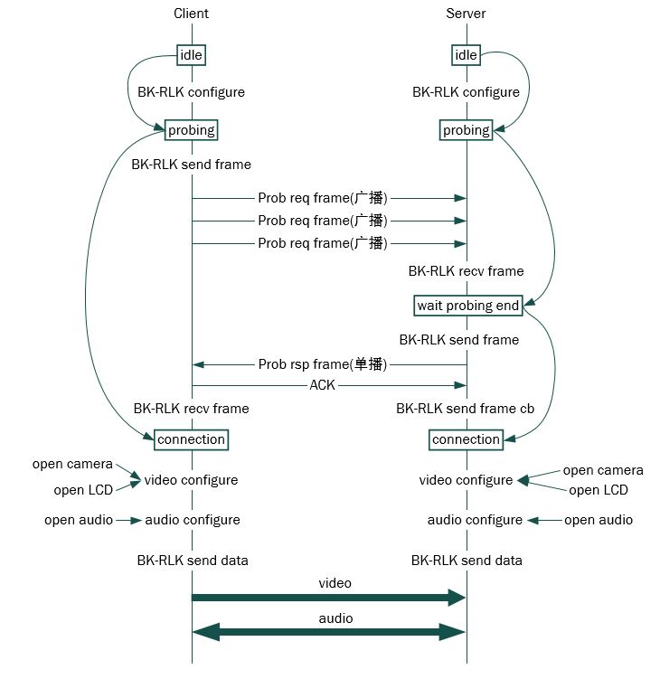
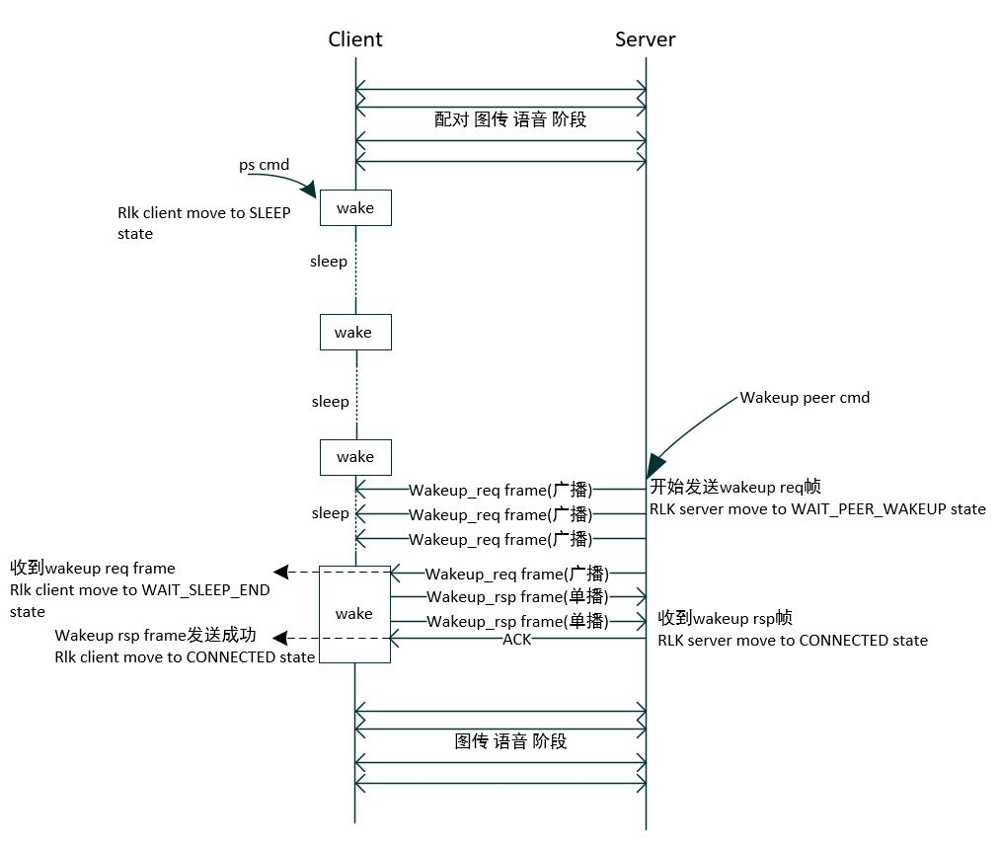
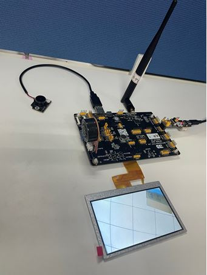

BK-RLK Multi-media demo
========================

:link_to_translation:`en:[English]`

1 功能概述
-------------------------------------
   该工程基于BK-RLK无线通信方案实现了单设备向多设备传输单向视频、双向音频及本地LCD显示功能，通过该工程可以查看如何借助BK- RLK无线通信方案实现设备发现、连接、业务数据传输和低功耗管理。

2 Demo 说明
-------------------------------------
   BK-RLK multi-media demo 是基于多个支持BK-RLK设备之间构建的多媒体通信系统,分为Client端和Server端。   该多媒体通信系统主要简单演示了BK-RLK以下功能的使用:

   - Client和Server间连接通信指南
   - Client和Server间功耗使用指南
   - Client和Server间视频,语音传输指南

Client和Server间连接通信指南:
   BK-RLK multi-media demo 通信系统为自动发现设备并连接配对进行图传的过程，自动发现设备并连接配对过程包含如下表所示的几种状态的转换，设备初始化过程中会默认配置连接状态到idle态，开始连接转换到probing状态，当连接完成连接状态才转换到connection状态。连接状态在connection状态时才能进行视频语音的通信。

+------------------+-------------------------------------------------------------------------+
| status           | Description                                                             |
+==================+=========================================================================+
| idle             | 设备初始化过程中，默认配置连接状态为idle态，Client端和Server端均使用    |
+------------------+-------------------------------------------------------------------------+
| probing          | 设备初始化完成后，自动进入probing状态，Client端和Server端均使用         |
+------------------+-------------------------------------------------------------------------+
| wait probing end | Server端在接收到Prob req 广播帧之后进入到wait probing end状态，仅Server |
|                  | 端使用                                                                  |
+------------------+-------------------------------------------------------------------------+
| connection       | 当连接完成均进入到connection状态                                        |
+------------------+-------------------------------------------------------------------------+

Figure 1 描述了BK-RLK multi-media demo通信系统中Client端与server端连接通信全过程。如图所示，Client端与Server端均在初始化时将连接状态设置为idle态。接下来均会进行BK-RLK的配置(BK-RLK 具体使用配置请参阅Wi-Fi BK-RLK 使用指南)，完成BK-RLK配置后，连接状态配置为probing状态。
Client端连接状态转到probing后，会调用BK-RLK数据发送接口连续发送Prop req 广播帧，直到在BK-RLK接收接口中收到Server端回复的Prob rsp单播帧后停止。Client端通过接收到的Prob rsp帧添加对端设备信息到BK-RLK配对维护链表中，并将连接状态转换到connection状态。然后，Client端开始图传和语音配置，打开摄像头，打开本地LCD,打开语音，开始调用BK-RLK发送接口开始与Server进行业务数据通信。
Server端连接状态转到probing后，会处于待机状态，直到通过BK-RLK接收接口接收到Client端发送的Prob req广播帧。Server端会跳转到wait probing end连接状态，并通过BK-RLK发送接口发送Prob rsp单播帧，收到ACK后将连接状态转到connection。后续开始配置图传和语音，与Client端进行业务数据通信。

注意：当Client端与Server端均处在connection连接状态时，当其中一端断开连接后，均会再次自动连接过程。

    Figure 1. Client端与Server端连接通信流程图

Client和Server间功耗使用指南:
   BK-RLK multi-media demo 通信系统中Client端可进入休眠状态，并且按周期维护一段工作时间，再进入休眠状态，涉及到的信息如下表所示：

+-----------+--------------------+------------------------+----------------------------------+
| 设备所属  | 信息               | 解释                   | 备注                             |
+===========+====================+========================+==================================+
|           |                    |                        | 这个值决定了设备休眠的时长，该值 |
|           | RLK_RTC_LOWPOWER   | 休眠周期，默认为2秒    | 设置越大，对应的功耗会越低，同时 |
|           | _PS_INTERVAL       |                        | 对端唤醒延时可能会变大。         |
|           +--------------------+------------------------+----------------------------------+
| Client 端 |                    |                        | 设备进入休眠后，需要周期监听是否 |
|           | RLK_RTC_LOWPOWER   |                        | 有业务发生。这个值决定了设备监听 |
|           | _KEEPALIVE_TIME    | 工作周期，默认为2毫秒  | 时长，该值设置越小，对应的工作时 |
|           | _INTERVAL          |                        | 长就会越小，功耗越小，同时也可能 |
|           |                    |                        | 会对唤醒延时产生影响。           |
|           +--------------------+------------------------+----------------------------------+
|           |                    | 串口命令，Client端输入 | 非命令场景下也可直接调用API函数  |
|           | rlkc ps            | ，Client设备进入休眠模 |                                  |
|           |                    | 式                     |                                  |
+-----------+--------------------+------------------------+----------------------------------+
|           |                    | 串口命令，Server端输入 | 非命令场景下也可直接调用API函数  |
| Server 端 | rlks wakeup_peer   | ，唤醒Client设备，保持 |                                  |
|           |                    | 工作模式               |                                  |
+-----------+--------------------+------------------------+----------------------------------+

功耗使用方式可分为Client端和Server端：
Client端输入rlkc ps命令，该命令是否生效，有以下几种表现形式

 - 正在进行的音视频会立即停止
 - 使用电流检测工具可以看到电流峰值马上下降

说明：输入该命令后，client设备会以配置好的休眠/工作周期工作。此时业务均被停止。非cli场景下，可直接调用API函数rlk_client_ps_cmd_handler()。

Server端输入rlks wakeup_peer命令，唤醒成功后会返回打印信息：WAKEUP PEER SUCCESS。

说明：输入该命令后，收到成功打印信息之前，client设备仍然会以配置好的休眠/工作周期工作。业务未被恢复。收到成功打印信息之后，client电流恢复峰值，且业务重新工作。
输入命令，到成功唤醒对端之间存在延时。这里取决于当前的空口环境及配置的休眠周期和工作周期时长。
非cli场景下，可直接调用API函数rlk_server_wakeup_peer()

具体唤醒流程如下Figure 2 所示：

    Figure 2. Client端与Server端ps流程图

开放环境下,使用同一套硬件的Wi-Fi场景与BK-RLK下的功耗对比如下表所示：

+-----------+-------------------------------------------------+-------------+
|   设备    |                    条件                         | 平均功耗    |
+===========+=================================================+=============+
|   Wi-Fi   | Dtim20                                          | 557uA       |
+-----------+-------------------------------------------------+-------------+
|  BK-RLK   | RLK_RTC_LOWPOWER_PS_INTERVAL = 2s               | 320uA       |
|           | RLK_RTC_LOWPOWER_KEEPALIVE_TIME_INTERVAL = 2ms  |             |
+-----------+-------------------------------------------------+-------------+

Client和Server间视频,语音传输指南:
   Client端和Server端配对成功后，自动进入到语音视频传输模式。

3 环境搭建
-------------------------------------
   BK-RLK 多媒体通信系统分为Client端和Server端两部分，其环境搭建如Figure 3和Figure 4所述。
   Figure 3 是一块作为Client端的BK7256样本设备,该设备添加一个usb摄像头，一块lcd显示屏和一个音频广播器。

    Figure 3. Client 端环境搭建

Figure 4是一块作为Server端的BK7256样本设备,该设备添加一块lcd显示屏和一个音频广播器。

.. figure:: ../../../_static/bk_rlk_server_env.jpg
    :align: center
    :alt: BK-RLK Server
    :figclass: align-center

    Figure 4. Server端环境搭建

4 代码路径
-------------------------------------
   BK-RLK Multi-media 系统 demo 路径均在： ``./projects/wifi``

   Client端demo路径：``./projects/wifi/rlk_av_client``

   Server端demo路径：``./projects/wifi/rlk_av_server``

   Client端编译命令：``make bk7256 PROJECT=wifi/rlk_av_client``

   Server端编译命令：``make bk7256 PROJECT=wifi/rlk_av_server``

5 参考链接
-------------------------------------

    `API参考: <../../api-reference/wifi/bk_wifi.html>`_ 介绍了BK-RLK API接口

    `开发者指南: <../../developer-guide/wifi/bk_rlk.html>`_ 介绍了BK-RLK使用指南

    `BK-RLK工程: <../../projects_work/wifi/bk_rlk_media.html>`_ 介绍了BK-RLK相关工程