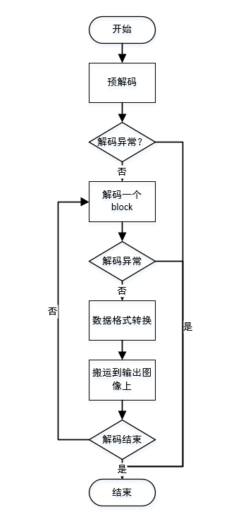

JPEG软解码
=================================

:link_to_translation:`en:[English]`

1、JPEG软解码流程
----------------------

JPEG软解码主要流程如下：

1)	预解码，将一张JPEG数据中头解析出来，获取图像格式，图像的长和宽，量化表以及霍夫曼表；

2)	查找量化表以及霍夫曼表进行解析一个block数据；

3)	将一个block数据转换为需要输出的图像格式；

4)	将转换后的图像数据写入到输出图像中；

5)	重复2-4，直至出现异常或解码结束；

    Figure 1. jpeg soft decode process

2、内存需求
----------------------

JPEG软解码对线程依赖在1K以内，主要需要的buffer及用途如下：

1) 一块10240的buffer，用于存储霍夫曼表以及中间数据处理；

2) 一块0xB0大小的buffer，用于存储中间运行的指针和变量；

3) 一块16*16*2大小的buffer，用于软解码后进行图像旋转；

3、JPEG软解码模块使用
----------------------

1) 调用 `bk_jpeg_dec_sw_init` ，初始化软解码模块；

2) 调用 `bk_jpeg_dec_sw_start` ，对传入的图像进行解码；

3) 调用 `bk_jpeg_dec_sw_deinit` ，将软解码内部buffer释放；

函数参数请查看 `API Reference : <../../api-reference/multi_media/bk_jpegdec_sw.html>`_

4、一次性解码函数
----------------------

出于部分场景下需要，提供了一次性解码的接口 `bk_jpeg_dec_sw_start_one_time`，

该接口使用前不需要调用 `bk_jpeg_dec_sw_init` ，buffer由外部传入；
如果外部传入NULL，则由接口内部自动申请；解码完成后自动释放内部申请的buffer；

.. note::

    该接口可以和软解码模块并行解码，解码速度并行时会降低；

5、解码速度优化
----------------------

在DTCM充足的情况下，可以在CP1和CP2上将 `CONFIG_SOFTWARE_DECODE_SRAM_MAPPING` 置为 y 来加快解码速度；
该优化方式为将解码线程以及部分解码使用的buffer放到dtcm上运行，同时将原来解码一个block就存到psram上改为缓冲16行之后再一起存到psram上，减少实际运行中psram频繁地址切换时间；

.. note::

    软解码和旋转模块不能同时工作，因为软解码中用于缓冲16行的buffer为旋转模块中使用的buffer；