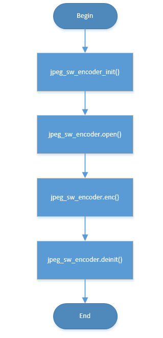

JPEG软编码
=================================

:link_to_translation:`en:[English]`

1、JPEG软编码流程
----------------------

JPEG软编码主要流程如下：

1)	输入数据格式转换(该步骤可选，输入格式必须为YVYU422，如果不是该格式需要进行格式转换)；

2)	初始化/申请压缩数据buffer/图像输出buffer；

3)	填充编码头部信息；

4)	以16x8像素的block为单位进行DCT/量化/哈夫曼编码，压缩后的数据填入图像输出buffer；

5)	重复4，直至出现异常或编码结束；

    Figure 1. jpeg soft encode process

2、内存需求
----------------------

JPEG软编码对线程依赖在3K以内，主要需要的buffer及用途如下：

1) 一块512bytes的内部buffer，用于存储16x8 block压缩数据；
2) 一块64k大小的图像输出buffer（该大小可根据需要调整使用malloc动态分配），用于输出压缩后的图像；

3、JPEG软编码模块使用
----------------------

1) 调用 `jpeg_sw_encoder_init` ，初始化软编码模块,注册相关回调函数如：open/enc/deinit；

2) 调用 `jpeg_sw_encoder.open` ，完成软编码器内部参数初始化/内存申请；

3) 调用 `jpeg_sw_encoder.enc` ，执行软编码操作；

4) 调用 `jpeg_sw_encoder.deinit` ，关闭软编码模块，释放内部申请buffer；

函数参数请查看 `API Reference : <../../api-reference/multi_media/bk_jpegenc_sw.html>`_

4、JPEG软编码例程
----------------------

请参考 jpeg_sw_enc_test.c

